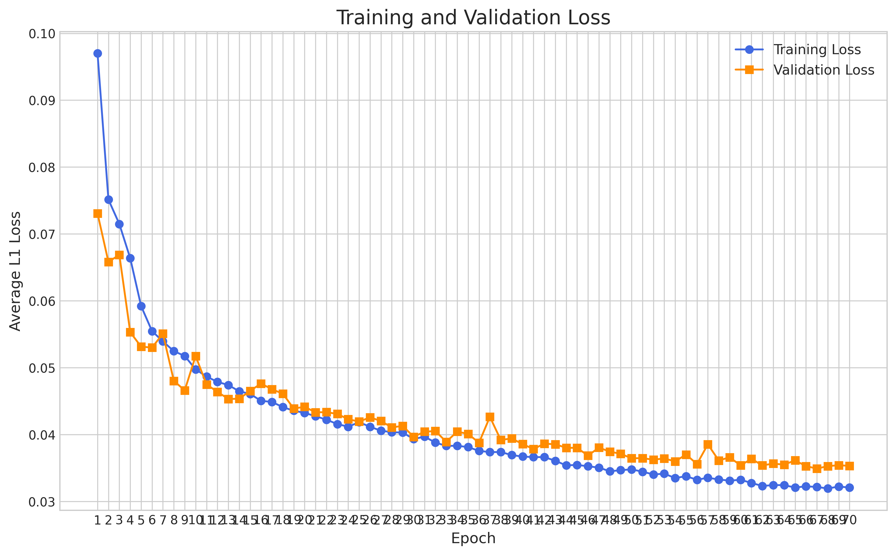
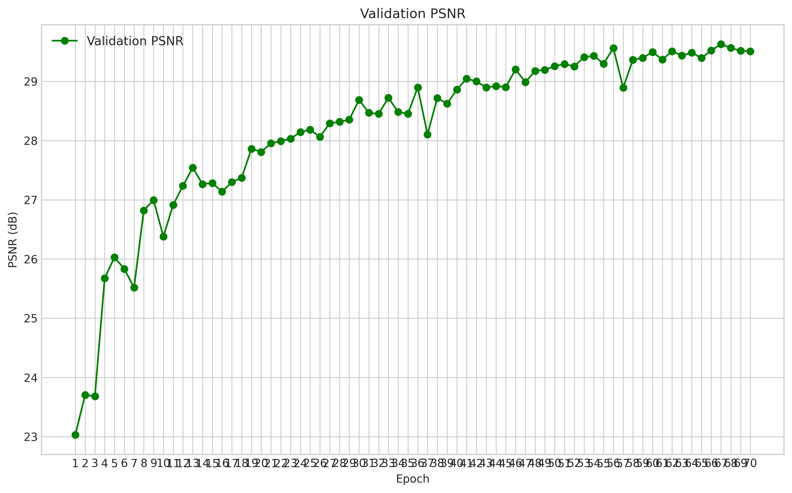
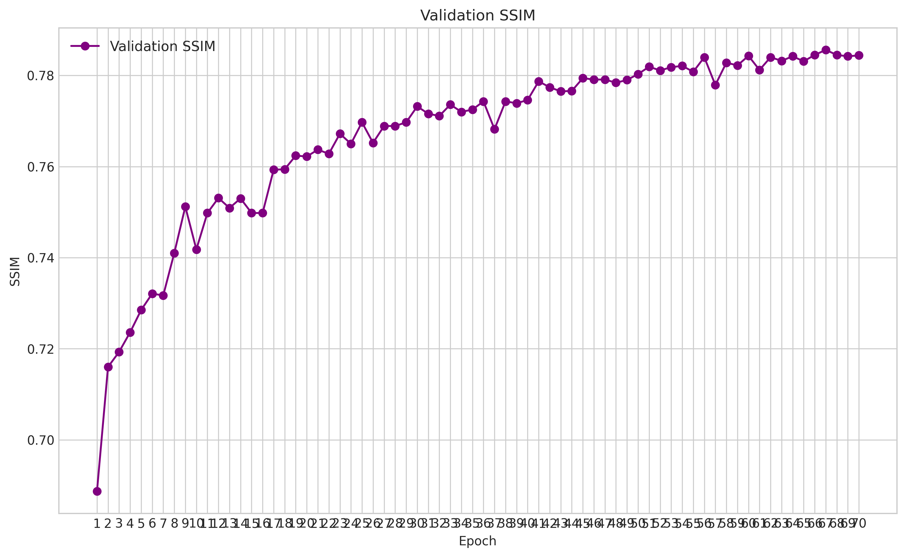

# DNF的jittor框架实现


本仓库是对论文`DNF: Decouple and Feedback Network for Seeing in the Dark`的复现，使用的是jittor框架

原仓库地址：https://github.com/Srameo/DNF.git

## 环境配置

```
pip install -r requirements.txt
```


## 数据准备


新建dataset文件夹，并将mcr和sid数据集的快捷方式放入
```
mkdir dataset && cd dataset
ln -s your/path/to/SID ./sid
ln -s your/path/to/MCR ./mcr
```

处理sid数据集
```
bash scripts/preprocess_sid.sh
```

## 训练脚本


由于500轮训练时间过长，我将baseline中的训练轮数均改成了70轮


使用sony数据集进行训练

```
python runner.py -cfg configs/cvpr/sony/baseline.yaml
```

使用mcr数据集进行训练

```
python runner.py -cfg configs/cvpr/mcr/baseline.yaml
```


使用fuji数据集进行训练

```
python runner.py -cfg configs/cvpr/fuji/baseline.yaml
```


## 测试脚本


```
bash benchmarks/sid_sony.sh pretrained/model_best.pkl --save-image
```


## 实验log


由于log太长，在这里只展示训练中最后十轮的log
```
[2025-08-08 20:11:00 baseline] (runner.py 296): INFO Full config saved to runs/CVPR_SONY/baseline/train-250808-2011.yaml
[2025-08-08 20:11:00 baseline] (runner.py 297): INFO Config:
name: CVPR_SONY
testset_as_validset: true
valid_per_epoch: 1
print_per_iter: 100
save_per_epoch: 1
manual_seed: 3407
profile: DNF_profile
loss:
  classes:
  - L1Loss
  - L1Loss
  types:
  - L1
  - L1
  which_gt:
  - raw
  - rgb
  which_stage:
  - raw
  - rgb
  weights:
  - 1.0
  - 1.0
data:
  type: SonyDictSet
  camera: Sony
  data_path: ./dataset/sid
  load_npy: true
  num_workers: 10
  pin_memory: true
  process:
    max_clip: 1.0
    min_clip: null
    transpose: false
    h_flip: true
    v_flip: true
    rotation: false
  test:
    batch_size: 1
    image_list_file: Sony_new_test_list.txt
    max_samples: null
    patch_size: null
    only_00: true
  train:
    batch_size: 1
    image_list_file: Sony_train_list.txt
    max_samples: null
    patch_size: 1024
    repeat: 1
  valid:
    batch_size: 2
    image_list_file: Sony_val_list.txt
    max_samples: null
    patch_size: 1024
  persistent_workers: false
model:
  f_number: 32
  block_size: 2
  denoising_block: CID
  color_correction_block: MCC
  type: DNF
  feedback_fuse: GFM
train:
  forward_type: train_forward_DNF
  base_lr: 0.0002
  clip_grad: 0.1
  early_stop: 70
  epochs: 70
  lr_scheduler:
    type: cosine
    t_in_epochs: true
  optimizer:
    type: adamw
    eps: 1.0e-08
    betas:
    - 0.9
    - 0.999
    momentum: 0.9
  min_lr: 2.0e-05
  start_epoch: 0
  warmup_epochs: 0
  weight_decay: 0
  auto_resume: false
test:
  forward_type: test_forward_DNF
  which_gt: rgb
  which_stage: rgb
  round: false
  save_image: false
base:
- base.yaml
tag: baseline
output: runs/CVPR_SONY/baseline

[2025-08-08 20:11:00 baseline] (runner.py 311): INFO 初始化结束，进入main(config)
[2025-08-08 20:11:00 baseline] (runner.py 37): INFO data加载完成
[2025-08-08 20:11:00 baseline] (runner.py 39): INFO Creating model:CVPR_SONY/DNF
[2025-08-08 20:11:04 baseline] (runner.py 133): INFO Total Params: 2,835,103
[2025-08-08 20:11:04 baseline] (runner.py 48): INFO Losses(
    module_list: Sequential(
        0: L1Loss()
        1: L1Loss()
    )
)
[2025-08-08 20:11:04 baseline] (runner.py 50): INFO Building forwards:
[2025-08-08 20:11:04 baseline] (runner.py 51): INFO Train forward: train_forward_DNF
[2025-08-08 20:11:04 baseline] (runner.py 52): INFO Test forward: test_forward_DNF
[2025-08-08 20:11:04 baseline] (runner.py 85): INFO Start training
[2025-08-09 02:00:41 baseline] (runner.py 175): INFO Train: [61/70][0/1865]	ETA 0:06:15 LR 0.000031	Time 0.2013 (0.2013)	Data 0.0047 (0.0047)	Loss 0.10096312 (0.10096312)	GradNorm 0.2076 (0.2076)	
[2025-08-09 02:00:57 baseline] (runner.py 175): INFO Train: [61/70][100/1865]	ETA 0:04:43 LR 0.000031	Time 0.1592 (0.1606)	Data 0.0044 (0.0043)	Loss 0.02137402 (0.03791674)	GradNorm 0.1895 (0.4884)	
[2025-08-09 02:01:13 baseline] (runner.py 175): INFO Train: [61/70][200/1865]	ETA 0:04:27 LR 0.000031	Time 0.1608 (0.1605)	Data 0.0043 (0.0043)	Loss 0.02125222 (0.03350326)	GradNorm 0.4094 (0.4837)	
[2025-08-09 02:01:29 baseline] (runner.py 175): INFO Train: [61/70][300/1865]	ETA 0:04:10 LR 0.000031	Time 0.1616 (0.1605)	Data 0.0043 (0.0043)	Loss 0.02504804 (0.03287168)	GradNorm 0.3953 (0.4651)	
[2025-08-09 02:01:45 baseline] (runner.py 175): INFO Train: [61/70][400/1865]	ETA 0:03:54 LR 0.000031	Time 0.1616 (0.1604)	Data 0.0042 (0.0043)	Loss 0.02415169 (0.03290890)	GradNorm 0.2390 (0.4654)	
[2025-08-09 02:02:01 baseline] (runner.py 175): INFO Train: [61/70][500/1865]	ETA 0:03:38 LR 0.000031	Time 0.1609 (0.1603)	Data 0.0042 (0.0043)	Loss 0.03268084 (0.03302289)	GradNorm 0.2918 (0.4661)	
[2025-08-09 02:02:17 baseline] (runner.py 175): INFO Train: [61/70][600/1865]	ETA 0:03:22 LR 0.000031	Time 0.1611 (0.1603)	Data 0.0042 (0.0043)	Loss 0.01064529 (0.03283262)	GradNorm 0.6264 (0.4667)	
[2025-08-09 02:02:33 baseline] (runner.py 175): INFO Train: [61/70][700/1865]	ETA 0:03:06 LR 0.000031	Time 0.1609 (0.1603)	Data 0.0042 (0.0043)	Loss 0.04320821 (0.03271390)	GradNorm 0.4483 (0.4638)	
[2025-08-09 02:02:49 baseline] (runner.py 175): INFO Train: [61/70][800/1865]	ETA 0:02:50 LR 0.000031	Time 0.1606 (0.1604)	Data 0.0042 (0.0043)	Loss 0.01121615 (0.03243877)	GradNorm 0.4931 (0.4597)	
[2025-08-09 02:03:05 baseline] (runner.py 175): INFO Train: [61/70][900/1865]	ETA 0:02:34 LR 0.000031	Time 0.1611 (0.1606)	Data 0.0042 (0.0043)	Loss 0.02871924 (0.03242006)	GradNorm 0.5126 (0.4621)	
[2025-08-09 02:03:22 baseline] (runner.py 175): INFO Train: [61/70][1000/1865]	ETA 0:02:18 LR 0.000031	Time 0.1627 (0.1608)	Data 0.0042 (0.0043)	Loss 0.07029577 (0.03252708)	GradNorm 0.1955 (0.4620)	
[2025-08-09 02:03:38 baseline] (runner.py 175): INFO Train: [61/70][1100/1865]	ETA 0:02:02 LR 0.000031	Time 0.1624 (0.1609)	Data 0.0042 (0.0043)	Loss 0.03280067 (0.03274118)	GradNorm 0.3244 (0.4647)	
[2025-08-09 02:03:54 baseline] (runner.py 175): INFO Train: [61/70][1200/1865]	ETA 0:01:46 LR 0.000031	Time 0.1620 (0.1610)	Data 0.0043 (0.0043)	Loss 0.02236925 (0.03284274)	GradNorm 0.4357 (0.4665)	
[2025-08-09 02:04:10 baseline] (runner.py 175): INFO Train: [61/70][1300/1865]	ETA 0:01:30 LR 0.000031	Time 0.1613 (0.1610)	Data 0.0042 (0.0043)	Loss 0.03012868 (0.03278813)	GradNorm 0.4439 (0.4648)	
[2025-08-09 02:04:26 baseline] (runner.py 175): INFO Train: [61/70][1400/1865]	ETA 0:01:14 LR 0.000031	Time 0.1737 (0.1610)	Data 0.0042 (0.0043)	Loss 0.02140487 (0.03275138)	GradNorm 0.6778 (0.4670)	
[2025-08-09 02:04:43 baseline] (runner.py 175): INFO Train: [61/70][1500/1865]	ETA 0:00:58 LR 0.000031	Time 0.1604 (0.1611)	Data 0.0041 (0.0043)	Loss 0.02602413 (0.03250363)	GradNorm 0.7287 (0.4693)	
[2025-08-09 02:04:59 baseline] (runner.py 175): INFO Train: [61/70][1600/1865]	ETA 0:00:42 LR 0.000031	Time 0.1628 (0.1612)	Data 0.0042 (0.0043)	Loss 0.03288945 (0.03244620)	GradNorm 1.3331 (0.4709)	
[2025-08-09 02:05:15 baseline] (runner.py 175): INFO Train: [61/70][1700/1865]	ETA 0:00:26 LR 0.000031	Time 0.1625 (0.1612)	Data 0.0043 (0.0043)	Loss 0.01432814 (0.03260960)	GradNorm 0.2814 (0.4697)	
[2025-08-09 02:05:31 baseline] (runner.py 175): INFO Train: [61/70][1800/1865]	ETA 0:00:10 LR 0.000031	Time 0.1627 (0.1612)	Data 0.0042 (0.0043)	Loss 0.02603461 (0.03277758)	GradNorm 0.5200 (0.4725)	
[2025-08-09 02:05:41 baseline] (runner.py 175): INFO Train: [61/70][1864/1865]	ETA 0:00:00 LR 0.000031	Time 0.1630 (0.1613)	Data 0.0042 (0.0043)	Loss 0.04354995 (0.03277820)	GradNorm 0.3893 (0.4728)	
[2025-08-09 02:05:41 baseline] (runner.py 186): INFO Valid: [61/70]	
[2025-08-09 02:05:42 baseline] (runner.py 215): INFO Valid: [61/70][0/88]	Time 0.5597 (0.5597)	Loss 0.02791350 (0.02791350)	PSNR 30.4166 (30.4166)	SSIM 0.8387 (0.8387)	
[2025-08-09 02:05:43 baseline] (runner.py 215): INFO Valid: [61/70][1/88]	Time 0.5603 (0.5600)	Loss 0.01986407 (0.02388878)	PSNR 33.1530 (31.7848)	SSIM 0.8961 (0.8674)	
[2025-08-09 02:05:43 baseline] (runner.py 215): INFO Valid: [61/70][2/88]	Time 0.5583 (0.5594)	Loss 0.02207175 (0.02328310)	PSNR 33.0934 (32.2210)	SSIM 0.8893 (0.8747)	
[2025-08-09 02:05:44 baseline] (runner.py 215): INFO Valid: [61/70][3/88]	Time 0.5610 (0.5598)	Loss 0.01387705 (0.02093159)	PSNR 35.2752 (32.9846)	SSIM 0.9248 (0.8872)	
[2025-08-09 02:05:44 baseline] (runner.py 215): INFO Valid: [61/70][4/88]	Time 0.5577 (0.5594)	Loss 0.02269158 (0.02128359)	PSNR 32.6811 (32.9239)	SSIM 0.9446 (0.8987)	
[2025-08-09 02:05:45 baseline] (runner.py 215): INFO Valid: [61/70][5/88]	Time 0.5580 (0.5592)	Loss 0.01648709 (0.02048417)	PSNR 35.3082 (33.3213)	SSIM 0.9545 (0.9080)	
[2025-08-09 02:05:45 baseline] (runner.py 215): INFO Valid: [61/70][6/88]	Time 0.5584 (0.5591)	Loss 0.02396934 (0.02098205)	PSNR 31.2234 (33.0216)	SSIM 0.8427 (0.8987)	
[2025-08-09 02:05:46 baseline] (runner.py 215): INFO Valid: [61/70][7/88]	Time 0.5585 (0.5590)	Loss 0.02019472 (0.02088364)	PSNR 32.4213 (32.9465)	SSIM 0.8750 (0.8957)	
[2025-08-09 02:05:47 baseline] (runner.py 215): INFO Valid: [61/70][8/88]	Time 0.5591 (0.5590)	Loss 0.02179369 (0.02098475)	PSNR 32.2119 (32.8649)	SSIM 0.8698 (0.8928)	
[2025-08-09 02:05:47 baseline] (runner.py 215): INFO Valid: [61/70][9/88]	Time 0.5580 (0.5589)	Loss 0.01588767 (0.02047504)	PSNR 34.9085 (33.0693)	SSIM 0.9056 (0.8941)	
[2025-08-09 02:05:48 baseline] (runner.py 215): INFO Valid: [61/70][10/88]	Time 0.5576 (0.5588)	Loss 0.02874993 (0.02122731)	PSNR 31.3980 (32.9173)	SSIM 0.9249 (0.8969)	
[2025-08-09 02:05:48 baseline] (runner.py 215): INFO Valid: [61/70][11/88]	Time 0.5604 (0.5589)	Loss 0.01864142 (0.02101182)	PSNR 35.1864 (33.1064)	SSIM 0.9520 (0.9015)	
[2025-08-09 02:05:49 baseline] (runner.py 215): INFO Valid: [61/70][12/88]	Time 0.5572 (0.5588)	Loss 0.01976162 (0.02091565)	PSNR 33.6950 (33.1517)	SSIM 0.9548 (0.9056)	
[2025-08-09 02:05:49 baseline] (runner.py 215): INFO Valid: [61/70][13/88]	Time 0.5570 (0.5587)	Loss 0.01234759 (0.02030364)	PSNR 37.4583 (33.4593)	SSIM 0.9720 (0.9103)	
[2025-08-09 02:05:50 baseline] (runner.py 215): INFO Valid: [61/70][14/88]	Time 0.5588 (0.5587)	Loss 0.01378224 (0.01986888)	PSNR 36.0787 (33.6339)	SSIM 0.9485 (0.9129)	
[2025-08-09 02:05:50 baseline] (runner.py 215): INFO Valid: [61/70][15/88]	Time 0.5602 (0.5588)	Loss 0.00975026 (0.01923647)	PSNR 38.2899 (33.9249)	SSIM 0.9613 (0.9159)	
[2025-08-09 02:05:51 baseline] (runner.py 215): INFO Valid: [61/70][16/88]	Time 0.5593 (0.5588)	Loss 0.02518794 (0.01958656)	PSNR 32.5692 (33.8452)	SSIM 0.8835 (0.9140)	
[2025-08-09 02:05:52 baseline] (runner.py 215): INFO Valid: [61/70][17/88]	Time 0.5589 (0.5588)	Loss 0.01987094 (0.01960236)	PSNR 34.3393 (33.8726)	SSIM 0.9134 (0.9140)	
[2025-08-09 02:05:52 baseline] (runner.py 215): INFO Valid: [61/70][18/88]	Time 0.5577 (0.5587)	Loss 0.05399751 (0.02141263)	PSNR 24.6684 (33.3882)	SSIM 0.8705 (0.9117)	
[2025-08-09 02:05:53 baseline] (runner.py 215): INFO Valid: [61/70][19/88]	Time 0.5582 (0.5587)	Loss 0.05908154 (0.02329607)	PSNR 22.9892 (32.8682)	SSIM 0.8743 (0.9098)	
[2025-08-09 02:05:53 baseline] (runner.py 215): INFO Valid: [61/70][20/88]	Time 0.5570 (0.5586)	Loss 0.05257346 (0.02469023)	PSNR 24.4852 (32.4691)	SSIM 0.8936 (0.9090)	
[2025-08-09 02:05:54 baseline] (runner.py 215): INFO Valid: [61/70][21/88]	Time 0.5566 (0.5585)	Loss 0.05399387 (0.02602222)	PSNR 23.7246 (32.0716)	SSIM 0.8942 (0.9084)	
[2025-08-09 02:05:54 baseline] (runner.py 215): INFO Valid: [61/70][22/88]	Time 0.5575 (0.5585)	Loss 0.03044995 (0.02621473)	PSNR 30.1923 (31.9899)	SSIM 0.9699 (0.9110)	
[2025-08-09 02:05:55 baseline] (runner.py 215): INFO Valid: [61/70][23/88]	Time 0.5635 (0.5587)	Loss 0.03709398 (0.02666803)	PSNR 29.0945 (31.8692)	SSIM 0.9719 (0.9136)	
[2025-08-09 02:05:55 baseline] (runner.py 215): INFO Valid: [61/70][24/88]	Time 0.5601 (0.5588)	Loss 0.01512020 (0.02620612)	PSNR 36.7237 (32.0634)	SSIM 0.9721 (0.9159)	
[2025-08-09 02:05:56 baseline] (runner.py 215): INFO Valid: [61/70][25/88]	Time 0.5603 (0.5588)	Loss 0.01128660 (0.02563229)	PSNR 39.0342 (32.3315)	SSIM 0.9768 (0.9183)	
[2025-08-09 02:05:57 baseline] (runner.py 215): INFO Valid: [61/70][26/88]	Time 0.5601 (0.5589)	Loss 0.03713603 (0.02605835)	PSNR 29.3654 (32.2217)	SSIM 0.8349 (0.9152)	
[2025-08-09 02:05:57 baseline] (runner.py 215): INFO Valid: [61/70][27/88]	Time 0.5593 (0.5589)	Loss 0.05927034 (0.02724450)	PSNR 25.5623 (31.9838)	SSIM 0.7560 (0.9095)	
[2025-08-09 02:05:58 baseline] (runner.py 215): INFO Valid: [61/70][28/88]	Time 0.5583 (0.5589)	Loss 0.04127942 (0.02772846)	PSNR 28.5491 (31.8654)	SSIM 0.8130 (0.9062)	
[2025-08-09 02:05:58 baseline] (runner.py 215): INFO Valid: [61/70][29/88]	Time 0.5585 (0.5588)	Loss 0.02652537 (0.02768836)	PSNR 30.8044 (31.8300)	SSIM 0.8464 (0.9042)	
[2025-08-09 02:05:59 baseline] (runner.py 215): INFO Valid: [61/70][30/88]	Time 0.5583 (0.5588)	Loss 0.05900701 (0.02869863)	PSNR 24.5950 (31.5966)	SSIM 0.5472 (0.8927)	
[2025-08-09 02:05:59 baseline] (runner.py 215): INFO Valid: [61/70][31/88]	Time 0.5583 (0.5588)	Loss 0.03048155 (0.02875435)	PSNR 30.2090 (31.5533)	SSIM 0.8504 (0.8913)	
[2025-08-09 02:06:00 baseline] (runner.py 215): INFO Valid: [61/70][32/88]	Time 0.5573 (0.5588)	Loss 0.03866457 (0.02905466)	PSNR 27.7193 (31.4371)	SSIM 0.7928 (0.8883)	
[2025-08-09 02:06:00 baseline] (runner.py 215): INFO Valid: [61/70][33/88]	Time 0.5596 (0.5588)	Loss 0.05916973 (0.02994040)	PSNR 25.0201 (31.2484)	SSIM 0.6963 (0.8827)	
[2025-08-09 02:06:01 baseline] (runner.py 215): INFO Valid: [61/70][34/88]	Time 0.5600 (0.5588)	Loss 0.05133460 (0.03055166)	PSNR 25.2954 (31.0783)	SSIM 0.7502 (0.8789)	
[2025-08-09 02:06:02 baseline] (runner.py 215): INFO Valid: [61/70][35/88]	Time 0.5589 (0.5588)	Loss 0.03164150 (0.03058193)	PSNR 29.1002 (31.0233)	SSIM 0.8053 (0.8769)	
[2025-08-09 02:06:02 baseline] (runner.py 215): INFO Valid: [61/70][36/88]	Time 0.5587 (0.5588)	Loss 0.04056328 (0.03085170)	PSNR 27.8253 (30.9369)	SSIM 0.7893 (0.8745)	
[2025-08-09 02:06:03 baseline] (runner.py 215): INFO Valid: [61/70][37/88]	Time 0.5586 (0.5588)	Loss 0.02633138 (0.03073274)	PSNR 30.7769 (30.9327)	SSIM 0.8790 (0.8746)	
[2025-08-09 02:06:03 baseline] (runner.py 215): INFO Valid: [61/70][38/88]	Time 0.5582 (0.5588)	Loss 0.01831160 (0.03041425)	PSNR 33.3280 (30.9941)	SSIM 0.8963 (0.8752)	
[2025-08-09 02:06:04 baseline] (runner.py 215): INFO Valid: [61/70][39/88]	Time 0.5583 (0.5588)	Loss 0.02815767 (0.03035784)	PSNR 30.1308 (30.9725)	SSIM 0.8232 (0.8739)	
[2025-08-09 02:06:04 baseline] (runner.py 215): INFO Valid: [61/70][40/88]	Time 0.5580 (0.5588)	Loss 0.02473987 (0.03022082)	PSNR 29.6798 (30.9410)	SSIM 0.8376 (0.8730)	
[2025-08-09 02:06:05 baseline] (runner.py 215): INFO Valid: [61/70][41/88]	Time 0.5582 (0.5588)	Loss 0.02434173 (0.03008084)	PSNR 29.9304 (30.9169)	SSIM 0.8741 (0.8730)	
[2025-08-09 02:06:06 baseline] (runner.py 215): INFO Valid: [61/70][42/88]	Time 0.5596 (0.5588)	Loss 0.01738774 (0.02978565)	PSNR 33.9646 (30.9878)	SSIM 0.8911 (0.8734)	
[2025-08-09 02:06:06 baseline] (runner.py 215): INFO Valid: [61/70][43/88]	Time 0.5589 (0.5588)	Loss 0.02984362 (0.02978697)	PSNR 28.7033 (30.9359)	SSIM 0.8156 (0.8721)	
[2025-08-09 02:06:07 baseline] (runner.py 215): INFO Valid: [61/70][44/88]	Time 0.5569 (0.5587)	Loss 0.02201705 (0.02961430)	PSNR 32.4459 (30.9694)	SSIM 0.9120 (0.8730)	
[2025-08-09 02:06:07 baseline] (runner.py 215): INFO Valid: [61/70][45/88]	Time 0.5575 (0.5587)	Loss 0.02036481 (0.02941323)	PSNR 32.7927 (31.0091)	SSIM 0.8695 (0.8729)	
[2025-08-09 02:06:08 baseline] (runner.py 215): INFO Valid: [61/70][46/88]	Time 0.5594 (0.5587)	Loss 0.02991109 (0.02942382)	PSNR 30.6489 (31.0014)	SSIM 0.9039 (0.8736)	
[2025-08-09 02:06:08 baseline] (runner.py 215): INFO Valid: [61/70][47/88]	Time 0.5580 (0.5587)	Loss 0.02682438 (0.02936966)	PSNR 31.9113 (31.0204)	SSIM 0.9079 (0.8743)	
[2025-08-09 02:06:09 baseline] (runner.py 215): INFO Valid: [61/70][48/88]	Time 0.5590 (0.5587)	Loss 0.02289778 (0.02923758)	PSNR 33.3172 (31.0672)	SSIM 0.9205 (0.8752)	
[2025-08-09 02:06:09 baseline] (runner.py 215): INFO Valid: [61/70][49/88]	Time 0.5590 (0.5587)	Loss 0.06146207 (0.02988207)	PSNR 24.2221 (30.9303)	SSIM 0.6127 (0.8700)	
[2025-08-09 02:06:10 baseline] (runner.py 215): INFO Valid: [61/70][50/88]	Time 0.5581 (0.5587)	Loss 0.05908244 (0.03045463)	PSNR 24.6369 (30.8069)	SSIM 0.6196 (0.8651)	
[2025-08-09 02:06:11 baseline] (runner.py 215): INFO Valid: [61/70][51/88]	Time 0.5588 (0.5587)	Loss 0.04978270 (0.03082632)	PSNR 26.3089 (30.7204)	SSIM 0.6459 (0.8609)	
[2025-08-09 02:06:11 baseline] (runner.py 215): INFO Valid: [61/70][52/88]	Time 0.5594 (0.5587)	Loss 0.03756890 (0.03095354)	PSNR 28.4132 (30.6769)	SSIM 0.5450 (0.8549)	
[2025-08-09 02:06:12 baseline] (runner.py 215): INFO Valid: [61/70][53/88]	Time 0.5590 (0.5587)	Loss 0.03645658 (0.03105545)	PSNR 28.5608 (30.6377)	SSIM 0.5475 (0.8492)	
[2025-08-09 02:06:12 baseline] (runner.py 215): INFO Valid: [61/70][54/88]	Time 0.5598 (0.5587)	Loss 0.03393878 (0.03110787)	PSNR 28.3622 (30.5963)	SSIM 0.5458 (0.8437)	
[2025-08-09 02:06:13 baseline] (runner.py 215): INFO Valid: [61/70][55/88]	Time 0.5594 (0.5588)	Loss 0.04289738 (0.03131840)	PSNR 27.4250 (30.5397)	SSIM 0.6109 (0.8395)	
[2025-08-09 02:06:13 baseline] (runner.py 215): INFO Valid: [61/70][56/88]	Time 0.5594 (0.5588)	Loss 0.04368201 (0.03153531)	PSNR 27.2109 (30.4813)	SSIM 0.6126 (0.8356)	
[2025-08-09 02:06:14 baseline] (runner.py 215): INFO Valid: [61/70][57/88]	Time 0.5603 (0.5588)	Loss 0.03846579 (0.03165480)	PSNR 28.5772 (30.4485)	SSIM 0.6268 (0.8320)	
[2025-08-09 02:06:14 baseline] (runner.py 215): INFO Valid: [61/70][58/88]	Time 0.5594 (0.5588)	Loss 0.02462362 (0.03153563)	PSNR 32.3785 (30.4812)	SSIM 0.8616 (0.8325)	
[2025-08-09 02:06:15 baseline] (runner.py 215): INFO Valid: [61/70][59/88]	Time 0.5586 (0.5588)	Loss 0.02542134 (0.03143372)	PSNR 31.7553 (30.5024)	SSIM 0.8629 (0.8330)	
[2025-08-09 02:06:16 baseline] (runner.py 215): INFO Valid: [61/70][60/88]	Time 0.5581 (0.5588)	Loss 0.02436864 (0.03131790)	PSNR 32.8818 (30.5414)	SSIM 0.8722 (0.8336)	
[2025-08-09 02:06:16 baseline] (runner.py 215): INFO Valid: [61/70][61/88]	Time 0.5593 (0.5588)	Loss 0.03761720 (0.03141950)	PSNR 28.4403 (30.5075)	SSIM 0.8298 (0.8336)	
[2025-08-09 02:06:17 baseline] (runner.py 215): INFO Valid: [61/70][62/88]	Time 0.5574 (0.5588)	Loss 0.04051506 (0.03156388)	PSNR 27.7821 (30.4643)	SSIM 0.8197 (0.8333)	
[2025-08-09 02:06:17 baseline] (runner.py 215): INFO Valid: [61/70][63/88]	Time 0.5585 (0.5588)	Loss 0.02082939 (0.03139615)	PSNR 33.2847 (30.5084)	SSIM 0.8940 (0.8343)	
[2025-08-09 02:06:18 baseline] (runner.py 215): INFO Valid: [61/70][64/88]	Time 0.5587 (0.5588)	Loss 0.10414746 (0.03251540)	PSNR 19.9845 (30.3465)	SSIM 0.3830 (0.8273)	
[2025-08-09 02:06:18 baseline] (runner.py 215): INFO Valid: [61/70][65/88]	Time 0.5578 (0.5588)	Loss 0.09037295 (0.03339203)	PSNR 21.0655 (30.2058)	SSIM 0.3972 (0.8208)	
[2025-08-09 02:06:19 baseline] (runner.py 215): INFO Valid: [61/70][66/88]	Time 0.5592 (0.5588)	Loss 0.06861612 (0.03391776)	PSNR 23.3662 (30.1037)	SSIM 0.4217 (0.8149)	
[2025-08-09 02:06:19 baseline] (runner.py 215): INFO Valid: [61/70][67/88]	Time 0.5603 (0.5588)	Loss 0.04588477 (0.03409375)	PSNR 26.2275 (30.0467)	SSIM 0.7399 (0.8138)	
[2025-08-09 02:06:20 baseline] (runner.py 215): INFO Valid: [61/70][68/88]	Time 0.5597 (0.5588)	Loss 0.04469628 (0.03424741)	PSNR 26.7834 (29.9994)	SSIM 0.7457 (0.8128)	
[2025-08-09 02:06:21 baseline] (runner.py 215): INFO Valid: [61/70][69/88]	Time 0.5598 (0.5588)	Loss 0.03678773 (0.03428370)	PSNR 29.0975 (29.9866)	SSIM 0.7533 (0.8119)	
[2025-08-09 02:06:21 baseline] (runner.py 215): INFO Valid: [61/70][70/88]	Time 0.5597 (0.5588)	Loss 0.03308691 (0.03426684)	PSNR 29.0040 (29.9727)	SSIM 0.7594 (0.8112)	
[2025-08-09 02:06:22 baseline] (runner.py 215): INFO Valid: [61/70][71/88]	Time 0.5585 (0.5588)	Loss 0.03251706 (0.03424254)	PSNR 29.2278 (29.9624)	SSIM 0.7615 (0.8105)	
[2025-08-09 02:06:22 baseline] (runner.py 215): INFO Valid: [61/70][72/88]	Time 0.5579 (0.5588)	Loss 0.03074978 (0.03419469)	PSNR 29.4456 (29.9553)	SSIM 0.7637 (0.8099)	
[2025-08-09 02:06:23 baseline] (runner.py 215): INFO Valid: [61/70][73/88]	Time 0.5594 (0.5588)	Loss 0.05053312 (0.03441548)	PSNR 25.8857 (29.9003)	SSIM 0.6199 (0.8073)	
[2025-08-09 02:06:23 baseline] (runner.py 215): INFO Valid: [61/70][74/88]	Time 0.5589 (0.5588)	Loss 0.04508687 (0.03455777)	PSNR 26.7059 (29.8577)	SSIM 0.6236 (0.8048)	
[2025-08-09 02:06:24 baseline] (runner.py 215): INFO Valid: [61/70][75/88]	Time 0.5591 (0.5588)	Loss 0.03968955 (0.03462529)	PSNR 27.7673 (29.8302)	SSIM 0.6407 (0.8027)	
[2025-08-09 02:06:25 baseline] (runner.py 215): INFO Valid: [61/70][76/88]	Time 0.5591 (0.5588)	Loss 0.04166307 (0.03471669)	PSNR 27.1834 (29.7958)	SSIM 0.6598 (0.8008)	
[2025-08-09 02:06:25 baseline] (runner.py 215): INFO Valid: [61/70][77/88]	Time 0.5594 (0.5588)	Loss 0.04344661 (0.03482861)	PSNR 26.9486 (29.7593)	SSIM 0.6589 (0.7990)	
[2025-08-09 02:06:26 baseline] (runner.py 215): INFO Valid: [61/70][78/88]	Time 0.5586 (0.5588)	Loss 0.03632584 (0.03484756)	PSNR 28.5241 (29.7437)	SSIM 0.6819 (0.7975)	
[2025-08-09 02:06:26 baseline] (runner.py 215): INFO Valid: [61/70][79/88]	Time 0.5586 (0.5588)	Loss 0.05338059 (0.03507923)	PSNR 26.3884 (29.7018)	SSIM 0.7260 (0.7966)	
[2025-08-09 02:06:27 baseline] (runner.py 215): INFO Valid: [61/70][80/88]	Time 0.5613 (0.5589)	Loss 0.04960119 (0.03525851)	PSNR 26.6082 (29.6636)	SSIM 0.7305 (0.7958)	
[2025-08-09 02:06:27 baseline] (runner.py 215): INFO Valid: [61/70][81/88]	Time 0.5572 (0.5588)	Loss 0.05393712 (0.03548630)	PSNR 27.0622 (29.6318)	SSIM 0.7387 (0.7951)	
[2025-08-09 02:06:28 baseline] (runner.py 215): INFO Valid: [61/70][82/88]	Time 0.5592 (0.5588)	Loss 0.05034650 (0.03566534)	PSNR 25.2332 (29.5788)	SSIM 0.6169 (0.7930)	
[2025-08-09 02:06:28 baseline] (runner.py 215): INFO Valid: [61/70][83/88]	Time 0.5603 (0.5589)	Loss 0.05243424 (0.03586497)	PSNR 25.2919 (29.5278)	SSIM 0.6146 (0.7908)	
[2025-08-09 02:06:29 baseline] (runner.py 215): INFO Valid: [61/70][84/88]	Time 0.5593 (0.5589)	Loss 0.05022942 (0.03603396)	PSNR 25.9743 (29.4860)	SSIM 0.6357 (0.7890)	
[2025-08-09 02:06:30 baseline] (runner.py 215): INFO Valid: [61/70][85/88]	Time 0.5585 (0.5589)	Loss 0.04964211 (0.03619220)	PSNR 25.2675 (29.4369)	SSIM 0.5462 (0.7862)	
[2025-08-09 02:06:30 baseline] (runner.py 215): INFO Valid: [61/70][86/88]	Time 0.5592 (0.5589)	Loss 0.04961730 (0.03634651)	PSNR 25.4946 (29.3916)	SSIM 0.5475 (0.7835)	
[2025-08-09 02:06:31 baseline] (runner.py 215): INFO Valid: [61/70][87/88]	Time 0.5575 (0.5588)	Loss 0.03890058 (0.03637553)	PSNR 27.1154 (29.3658)	SSIM 0.5824 (0.7812)	
[2025-08-09 02:06:31 baseline] (runner.py 221): INFO  * PSNR 29.3658	SSIM 0.7812
[2025-08-09 02:06:31 baseline] (miscs.py 72): INFO runs/CVPR_SONY/baseline/checkpoints/checkpoint.pkl saving......
[2025-08-09 02:06:31 baseline] (miscs.py 75): INFO runs/CVPR_SONY/baseline/checkpoints/checkpoint.pkl saved
[2025-08-09 02:06:31 baseline] (miscs.py 80): INFO runs/CVPR_SONY/baseline/checkpoints/checkpoint.pkl copied to epoch_0061.pkl
[2025-08-09 02:06:31 baseline] (runner.py 118): INFO Train: [61/70] Max Valid PSNR: 29.5606, Max Valid SSIM: 0.7840
[2025-08-09 02:06:31 baseline] (runner.py 175): INFO Train: [62/70][0/1865]	ETA 0:06:24 LR 0.000029	Time 0.2061 (0.2061)	Data 0.0047 (0.0047)	Loss 0.04524592 (0.04524592)	GradNorm 0.2375 (0.2375)	
[2025-08-09 02:06:47 baseline] (runner.py 175): INFO Train: [62/70][100/1865]	ETA 0:04:46 LR 0.000029	Time 0.1609 (0.1624)	Data 0.0042 (0.0043)	Loss 0.04034517 (0.03708085)	GradNorm 0.2793 (0.4558)	
[2025-08-09 02:07:04 baseline] (runner.py 175): INFO Train: [62/70][200/1865]	ETA 0:04:30 LR 0.000029	Time 0.1916 (0.1623)	Data 0.0043 (0.0043)	Loss 0.02941444 (0.03441277)	GradNorm 0.3951 (0.4340)	
[2025-08-09 02:07:20 baseline] (runner.py 175): INFO Train: [62/70][300/1865]	ETA 0:04:13 LR 0.000029	Time 0.1593 (0.1618)	Data 0.0042 (0.0044)	Loss 0.02373188 (0.03320410)	GradNorm 0.9398 (0.4473)	
[2025-08-09 02:07:36 baseline] (runner.py 175): INFO Train: [62/70][400/1865]	ETA 0:03:56 LR 0.000029	Time 0.1596 (0.1615)	Data 0.0042 (0.0044)	Loss 0.01223734 (0.03209340)	GradNorm 0.1951 (0.4422)	
[2025-08-09 02:07:52 baseline] (runner.py 175): INFO Train: [62/70][500/1865]	ETA 0:03:39 LR 0.000029	Time 0.1611 (0.1612)	Data 0.0042 (0.0044)	Loss 0.04694393 (0.03176695)	GradNorm 0.5411 (0.4443)	
[2025-08-09 02:08:08 baseline] (runner.py 175): INFO Train: [62/70][600/1865]	ETA 0:03:23 LR 0.000029	Time 0.1588 (0.1612)	Data 0.0042 (0.0044)	Loss 0.02043278 (0.03227009)	GradNorm 0.5745 (0.4450)	
[2025-08-09 02:08:24 baseline] (runner.py 175): INFO Train: [62/70][700/1865]	ETA 0:03:07 LR 0.000029	Time 0.1608 (0.1611)	Data 0.0043 (0.0044)	Loss 0.06146121 (0.03226287)	GradNorm 0.3093 (0.4487)	
[2025-08-09 02:08:40 baseline] (runner.py 175): INFO Train: [62/70][800/1865]	ETA 0:02:51 LR 0.000029	Time 0.1591 (0.1609)	Data 0.0043 (0.0044)	Loss 0.01925737 (0.03248071)	GradNorm 0.7283 (0.4485)	
[2025-08-09 02:08:56 baseline] (runner.py 175): INFO Train: [62/70][900/1865]	ETA 0:02:35 LR 0.000029	Time 0.1607 (0.1609)	Data 0.0043 (0.0044)	Loss 0.07034539 (0.03239405)	GradNorm 0.3487 (0.4471)	
[2025-08-09 02:09:12 baseline] (runner.py 175): INFO Train: [62/70][1000/1865]	ETA 0:02:18 LR 0.000029	Time 0.1607 (0.1609)	Data 0.0043 (0.0044)	Loss 0.03424269 (0.03191795)	GradNorm 1.1144 (0.4506)	
[2025-08-09 02:09:28 baseline] (runner.py 175): INFO Train: [62/70][1100/1865]	ETA 0:02:02 LR 0.000029	Time 0.1613 (0.1608)	Data 0.0042 (0.0044)	Loss 0.02139731 (0.03187638)	GradNorm 0.2223 (0.4520)	
[2025-08-09 02:09:44 baseline] (runner.py 175): INFO Train: [62/70][1200/1865]	ETA 0:01:46 LR 0.000029	Time 0.1609 (0.1608)	Data 0.0042 (0.0044)	Loss 0.05568673 (0.03173857)	GradNorm 0.5683 (0.4522)	
[2025-08-09 02:10:00 baseline] (runner.py 175): INFO Train: [62/70][1300/1865]	ETA 0:01:30 LR 0.000029	Time 0.1595 (0.1608)	Data 0.0042 (0.0044)	Loss 0.05620635 (0.03170872)	GradNorm 0.3989 (0.4564)	
[2025-08-09 02:10:16 baseline] (runner.py 175): INFO Train: [62/70][1400/1865]	ETA 0:01:14 LR 0.000029	Time 0.1591 (0.1608)	Data 0.0042 (0.0044)	Loss 0.03368226 (0.03180915)	GradNorm 0.5999 (0.4544)	
[2025-08-09 02:10:32 baseline] (runner.py 175): INFO Train: [62/70][1500/1865]	ETA 0:00:58 LR 0.000029	Time 0.1608 (0.1608)	Data 0.0042 (0.0043)	Loss 0.03453219 (0.03180104)	GradNorm 0.6236 (0.4536)	
[2025-08-09 02:10:49 baseline] (runner.py 175): INFO Train: [62/70][1600/1865]	ETA 0:00:42 LR 0.000029	Time 0.1590 (0.1608)	Data 0.0042 (0.0043)	Loss 0.05688106 (0.03175276)	GradNorm 0.7816 (0.4561)	
[2025-08-09 02:11:05 baseline] (runner.py 175): INFO Train: [62/70][1700/1865]	ETA 0:00:26 LR 0.000029	Time 0.1588 (0.1608)	Data 0.0042 (0.0043)	Loss 0.02185752 (0.03192455)	GradNorm 0.9167 (0.4593)	
[2025-08-09 02:11:21 baseline] (runner.py 175): INFO Train: [62/70][1800/1865]	ETA 0:00:10 LR 0.000029	Time 0.1590 (0.1607)	Data 0.0042 (0.0043)	Loss 0.01922579 (0.03229942)	GradNorm 1.2297 (0.4593)	
[2025-08-09 02:11:31 baseline] (runner.py 175): INFO Train: [62/70][1864/1865]	ETA 0:00:00 LR 0.000029	Time 0.1605 (0.1607)	Data 0.0049 (0.0043)	Loss 0.02134207 (0.03232175)	GradNorm 0.5126 (0.4601)	
[2025-08-09 02:11:31 baseline] (runner.py 186): INFO Valid: [62/70]	
[2025-08-09 02:11:31 baseline] (runner.py 215): INFO Valid: [62/70][0/88]	Time 0.5587 (0.5587)	Loss 0.02588761 (0.02588761)	PSNR 30.8840 (30.8840)	SSIM 0.8498 (0.8498)	
[2025-08-09 02:11:32 baseline] (runner.py 215): INFO Valid: [62/70][1/88]	Time 0.5603 (0.5595)	Loss 0.01963336 (0.02276049)	PSNR 33.2381 (32.0610)	SSIM 0.8967 (0.8733)	
[2025-08-09 02:11:32 baseline] (runner.py 215): INFO Valid: [62/70][2/88]	Time 0.5578 (0.5589)	Loss 0.01664430 (0.02072176)	PSNR 33.9587 (32.6936)	SSIM 0.9055 (0.8840)	
[2025-08-09 02:11:33 baseline] (runner.py 215): INFO Valid: [62/70][3/88]	Time 0.5570 (0.5585)	Loss 0.01359467 (0.01893998)	PSNR 35.3619 (33.3607)	SSIM 0.9277 (0.8950)	
[2025-08-09 02:11:34 baseline] (runner.py 215): INFO Valid: [62/70][4/88]	Time 0.5559 (0.5579)	Loss 0.02202728 (0.01955744)	PSNR 32.5740 (33.2033)	SSIM 0.9420 (0.9044)	
[2025-08-09 02:11:34 baseline] (runner.py 215): INFO Valid: [62/70][5/88]	Time 0.5569 (0.5578)	Loss 0.01742391 (0.01920185)	PSNR 34.4300 (33.4078)	SSIM 0.9518 (0.9123)	
[2025-08-09 02:11:35 baseline] (runner.py 215): INFO Valid: [62/70][6/88]	Time 0.5575 (0.5577)	Loss 0.02065022 (0.01940876)	PSNR 32.2141 (33.2373)	SSIM 0.8567 (0.9043)	
[2025-08-09 02:11:35 baseline] (runner.py 215): INFO Valid: [62/70][7/88]	Time 0.5585 (0.5578)	Loss 0.01888681 (0.01934352)	PSNR 32.9443 (33.2006)	SSIM 0.8778 (0.9010)	
[2025-08-09 02:11:36 baseline] (runner.py 215): INFO Valid: [62/70][8/88]	Time 0.5580 (0.5578)	Loss 0.02091427 (0.01951805)	PSNR 32.4351 (33.1156)	SSIM 0.8762 (0.8983)	
[2025-08-09 02:11:36 baseline] (runner.py 215): INFO Valid: [62/70][9/88]	Time 0.5573 (0.5578)	Loss 0.01605194 (0.01917144)	PSNR 34.7573 (33.2797)	SSIM 0.9050 (0.8989)	
[2025-08-09 02:11:37 baseline] (runner.py 215): INFO Valid: [62/70][10/88]	Time 0.5586 (0.5579)	Loss 0.03268068 (0.02039955)	PSNR 30.1407 (32.9944)	SSIM 0.9202 (0.9009)	
[2025-08-09 02:11:37 baseline] (runner.py 215): INFO Valid: [62/70][11/88]	Time 0.5569 (0.5578)	Loss 0.02211664 (0.02054264)	PSNR 33.6602 (33.0499)	SSIM 0.9515 (0.9051)	
[2025-08-09 02:11:38 baseline] (runner.py 215): INFO Valid: [62/70][12/88]	Time 0.5569 (0.5577)	Loss 0.01485100 (0.02010482)	PSNR 36.0294 (33.2791)	SSIM 0.9621 (0.9095)	
[2025-08-09 02:11:39 baseline] (runner.py 215): INFO Valid: [62/70][13/88]	Time 0.5575 (0.5577)	Loss 0.01103653 (0.01945709)	PSNR 38.5220 (33.6536)	SSIM 0.9726 (0.9140)	
[2025-08-09 02:11:39 baseline] (runner.py 215): INFO Valid: [62/70][14/88]	Time 0.5573 (0.5577)	Loss 0.01356100 (0.01906401)	PSNR 35.8051 (33.7970)	SSIM 0.9219 (0.9145)	
[2025-08-09 02:11:40 baseline] (runner.py 215): INFO Valid: [62/70][15/88]	Time 0.5572 (0.5576)	Loss 0.00994860 (0.01849430)	PSNR 38.4126 (34.0855)	SSIM 0.9639 (0.9176)	
[2025-08-09 02:11:40 baseline] (runner.py 215): INFO Valid: [62/70][16/88]	Time 0.5585 (0.5577)	Loss 0.02478470 (0.01886432)	PSNR 32.3252 (33.9819)	SSIM 0.8890 (0.9159)	
[2025-08-09 02:11:41 baseline] (runner.py 215): INFO Valid: [62/70][17/88]	Time 0.5574 (0.5577)	Loss 0.02110349 (0.01898872)	PSNR 33.6290 (33.9623)	SSIM 0.9160 (0.9159)	
[2025-08-09 02:11:41 baseline] (runner.py 215): INFO Valid: [62/70][18/88]	Time 0.5580 (0.5577)	Loss 0.04701539 (0.02046381)	PSNR 26.5015 (33.5696)	SSIM 0.8752 (0.9138)	
[2025-08-09 02:11:42 baseline] (runner.py 215): INFO Valid: [62/70][19/88]	Time 0.5573 (0.5577)	Loss 0.05165683 (0.02202346)	PSNR 24.7401 (33.1282)	SSIM 0.8820 (0.9122)	
[2025-08-09 02:11:43 baseline] (runner.py 215): INFO Valid: [62/70][20/88]	Time 0.5562 (0.5576)	Loss 0.04560955 (0.02314661)	PSNR 26.1016 (32.7936)	SSIM 0.9005 (0.9116)	
[2025-08-09 02:11:43 baseline] (runner.py 215): INFO Valid: [62/70][21/88]	Time 0.5570 (0.5576)	Loss 0.04753288 (0.02425508)	PSNR 25.2528 (32.4508)	SSIM 0.9008 (0.9111)	
[2025-08-09 02:11:44 baseline] (runner.py 215): INFO Valid: [62/70][22/88]	Time 0.5584 (0.5576)	Loss 0.02914340 (0.02446761)	PSNR 30.1000 (32.3486)	SSIM 0.9695 (0.9137)	
[2025-08-09 02:11:44 baseline] (runner.py 215): INFO Valid: [62/70][23/88]	Time 0.5579 (0.5576)	Loss 0.02993481 (0.02469541)	PSNR 29.9483 (32.2486)	SSIM 0.9726 (0.9161)	
[2025-08-09 02:11:45 baseline] (runner.py 215): INFO Valid: [62/70][24/88]	Time 0.5590 (0.5577)	Loss 0.01807528 (0.02443061)	PSNR 35.1685 (32.3654)	SSIM 0.9712 (0.9183)	
[2025-08-09 02:11:45 baseline] (runner.py 215): INFO Valid: [62/70][25/88]	Time 0.5590 (0.5577)	Loss 0.01159113 (0.02393678)	PSNR 38.6598 (32.6075)	SSIM 0.9771 (0.9206)	
[2025-08-09 02:11:46 baseline] (runner.py 215): INFO Valid: [62/70][26/88]	Time 0.5571 (0.5577)	Loss 0.03354928 (0.02429280)	PSNR 29.8478 (32.5053)	SSIM 0.8388 (0.9176)	
[2025-08-09 02:11:46 baseline] (runner.py 215): INFO Valid: [62/70][27/88]	Time 0.5587 (0.5577)	Loss 0.05769349 (0.02548568)	PSNR 25.5658 (32.2574)	SSIM 0.7555 (0.9118)	
[2025-08-09 02:11:47 baseline] (runner.py 215): INFO Valid: [62/70][28/88]	Time 0.5586 (0.5578)	Loss 0.03914397 (0.02595666)	PSNR 28.6033 (32.1314)	SSIM 0.8128 (0.9084)	
[2025-08-09 02:11:48 baseline] (runner.py 215): INFO Valid: [62/70][29/88]	Time 0.5579 (0.5578)	Loss 0.02483403 (0.02591924)	PSNR 31.2014 (32.1004)	SSIM 0.8499 (0.9064)	
[2025-08-09 02:11:48 baseline] (runner.py 215): INFO Valid: [62/70][30/88]	Time 0.5588 (0.5578)	Loss 0.05452512 (0.02684201)	PSNR 25.0254 (31.8722)	SSIM 0.5597 (0.8952)	
[2025-08-09 02:11:49 baseline] (runner.py 215): INFO Valid: [62/70][31/88]	Time 0.5580 (0.5578)	Loss 0.02889132 (0.02690605)	PSNR 30.4792 (31.8287)	SSIM 0.8534 (0.8939)	
[2025-08-09 02:11:49 baseline] (runner.py 215): INFO Valid: [62/70][32/88]	Time 0.5583 (0.5578)	Loss 0.03612361 (0.02718537)	PSNR 28.1830 (31.7182)	SSIM 0.8029 (0.8912)	
[2025-08-09 02:11:50 baseline] (runner.py 215): INFO Valid: [62/70][33/88]	Time 0.5588 (0.5579)	Loss 0.05506210 (0.02800527)	PSNR 25.3855 (31.5319)	SSIM 0.7006 (0.8856)	
[2025-08-09 02:11:50 baseline] (runner.py 215): INFO Valid: [62/70][34/88]	Time 0.5581 (0.5579)	Loss 0.05017458 (0.02863868)	PSNR 25.0492 (31.3467)	SSIM 0.7474 (0.8816)	
[2025-08-09 02:11:51 baseline] (runner.py 215): INFO Valid: [62/70][35/88]	Time 0.5575 (0.5579)	Loss 0.03108091 (0.02870652)	PSNR 29.1694 (31.2862)	SSIM 0.8074 (0.8795)	
[2025-08-09 02:11:51 baseline] (runner.py 215): INFO Valid: [62/70][36/88]	Time 0.5578 (0.5579)	Loss 0.04013651 (0.02901544)	PSNR 27.7138 (31.1897)	SSIM 0.7920 (0.8772)	
[2025-08-09 02:11:52 baseline] (runner.py 215): INFO Valid: [62/70][37/88]	Time 0.5582 (0.5579)	Loss 0.02503186 (0.02891061)	PSNR 30.9324 (31.1829)	SSIM 0.8924 (0.8776)	
[2025-08-09 02:11:53 baseline] (runner.py 215): INFO Valid: [62/70][38/88]	Time 0.5571 (0.5578)	Loss 0.01685529 (0.02860150)	PSNR 33.6192 (31.2454)	SSIM 0.9092 (0.8784)	
[2025-08-09 02:11:53 baseline] (runner.py 215): INFO Valid: [62/70][39/88]	Time 0.5575 (0.5578)	Loss 0.02735057 (0.02857022)	PSNR 30.2464 (31.2204)	SSIM 0.8288 (0.8772)	
[2025-08-09 02:11:54 baseline] (runner.py 215): INFO Valid: [62/70][40/88]	Time 0.5576 (0.5578)	Loss 0.02635582 (0.02851621)	PSNR 29.2115 (31.1714)	SSIM 0.8256 (0.8759)	
[2025-08-09 02:11:54 baseline] (runner.py 215): INFO Valid: [62/70][41/88]	Time 0.5572 (0.5578)	Loss 0.02472802 (0.02842602)	PSNR 29.8376 (31.1396)	SSIM 0.8748 (0.8759)	
[2025-08-09 02:11:55 baseline] (runner.py 215): INFO Valid: [62/70][42/88]	Time 0.5573 (0.5578)	Loss 0.01459865 (0.02810445)	PSNR 34.6873 (31.2221)	SSIM 0.9164 (0.8768)	
[2025-08-09 02:11:55 baseline] (runner.py 215): INFO Valid: [62/70][43/88]	Time 0.5585 (0.5578)	Loss 0.02692194 (0.02807758)	PSNR 29.4773 (31.1825)	SSIM 0.8188 (0.8755)	
[2025-08-09 02:11:56 baseline] (runner.py 215): INFO Valid: [62/70][44/88]	Time 0.5566 (0.5578)	Loss 0.02002100 (0.02789854)	PSNR 33.0183 (31.2233)	SSIM 0.9173 (0.8764)	
[2025-08-09 02:11:56 baseline] (runner.py 215): INFO Valid: [62/70][45/88]	Time 0.5590 (0.5578)	Loss 0.01824952 (0.02768878)	PSNR 33.4084 (31.2708)	SSIM 0.8988 (0.8769)	
[2025-08-09 02:11:57 baseline] (runner.py 215): INFO Valid: [62/70][46/88]	Time 0.5576 (0.5578)	Loss 0.03135698 (0.02776683)	PSNR 30.3281 (31.2507)	SSIM 0.9036 (0.8775)	
[2025-08-09 02:11:58 baseline] (runner.py 215): INFO Valid: [62/70][47/88]	Time 0.5572 (0.5578)	Loss 0.02514222 (0.02771215)	PSNR 32.1137 (31.2687)	SSIM 0.9090 (0.8781)	
[2025-08-09 02:11:58 baseline] (runner.py 215): INFO Valid: [62/70][48/88]	Time 0.5587 (0.5578)	Loss 0.02164046 (0.02758824)	PSNR 33.2459 (31.3091)	SSIM 0.9216 (0.8790)	
[2025-08-09 02:11:59 baseline] (runner.py 215): INFO Valid: [62/70][49/88]	Time 0.5587 (0.5578)	Loss 0.06283122 (0.02829309)	PSNR 24.1796 (31.1665)	SSIM 0.6121 (0.8737)	
[2025-08-09 02:11:59 baseline] (runner.py 215): INFO Valid: [62/70][50/88]	Time 0.5578 (0.5578)	Loss 0.05777871 (0.02887124)	PSNR 24.7571 (31.0408)	SSIM 0.6196 (0.8687)	
[2025-08-09 02:12:00 baseline] (runner.py 215): INFO Valid: [62/70][51/88]	Time 0.5577 (0.5578)	Loss 0.04921818 (0.02926253)	PSNR 26.1827 (30.9474)	SSIM 0.6451 (0.8644)	
[2025-08-09 02:12:00 baseline] (runner.py 215): INFO Valid: [62/70][52/88]	Time 0.5580 (0.5578)	Loss 0.03583145 (0.02938647)	PSNR 28.4095 (30.8995)	SSIM 0.5521 (0.8585)	
[2025-08-09 02:12:01 baseline] (runner.py 215): INFO Valid: [62/70][53/88]	Time 0.5580 (0.5578)	Loss 0.03428016 (0.02947710)	PSNR 28.5632 (30.8562)	SSIM 0.5576 (0.8529)	
[2025-08-09 02:12:01 baseline] (runner.py 215): INFO Valid: [62/70][54/88]	Time 0.5591 (0.5579)	Loss 0.03541410 (0.02958504)	PSNR 28.0531 (30.8053)	SSIM 0.5323 (0.8471)	
[2025-08-09 02:12:02 baseline] (runner.py 215): INFO Valid: [62/70][55/88]	Time 0.5586 (0.5579)	Loss 0.04162692 (0.02980008)	PSNR 27.6161 (30.7483)	SSIM 0.6141 (0.8429)	
[2025-08-09 02:12:03 baseline] (runner.py 215): INFO Valid: [62/70][56/88]	Time 0.5594 (0.5579)	Loss 0.04133397 (0.03000243)	PSNR 27.4809 (30.6910)	SSIM 0.6160 (0.8390)	
[2025-08-09 02:12:03 baseline] (runner.py 215): INFO Valid: [62/70][57/88]	Time 0.5575 (0.5579)	Loss 0.03580488 (0.03010247)	PSNR 28.5879 (30.6547)	SSIM 0.6266 (0.8353)	
[2025-08-09 02:12:04 baseline] (runner.py 215): INFO Valid: [62/70][58/88]	Time 0.5585 (0.5579)	Loss 0.02657800 (0.03004273)	PSNR 32.2761 (30.6822)	SSIM 0.8630 (0.8358)	
[2025-08-09 02:12:04 baseline] (runner.py 215): INFO Valid: [62/70][59/88]	Time 0.5568 (0.5579)	Loss 0.02344331 (0.02993274)	PSNR 32.4185 (30.7111)	SSIM 0.8656 (0.8363)	
[2025-08-09 02:12:05 baseline] (runner.py 215): INFO Valid: [62/70][60/88]	Time 0.5579 (0.5579)	Loss 0.02084434 (0.02978375)	PSNR 33.7619 (30.7612)	SSIM 0.8743 (0.8369)	
[2025-08-09 02:12:05 baseline] (runner.py 215): INFO Valid: [62/70][61/88]	Time 0.5594 (0.5579)	Loss 0.03649478 (0.02989199)	PSNR 28.6132 (30.7265)	SSIM 0.8395 (0.8369)	
[2025-08-09 02:12:06 baseline] (runner.py 215): INFO Valid: [62/70][62/88]	Time 0.5574 (0.5579)	Loss 0.03916356 (0.03003916)	PSNR 27.8803 (30.6813)	SSIM 0.8284 (0.8368)	
[2025-08-09 02:12:06 baseline] (runner.py 215): INFO Valid: [62/70][63/88]	Time 0.5577 (0.5579)	Loss 0.02250877 (0.02992150)	PSNR 32.3650 (30.7076)	SSIM 0.8837 (0.8375)	
[2025-08-09 02:12:07 baseline] (runner.py 215): INFO Valid: [62/70][64/88]	Time 0.5584 (0.5579)	Loss 0.11341254 (0.03120598)	PSNR 19.2939 (30.5320)	SSIM 0.3783 (0.8305)	
[2025-08-09 02:12:08 baseline] (runner.py 215): INFO Valid: [62/70][65/88]	Time 0.5567 (0.5579)	Loss 0.09641630 (0.03219401)	PSNR 20.4921 (30.3799)	SSIM 0.3944 (0.8239)	
[2025-08-09 02:12:08 baseline] (runner.py 215): INFO Valid: [62/70][66/88]	Time 0.5578 (0.5579)	Loss 0.06992143 (0.03275711)	PSNR 23.0495 (30.2705)	SSIM 0.4213 (0.8178)	
[2025-08-09 02:12:09 baseline] (runner.py 215): INFO Valid: [62/70][67/88]	Time 0.5582 (0.5579)	Loss 0.04781290 (0.03297852)	PSNR 26.1895 (30.2105)	SSIM 0.7380 (0.8167)	
[2025-08-09 02:12:09 baseline] (runner.py 215): INFO Valid: [62/70][68/88]	Time 0.5585 (0.5579)	Loss 0.04129718 (0.03309908)	PSNR 27.1723 (30.1665)	SSIM 0.7463 (0.8157)	
[2025-08-09 02:12:10 baseline] (runner.py 215): INFO Valid: [62/70][69/88]	Time 0.5569 (0.5579)	Loss 0.03357138 (0.03310582)	PSNR 29.4806 (30.1567)	SSIM 0.7566 (0.8148)	
[2025-08-09 02:12:10 baseline] (runner.py 215): INFO Valid: [62/70][70/88]	Time 0.5568 (0.5579)	Loss 0.03697927 (0.03316038)	PSNR 28.5089 (30.1335)	SSIM 0.7529 (0.8139)	
[2025-08-09 02:12:11 baseline] (runner.py 215): INFO Valid: [62/70][71/88]	Time 0.5569 (0.5579)	Loss 0.03189654 (0.03314283)	PSNR 29.4161 (30.1235)	SSIM 0.7642 (0.8132)	
[2025-08-09 02:12:12 baseline] (runner.py 215): INFO Valid: [62/70][72/88]	Time 0.5577 (0.5579)	Loss 0.02949378 (0.03309284)	PSNR 29.7752 (30.1187)	SSIM 0.7667 (0.8126)	
[2025-08-09 02:12:12 baseline] (runner.py 215): INFO Valid: [62/70][73/88]	Time 0.5575 (0.5579)	Loss 0.05401330 (0.03337555)	PSNR 25.6493 (30.0583)	SSIM 0.6172 (0.8100)	
[2025-08-09 02:12:13 baseline] (runner.py 215): INFO Valid: [62/70][74/88]	Time 0.5563 (0.5578)	Loss 0.04475720 (0.03352730)	PSNR 26.7633 (30.0144)	SSIM 0.6265 (0.8075)	
[2025-08-09 02:12:13 baseline] (runner.py 215): INFO Valid: [62/70][75/88]	Time 0.5577 (0.5578)	Loss 0.04092826 (0.03362468)	PSNR 27.7773 (29.9850)	SSIM 0.6400 (0.8053)	
[2025-08-09 02:12:14 baseline] (runner.py 215): INFO Valid: [62/70][76/88]	Time 0.5582 (0.5578)	Loss 0.04175039 (0.03373021)	PSNR 27.2854 (29.9499)	SSIM 0.6628 (0.8035)	
[2025-08-09 02:12:14 baseline] (runner.py 215): INFO Valid: [62/70][77/88]	Time 0.5568 (0.5578)	Loss 0.04108653 (0.03382452)	PSNR 27.2674 (29.9155)	SSIM 0.6662 (0.8017)	
[2025-08-09 02:12:15 baseline] (runner.py 215): INFO Valid: [62/70][78/88]	Time 0.5577 (0.5578)	Loss 0.03621439 (0.03385478)	PSNR 28.4583 (29.8971)	SSIM 0.6829 (0.8002)	
[2025-08-09 02:12:15 baseline] (runner.py 215): INFO Valid: [62/70][79/88]	Time 0.5570 (0.5578)	Loss 0.06089909 (0.03419283)	PSNR 26.0685 (29.8492)	SSIM 0.7245 (0.7993)	
[2025-08-09 02:12:16 baseline] (runner.py 215): INFO Valid: [62/70][80/88]	Time 0.5563 (0.5578)	Loss 0.05175604 (0.03440966)	PSNR 26.6160 (29.8093)	SSIM 0.7311 (0.7984)	
[2025-08-09 02:12:17 baseline] (runner.py 215): INFO Valid: [62/70][81/88]	Time 0.5570 (0.5578)	Loss 0.04834936 (0.03457966)	PSNR 27.4296 (29.7803)	SSIM 0.7405 (0.7977)	
[2025-08-09 02:12:17 baseline] (runner.py 215): INFO Valid: [62/70][82/88]	Time 0.5584 (0.5578)	Loss 0.04854718 (0.03474794)	PSNR 25.4274 (29.7278)	SSIM 0.6239 (0.7956)	
[2025-08-09 02:12:18 baseline] (runner.py 215): INFO Valid: [62/70][83/88]	Time 0.5584 (0.5578)	Loss 0.04882310 (0.03491550)	PSNR 25.5659 (29.6783)	SSIM 0.6248 (0.7936)	
[2025-08-09 02:12:18 baseline] (runner.py 215): INFO Valid: [62/70][84/88]	Time 0.5566 (0.5578)	Loss 0.04601637 (0.03504610)	PSNR 26.4922 (29.6408)	SSIM 0.6461 (0.7918)	
[2025-08-09 02:12:19 baseline] (runner.py 215): INFO Valid: [62/70][85/88]	Time 0.5567 (0.5578)	Loss 0.04884363 (0.03520654)	PSNR 25.2602 (29.5899)	SSIM 0.5508 (0.7890)	
[2025-08-09 02:12:19 baseline] (runner.py 215): INFO Valid: [62/70][86/88]	Time 0.5569 (0.5578)	Loss 0.04832661 (0.03535734)	PSNR 25.3330 (29.5409)	SSIM 0.5557 (0.7864)	
[2025-08-09 02:12:20 baseline] (runner.py 215): INFO Valid: [62/70][87/88]	Time 0.5587 (0.5578)	Loss 0.04017118 (0.03541204)	PSNR 26.5755 (29.5072)	SSIM 0.5761 (0.7840)	
[2025-08-09 02:12:20 baseline] (runner.py 221): INFO  * PSNR 29.5072	SSIM 0.7840
[2025-08-09 02:12:20 baseline] (miscs.py 72): INFO runs/CVPR_SONY/baseline/checkpoints/checkpoint.pkl saving......
[2025-08-09 02:12:20 baseline] (miscs.py 75): INFO runs/CVPR_SONY/baseline/checkpoints/checkpoint.pkl saved
[2025-08-09 02:12:20 baseline] (miscs.py 80): INFO runs/CVPR_SONY/baseline/checkpoints/checkpoint.pkl copied to epoch_0062.pkl
[2025-08-09 02:12:20 baseline] (runner.py 118): INFO Train: [62/70] Max Valid PSNR: 29.5606, Max Valid SSIM: 0.7840
[2025-08-09 02:12:21 baseline] (runner.py 175): INFO Train: [63/70][0/1865]	ETA 0:06:14 LR 0.000027	Time 0.2011 (0.2011)	Data 0.0047 (0.0047)	Loss 0.04360547 (0.04360547)	GradNorm 0.4685 (0.4685)	
[2025-08-09 02:12:36 baseline] (runner.py 175): INFO Train: [63/70][100/1865]	ETA 0:04:42 LR 0.000027	Time 0.1624 (0.1600)	Data 0.0042 (0.0043)	Loss 0.02345125 (0.03304266)	GradNorm 0.5876 (0.4559)	
[2025-08-09 02:12:52 baseline] (runner.py 175): INFO Train: [63/70][200/1865]	ETA 0:04:25 LR 0.000027	Time 0.1587 (0.1598)	Data 0.0042 (0.0043)	Loss 0.03045439 (0.03123908)	GradNorm 0.2795 (0.4363)	
[2025-08-09 02:13:08 baseline] (runner.py 175): INFO Train: [63/70][300/1865]	ETA 0:04:09 LR 0.000027	Time 0.1586 (0.1598)	Data 0.0042 (0.0043)	Loss 0.02038443 (0.03190600)	GradNorm 0.7584 (0.4572)	
[2025-08-09 02:13:24 baseline] (runner.py 175): INFO Train: [63/70][400/1865]	ETA 0:03:54 LR 0.000027	Time 0.1588 (0.1599)	Data 0.0041 (0.0043)	Loss 0.01179486 (0.03240058)	GradNorm 0.2393 (0.4779)	
[2025-08-09 02:13:40 baseline] (runner.py 175): INFO Train: [63/70][500/1865]	ETA 0:03:38 LR 0.000027	Time 0.1608 (0.1599)	Data 0.0042 (0.0043)	Loss 0.01981838 (0.03226979)	GradNorm 0.2560 (0.4741)	
[2025-08-09 02:13:56 baseline] (runner.py 175): INFO Train: [63/70][600/1865]	ETA 0:03:22 LR 0.000027	Time 0.1604 (0.1599)	Data 0.0042 (0.0043)	Loss 0.02947669 (0.03209440)	GradNorm 0.3524 (0.4680)	
[2025-08-09 02:14:12 baseline] (runner.py 175): INFO Train: [63/70][700/1865]	ETA 0:03:06 LR 0.000027	Time 0.1613 (0.1599)	Data 0.0042 (0.0043)	Loss 0.11632262 (0.03215720)	GradNorm 0.8495 (0.4622)	
[2025-08-09 02:14:29 baseline] (runner.py 175): INFO Train: [63/70][800/1865]	ETA 0:02:50 LR 0.000027	Time 0.1612 (0.1601)	Data 0.0042 (0.0043)	Loss 0.02885761 (0.03226687)	GradNorm 0.2600 (0.4587)	
[2025-08-09 02:14:45 baseline] (runner.py 175): INFO Train: [63/70][900/1865]	ETA 0:02:34 LR 0.000027	Time 0.1603 (0.1604)	Data 0.0042 (0.0043)	Loss 0.01805973 (0.03276906)	GradNorm 0.5949 (0.4557)	
[2025-08-09 02:15:01 baseline] (runner.py 175): INFO Train: [63/70][1000/1865]	ETA 0:02:18 LR 0.000027	Time 0.1618 (0.1606)	Data 0.0043 (0.0043)	Loss 0.02730301 (0.03231102)	GradNorm 0.5405 (0.4554)	
[2025-08-09 02:15:17 baseline] (runner.py 175): INFO Train: [63/70][1100/1865]	ETA 0:02:02 LR 0.000027	Time 0.1615 (0.1608)	Data 0.0043 (0.0043)	Loss 0.07005496 (0.03236860)	GradNorm 0.2054 (0.4553)	
[2025-08-09 02:15:34 baseline] (runner.py 175): INFO Train: [63/70][1200/1865]	ETA 0:01:46 LR 0.000027	Time 0.1638 (0.1609)	Data 0.0043 (0.0043)	Loss 0.05192676 (0.03247066)	GradNorm 0.2543 (0.4590)	
[2025-08-09 02:15:50 baseline] (runner.py 175): INFO Train: [63/70][1300/1865]	ETA 0:01:30 LR 0.000027	Time 0.1611 (0.1610)	Data 0.0042 (0.0043)	Loss 0.03145602 (0.03252966)	GradNorm 0.8005 (0.4605)	
[2025-08-09 02:16:06 baseline] (runner.py 175): INFO Train: [63/70][1400/1865]	ETA 0:01:14 LR 0.000027	Time 0.1630 (0.1611)	Data 0.0042 (0.0043)	Loss 0.04642463 (0.03259098)	GradNorm 0.4744 (0.4659)	
[2025-08-09 02:16:22 baseline] (runner.py 175): INFO Train: [63/70][1500/1865]	ETA 0:00:58 LR 0.000027	Time 0.1595 (0.1612)	Data 0.0042 (0.0043)	Loss 0.02425994 (0.03254533)	GradNorm 0.2775 (0.4651)	
[2025-08-09 02:16:38 baseline] (runner.py 175): INFO Train: [63/70][1600/1865]	ETA 0:00:42 LR 0.000027	Time 0.1608 (0.1611)	Data 0.0042 (0.0043)	Loss 0.03123357 (0.03254264)	GradNorm 1.6801 (0.4674)	
[2025-08-09 02:16:54 baseline] (runner.py 175): INFO Train: [63/70][1700/1865]	ETA 0:00:26 LR 0.000027	Time 0.1602 (0.1611)	Data 0.0042 (0.0043)	Loss 0.03660519 (0.03251773)	GradNorm 0.3596 (0.4681)	
[2025-08-09 02:17:10 baseline] (runner.py 175): INFO Train: [63/70][1800/1865]	ETA 0:00:10 LR 0.000027	Time 0.1583 (0.1610)	Data 0.0041 (0.0043)	Loss 0.01093636 (0.03244345)	GradNorm 0.3678 (0.4685)	
[2025-08-09 02:17:20 baseline] (runner.py 175): INFO Train: [63/70][1864/1865]	ETA 0:00:00 LR 0.000027	Time 0.1601 (0.1609)	Data 0.0042 (0.0043)	Loss 0.07625319 (0.03246040)	GradNorm 0.2574 (0.4719)	
[2025-08-09 02:17:20 baseline] (runner.py 186): INFO Valid: [63/70]	
[2025-08-09 02:17:21 baseline] (runner.py 215): INFO Valid: [63/70][0/88]	Time 0.5580 (0.5580)	Loss 0.02662692 (0.02662692)	PSNR 30.7866 (30.7866)	SSIM 0.8461 (0.8461)	
[2025-08-09 02:17:22 baseline] (runner.py 215): INFO Valid: [63/70][1/88]	Time 0.5653 (0.5616)	Loss 0.01970180 (0.02316436)	PSNR 33.1747 (31.9806)	SSIM 0.8930 (0.8695)	
[2025-08-09 02:17:22 baseline] (runner.py 215): INFO Valid: [63/70][2/88]	Time 0.5566 (0.5599)	Loss 0.01772752 (0.02135208)	PSNR 33.8445 (32.6019)	SSIM 0.8984 (0.8792)	
[2025-08-09 02:17:23 baseline] (runner.py 215): INFO Valid: [63/70][3/88]	Time 0.5585 (0.5596)	Loss 0.01421765 (0.01956847)	PSNR 34.9214 (33.1818)	SSIM 0.9233 (0.8902)	
[2025-08-09 02:17:23 baseline] (runner.py 215): INFO Valid: [63/70][4/88]	Time 0.5590 (0.5595)	Loss 0.02326291 (0.02030736)	PSNR 32.0954 (32.9645)	SSIM 0.9405 (0.9003)	
[2025-08-09 02:17:24 baseline] (runner.py 215): INFO Valid: [63/70][5/88]	Time 0.5571 (0.5591)	Loss 0.01841291 (0.01999162)	PSNR 33.7377 (33.0934)	SSIM 0.9482 (0.9082)	
[2025-08-09 02:17:24 baseline] (runner.py 215): INFO Valid: [63/70][6/88]	Time 0.5571 (0.5588)	Loss 0.02078331 (0.02010472)	PSNR 32.1454 (32.9580)	SSIM 0.8557 (0.9007)	
[2025-08-09 02:17:25 baseline] (runner.py 215): INFO Valid: [63/70][7/88]	Time 0.5583 (0.5587)	Loss 0.01856441 (0.01991218)	PSNR 33.0703 (32.9720)	SSIM 0.8836 (0.8986)	
[2025-08-09 02:17:25 baseline] (runner.py 215): INFO Valid: [63/70][8/88]	Time 0.5627 (0.5592)	Loss 0.02085596 (0.02001704)	PSNR 32.4448 (32.9134)	SSIM 0.8758 (0.8961)	
[2025-08-09 02:17:26 baseline] (runner.py 215): INFO Valid: [63/70][9/88]	Time 0.5570 (0.5589)	Loss 0.01588511 (0.01960385)	PSNR 34.7336 (33.0954)	SSIM 0.9085 (0.8973)	
[2025-08-09 02:17:27 baseline] (runner.py 215): INFO Valid: [63/70][10/88]	Time 0.5570 (0.5588)	Loss 0.03498089 (0.02100176)	PSNR 29.8832 (32.8034)	SSIM 0.9198 (0.8993)	
[2025-08-09 02:17:27 baseline] (runner.py 215): INFO Valid: [63/70][11/88]	Time 0.5572 (0.5586)	Loss 0.02324539 (0.02118873)	PSNR 33.2175 (32.8379)	SSIM 0.9495 (0.9035)	
[2025-08-09 02:17:28 baseline] (runner.py 215): INFO Valid: [63/70][12/88]	Time 0.5568 (0.5585)	Loss 0.01584604 (0.02077775)	PSNR 35.7689 (33.0634)	SSIM 0.9607 (0.9079)	
[2025-08-09 02:17:28 baseline] (runner.py 215): INFO Valid: [63/70][13/88]	Time 0.5567 (0.5584)	Loss 0.01140461 (0.02010824)	PSNR 38.3182 (33.4387)	SSIM 0.9722 (0.9125)	
[2025-08-09 02:17:29 baseline] (runner.py 215): INFO Valid: [63/70][14/88]	Time 0.5568 (0.5583)	Loss 0.01252709 (0.01960283)	PSNR 36.4987 (33.6427)	SSIM 0.9438 (0.9146)	
[2025-08-09 02:17:29 baseline] (runner.py 215): INFO Valid: [63/70][15/88]	Time 0.5582 (0.5583)	Loss 0.00986336 (0.01899412)	PSNR 38.3945 (33.9397)	SSIM 0.9619 (0.9176)	
[2025-08-09 02:17:30 baseline] (runner.py 215): INFO Valid: [63/70][16/88]	Time 0.5580 (0.5583)	Loss 0.02482537 (0.01933713)	PSNR 32.4832 (33.8540)	SSIM 0.8889 (0.9159)	
[2025-08-09 02:17:30 baseline] (runner.py 215): INFO Valid: [63/70][17/88]	Time 0.5582 (0.5582)	Loss 0.02041969 (0.01939727)	PSNR 33.7828 (33.8501)	SSIM 0.9168 (0.9159)	
[2025-08-09 02:17:31 baseline] (runner.py 215): INFO Valid: [63/70][18/88]	Time 0.5559 (0.5581)	Loss 0.04584484 (0.02078925)	PSNR 26.0519 (33.4396)	SSIM 0.8779 (0.9139)	
[2025-08-09 02:17:32 baseline] (runner.py 215): INFO Valid: [63/70][19/88]	Time 0.5568 (0.5581)	Loss 0.04966073 (0.02223283)	PSNR 24.4078 (32.9880)	SSIM 0.8849 (0.9125)	
[2025-08-09 02:17:32 baseline] (runner.py 215): INFO Valid: [63/70][20/88]	Time 0.5589 (0.5581)	Loss 0.04756967 (0.02343934)	PSNR 25.6039 (32.6364)	SSIM 0.9017 (0.9120)	
[2025-08-09 02:17:33 baseline] (runner.py 215): INFO Valid: [63/70][21/88]	Time 0.5564 (0.5580)	Loss 0.04532575 (0.02443418)	PSNR 25.0849 (32.2932)	SSIM 0.9053 (0.9116)	
[2025-08-09 02:17:33 baseline] (runner.py 215): INFO Valid: [63/70][22/88]	Time 0.5566 (0.5580)	Loss 0.02771122 (0.02457666)	PSNR 30.8274 (32.2294)	SSIM 0.9710 (0.9142)	
[2025-08-09 02:17:34 baseline] (runner.py 215): INFO Valid: [63/70][23/88]	Time 0.5580 (0.5580)	Loss 0.03238529 (0.02490202)	PSNR 29.6644 (32.1226)	SSIM 0.9735 (0.9167)	
[2025-08-09 02:17:34 baseline] (runner.py 215): INFO Valid: [63/70][24/88]	Time 0.5593 (0.5580)	Loss 0.01900430 (0.02466611)	PSNR 35.2613 (32.2481)	SSIM 0.9712 (0.9189)	
[2025-08-09 02:17:35 baseline] (runner.py 215): INFO Valid: [63/70][25/88]	Time 0.5595 (0.5581)	Loss 0.01325176 (0.02422710)	PSNR 38.1425 (32.4748)	SSIM 0.9771 (0.9211)	
[2025-08-09 02:17:36 baseline] (runner.py 215): INFO Valid: [63/70][26/88]	Time 0.5577 (0.5581)	Loss 0.03385965 (0.02458386)	PSNR 29.9146 (32.3800)	SSIM 0.8389 (0.9181)	
[2025-08-09 02:17:36 baseline] (runner.py 215): INFO Valid: [63/70][27/88]	Time 0.5575 (0.5580)	Loss 0.05857088 (0.02579768)	PSNR 25.4910 (32.1340)	SSIM 0.7558 (0.9123)	
[2025-08-09 02:17:37 baseline] (runner.py 215): INFO Valid: [63/70][28/88]	Time 0.5578 (0.5580)	Loss 0.03971698 (0.02627766)	PSNR 28.7032 (32.0157)	SSIM 0.8150 (0.9089)	
[2025-08-09 02:17:37 baseline] (runner.py 215): INFO Valid: [63/70][29/88]	Time 0.5567 (0.5580)	Loss 0.02507903 (0.02623770)	PSNR 30.9789 (31.9811)	SSIM 0.8500 (0.9070)	
[2025-08-09 02:17:38 baseline] (runner.py 215): INFO Valid: [63/70][30/88]	Time 0.5588 (0.5580)	Loss 0.05731246 (0.02724011)	PSNR 24.7521 (31.7479)	SSIM 0.5542 (0.8956)	
[2025-08-09 02:17:38 baseline] (runner.py 215): INFO Valid: [63/70][31/88]	Time 0.5594 (0.5581)	Loss 0.02938117 (0.02730702)	PSNR 30.4916 (31.7086)	SSIM 0.8529 (0.8943)	
[2025-08-09 02:17:39 baseline] (runner.py 215): INFO Valid: [63/70][32/88]	Time 0.5580 (0.5581)	Loss 0.03594277 (0.02756871)	PSNR 28.2870 (31.6050)	SSIM 0.8040 (0.8915)	
[2025-08-09 02:17:39 baseline] (runner.py 215): INFO Valid: [63/70][33/88]	Time 0.5583 (0.5581)	Loss 0.05547698 (0.02838954)	PSNR 25.3599 (31.4213)	SSIM 0.7048 (0.8860)	
[2025-08-09 02:17:40 baseline] (runner.py 215): INFO Valid: [63/70][34/88]	Time 0.5584 (0.5581)	Loss 0.05047728 (0.02902062)	PSNR 25.2913 (31.2461)	SSIM 0.7504 (0.8821)	
[2025-08-09 02:17:41 baseline] (runner.py 215): INFO Valid: [63/70][35/88]	Time 0.5612 (0.5582)	Loss 0.03207345 (0.02910542)	PSNR 29.0086 (31.1840)	SSIM 0.8019 (0.8799)	
[2025-08-09 02:17:41 baseline] (runner.py 215): INFO Valid: [63/70][36/88]	Time 0.5576 (0.5581)	Loss 0.04072379 (0.02941943)	PSNR 27.6739 (31.0891)	SSIM 0.7897 (0.8775)	
[2025-08-09 02:17:42 baseline] (runner.py 215): INFO Valid: [63/70][37/88]	Time 0.5571 (0.5581)	Loss 0.02597586 (0.02932881)	PSNR 30.7326 (31.0797)	SSIM 0.8806 (0.8776)	
[2025-08-09 02:17:42 baseline] (runner.py 215): INFO Valid: [63/70][38/88]	Time 0.5574 (0.5581)	Loss 0.01819577 (0.02904335)	PSNR 33.3082 (31.1369)	SSIM 0.8997 (0.8781)	
[2025-08-09 02:17:43 baseline] (runner.py 215): INFO Valid: [63/70][39/88]	Time 0.5578 (0.5581)	Loss 0.02777613 (0.02901167)	PSNR 30.3058 (31.1161)	SSIM 0.8266 (0.8768)	
[2025-08-09 02:17:43 baseline] (runner.py 215): INFO Valid: [63/70][40/88]	Time 0.5571 (0.5581)	Loss 0.02615838 (0.02894208)	PSNR 29.2887 (31.0715)	SSIM 0.8282 (0.8757)	
[2025-08-09 02:17:44 baseline] (runner.py 215): INFO Valid: [63/70][41/88]	Time 0.5570 (0.5580)	Loss 0.02438050 (0.02883347)	PSNR 29.8419 (31.0423)	SSIM 0.8749 (0.8756)	
[2025-08-09 02:17:44 baseline] (runner.py 215): INFO Valid: [63/70][42/88]	Time 0.5573 (0.5580)	Loss 0.01656354 (0.02854812)	PSNR 34.0799 (31.1129)	SSIM 0.8993 (0.8762)	
[2025-08-09 02:17:45 baseline] (runner.py 215): INFO Valid: [63/70][43/88]	Time 0.5578 (0.5580)	Loss 0.02760813 (0.02852676)	PSNR 29.4875 (31.0760)	SSIM 0.8195 (0.8749)	
[2025-08-09 02:17:46 baseline] (runner.py 215): INFO Valid: [63/70][44/88]	Time 0.5567 (0.5580)	Loss 0.02197251 (0.02838111)	PSNR 32.3285 (31.1038)	SSIM 0.9130 (0.8757)	
[2025-08-09 02:17:46 baseline] (runner.py 215): INFO Valid: [63/70][45/88]	Time 0.5582 (0.5580)	Loss 0.01992012 (0.02819717)	PSNR 33.1164 (31.1475)	SSIM 0.8824 (0.8759)	
[2025-08-09 02:17:47 baseline] (runner.py 215): INFO Valid: [63/70][46/88]	Time 0.5579 (0.5580)	Loss 0.03098077 (0.02825640)	PSNR 30.2860 (31.1292)	SSIM 0.9039 (0.8765)	
[2025-08-09 02:17:47 baseline] (runner.py 215): INFO Valid: [63/70][47/88]	Time 0.5568 (0.5580)	Loss 0.02550749 (0.02819913)	PSNR 32.0854 (31.1491)	SSIM 0.9089 (0.8772)	
[2025-08-09 02:17:48 baseline] (runner.py 215): INFO Valid: [63/70][48/88]	Time 0.5578 (0.5580)	Loss 0.02171052 (0.02806671)	PSNR 33.1605 (31.1902)	SSIM 0.9214 (0.8781)	
[2025-08-09 02:17:48 baseline] (runner.py 215): INFO Valid: [63/70][49/88]	Time 0.5570 (0.5579)	Loss 0.06109447 (0.02872726)	PSNR 24.2723 (31.0518)	SSIM 0.6132 (0.8728)	
[2025-08-09 02:17:49 baseline] (runner.py 215): INFO Valid: [63/70][50/88]	Time 0.5574 (0.5579)	Loss 0.05811528 (0.02930350)	PSNR 24.7625 (30.9285)	SSIM 0.6206 (0.8678)	
[2025-08-09 02:17:49 baseline] (runner.py 215): INFO Valid: [63/70][51/88]	Time 0.5577 (0.5579)	Loss 0.04891513 (0.02968064)	PSNR 26.3256 (30.8400)	SSIM 0.6460 (0.8636)	
[2025-08-09 02:17:50 baseline] (runner.py 215): INFO Valid: [63/70][52/88]	Time 0.5574 (0.5579)	Loss 0.03805763 (0.02983870)	PSNR 28.1853 (30.7899)	SSIM 0.5440 (0.8575)	
[2025-08-09 02:17:51 baseline] (runner.py 215): INFO Valid: [63/70][53/88]	Time 0.5573 (0.5579)	Loss 0.03627797 (0.02995795)	PSNR 28.4997 (30.7475)	SSIM 0.5463 (0.8518)	
[2025-08-09 02:17:51 baseline] (runner.py 215): INFO Valid: [63/70][54/88]	Time 0.5587 (0.5579)	Loss 0.03557545 (0.03006008)	PSNR 28.0820 (30.6990)	SSIM 0.5458 (0.8462)	
[2025-08-09 02:17:52 baseline] (runner.py 215): INFO Valid: [63/70][55/88]	Time 0.5594 (0.5579)	Loss 0.04268592 (0.03028554)	PSNR 27.3315 (30.6389)	SSIM 0.6116 (0.8420)	
[2025-08-09 02:17:52 baseline] (runner.py 215): INFO Valid: [63/70][56/88]	Time 0.5565 (0.5579)	Loss 0.04351097 (0.03051757)	PSNR 27.1714 (30.5781)	SSIM 0.6135 (0.8380)	
[2025-08-09 02:17:53 baseline] (runner.py 215): INFO Valid: [63/70][57/88]	Time 0.5562 (0.5579)	Loss 0.03724222 (0.03063351)	PSNR 28.5522 (30.5431)	SSIM 0.6261 (0.8343)	
[2025-08-09 02:17:53 baseline] (runner.py 215): INFO Valid: [63/70][58/88]	Time 0.5586 (0.5579)	Loss 0.02483345 (0.03053521)	PSNR 32.2441 (30.5720)	SSIM 0.8626 (0.8348)	
[2025-08-09 02:17:54 baseline] (runner.py 215): INFO Valid: [63/70][59/88]	Time 0.5572 (0.5579)	Loss 0.02474698 (0.03043874)	PSNR 31.9286 (30.5946)	SSIM 0.8644 (0.8353)	
[2025-08-09 02:17:54 baseline] (runner.py 215): INFO Valid: [63/70][60/88]	Time 0.5568 (0.5579)	Loss 0.02312199 (0.03031879)	PSNR 33.5141 (30.6424)	SSIM 0.8733 (0.8359)	
[2025-08-09 02:17:55 baseline] (runner.py 215): INFO Valid: [63/70][61/88]	Time 0.5591 (0.5579)	Loss 0.03667841 (0.03042136)	PSNR 28.6702 (30.6106)	SSIM 0.8372 (0.8360)	
[2025-08-09 02:17:56 baseline] (runner.py 215): INFO Valid: [63/70][62/88]	Time 0.5576 (0.5579)	Loss 0.03982659 (0.03057065)	PSNR 27.9635 (30.5686)	SSIM 0.8252 (0.8358)	
[2025-08-09 02:17:56 baseline] (runner.py 215): INFO Valid: [63/70][63/88]	Time 0.5596 (0.5579)	Loss 0.02177751 (0.03043326)	PSNR 32.9721 (30.6062)	SSIM 0.8923 (0.8367)	
[2025-08-09 02:17:57 baseline] (runner.py 215): INFO Valid: [63/70][64/88]	Time 0.5583 (0.5579)	Loss 0.10545582 (0.03158745)	PSNR 19.9160 (30.4417)	SSIM 0.3833 (0.8297)	
[2025-08-09 02:17:57 baseline] (runner.py 215): INFO Valid: [63/70][65/88]	Time 0.5585 (0.5579)	Loss 0.09005271 (0.03247329)	PSNR 21.1092 (30.3003)	SSIM 0.3985 (0.8232)	
[2025-08-09 02:17:58 baseline] (runner.py 215): INFO Valid: [63/70][66/88]	Time 0.5591 (0.5579)	Loss 0.06936367 (0.03302389)	PSNR 23.1323 (30.1933)	SSIM 0.4218 (0.8172)	
[2025-08-09 02:17:58 baseline] (runner.py 215): INFO Valid: [63/70][67/88]	Time 0.5572 (0.5579)	Loss 0.04743999 (0.03323589)	PSNR 26.0485 (30.1324)	SSIM 0.7375 (0.8160)	
[2025-08-09 02:17:59 baseline] (runner.py 215): INFO Valid: [63/70][68/88]	Time 0.5570 (0.5579)	Loss 0.04370140 (0.03338757)	PSNR 26.8457 (30.0847)	SSIM 0.7452 (0.8150)	
[2025-08-09 02:17:59 baseline] (runner.py 215): INFO Valid: [63/70][69/88]	Time 0.5569 (0.5579)	Loss 0.03544684 (0.03341699)	PSNR 29.2352 (30.0726)	SSIM 0.7572 (0.8142)	
[2025-08-09 02:18:00 baseline] (runner.py 215): INFO Valid: [63/70][70/88]	Time 0.5592 (0.5579)	Loss 0.03547092 (0.03344592)	PSNR 28.7101 (30.0534)	SSIM 0.7573 (0.8134)	
[2025-08-09 02:18:01 baseline] (runner.py 215): INFO Valid: [63/70][71/88]	Time 0.5576 (0.5579)	Loss 0.03203224 (0.03342628)	PSNR 29.3188 (30.0432)	SSIM 0.7635 (0.8127)	
[2025-08-09 02:18:01 baseline] (runner.py 215): INFO Valid: [63/70][72/88]	Time 0.5568 (0.5579)	Loss 0.03055990 (0.03338702)	PSNR 29.4832 (30.0355)	SSIM 0.7639 (0.8120)	
[2025-08-09 02:18:02 baseline] (runner.py 215): INFO Valid: [63/70][73/88]	Time 0.5578 (0.5579)	Loss 0.05043921 (0.03361745)	PSNR 26.1589 (29.9831)	SSIM 0.6204 (0.8094)	
[2025-08-09 02:18:02 baseline] (runner.py 215): INFO Valid: [63/70][74/88]	Time 0.5580 (0.5579)	Loss 0.04417337 (0.03375820)	PSNR 26.7986 (29.9407)	SSIM 0.6246 (0.8069)	
[2025-08-09 02:18:03 baseline] (runner.py 215): INFO Valid: [63/70][75/88]	Time 0.5577 (0.5579)	Loss 0.03960920 (0.03383518)	PSNR 28.0995 (29.9164)	SSIM 0.6423 (0.8048)	
[2025-08-09 02:18:03 baseline] (runner.py 215): INFO Valid: [63/70][76/88]	Time 0.5574 (0.5579)	Loss 0.04163339 (0.03393646)	PSNR 27.3093 (29.8826)	SSIM 0.6627 (0.8029)	
[2025-08-09 02:18:04 baseline] (runner.py 215): INFO Valid: [63/70][77/88]	Time 0.5575 (0.5579)	Loss 0.04019612 (0.03401671)	PSNR 27.4262 (29.8511)	SSIM 0.6655 (0.8012)	
[2025-08-09 02:18:05 baseline] (runner.py 215): INFO Valid: [63/70][78/88]	Time 0.5591 (0.5579)	Loss 0.03854033 (0.03407397)	PSNR 27.7476 (29.8245)	SSIM 0.6796 (0.7996)	
[2025-08-09 02:18:05 baseline] (runner.py 215): INFO Valid: [63/70][79/88]	Time 0.5587 (0.5579)	Loss 0.06249331 (0.03442921)	PSNR 25.8202 (29.7744)	SSIM 0.7230 (0.7987)	
[2025-08-09 02:18:06 baseline] (runner.py 215): INFO Valid: [63/70][80/88]	Time 0.5568 (0.5579)	Loss 0.05239647 (0.03465103)	PSNR 26.4942 (29.7339)	SSIM 0.7300 (0.7978)	
[2025-08-09 02:18:06 baseline] (runner.py 215): INFO Valid: [63/70][81/88]	Time 0.5577 (0.5579)	Loss 0.04839080 (0.03481859)	PSNR 27.2815 (29.7040)	SSIM 0.7391 (0.7971)	
[2025-08-09 02:18:07 baseline] (runner.py 215): INFO Valid: [63/70][82/88]	Time 0.5579 (0.5579)	Loss 0.04833382 (0.03498142)	PSNR 25.4203 (29.6524)	SSIM 0.6226 (0.7950)	
[2025-08-09 02:18:07 baseline] (runner.py 215): INFO Valid: [63/70][83/88]	Time 0.5585 (0.5579)	Loss 0.04785462 (0.03513468)	PSNR 25.6834 (29.6052)	SSIM 0.6235 (0.7930)	
[2025-08-09 02:18:08 baseline] (runner.py 215): INFO Valid: [63/70][84/88]	Time 0.5576 (0.5579)	Loss 0.04567172 (0.03525864)	PSNR 26.4651 (29.5682)	SSIM 0.6438 (0.7912)	
[2025-08-09 02:18:08 baseline] (runner.py 215): INFO Valid: [63/70][85/88]	Time 0.5572 (0.5579)	Loss 0.04980049 (0.03542773)	PSNR 25.1403 (29.5167)	SSIM 0.5458 (0.7884)	
[2025-08-09 02:18:09 baseline] (runner.py 215): INFO Valid: [63/70][86/88]	Time 0.5568 (0.5579)	Loss 0.04892979 (0.03558293)	PSNR 25.4967 (29.4705)	SSIM 0.5499 (0.7856)	
[2025-08-09 02:18:10 baseline] (runner.py 215): INFO Valid: [63/70][87/88]	Time 0.5568 (0.5579)	Loss 0.04229046 (0.03565915)	PSNR 26.1727 (29.4330)	SSIM 0.5713 (0.7832)	
[2025-08-09 02:18:10 baseline] (runner.py 221): INFO  * PSNR 29.4330	SSIM 0.7832
[2025-08-09 02:18:10 baseline] (miscs.py 72): INFO runs/CVPR_SONY/baseline/checkpoints/checkpoint.pkl saving......
[2025-08-09 02:18:10 baseline] (miscs.py 75): INFO runs/CVPR_SONY/baseline/checkpoints/checkpoint.pkl saved
[2025-08-09 02:18:10 baseline] (miscs.py 80): INFO runs/CVPR_SONY/baseline/checkpoints/checkpoint.pkl copied to epoch_0063.pkl
[2025-08-09 02:18:10 baseline] (runner.py 118): INFO Train: [63/70] Max Valid PSNR: 29.5606, Max Valid SSIM: 0.7840
[2025-08-09 02:18:10 baseline] (runner.py 175): INFO Train: [64/70][0/1865]	ETA 0:06:13 LR 0.000026	Time 0.2004 (0.2004)	Data 0.0047 (0.0047)	Loss 0.02328086 (0.02328086)	GradNorm 0.6050 (0.6050)	
[2025-08-09 02:18:26 baseline] (runner.py 175): INFO Train: [64/70][100/1865]	ETA 0:04:44 LR 0.000026	Time 0.1592 (0.1611)	Data 0.0042 (0.0044)	Loss 0.06981465 (0.03042788)	GradNorm 0.8146 (0.5337)	
[2025-08-09 02:18:42 baseline] (runner.py 175): INFO Train: [64/70][200/1865]	ETA 0:04:28 LR 0.000026	Time 0.1606 (0.1615)	Data 0.0042 (0.0044)	Loss 0.02833021 (0.03286890)	GradNorm 1.2617 (0.5162)	
[2025-08-09 02:18:59 baseline] (runner.py 175): INFO Train: [64/70][300/1865]	ETA 0:04:12 LR 0.000026	Time 0.1609 (0.1616)	Data 0.0042 (0.0044)	Loss 0.02041235 (0.03278946)	GradNorm 0.6455 (0.5144)	
[2025-08-09 02:19:15 baseline] (runner.py 175): INFO Train: [64/70][400/1865]	ETA 0:03:56 LR 0.000026	Time 0.1627 (0.1617)	Data 0.0042 (0.0044)	Loss 0.02675018 (0.03218632)	GradNorm 0.5306 (0.4922)	
[2025-08-09 02:19:31 baseline] (runner.py 175): INFO Train: [64/70][500/1865]	ETA 0:03:40 LR 0.000026	Time 0.1608 (0.1617)	Data 0.0042 (0.0043)	Loss 0.02751453 (0.03161130)	GradNorm 0.2924 (0.4862)	
[2025-08-09 02:19:47 baseline] (runner.py 175): INFO Train: [64/70][600/1865]	ETA 0:03:24 LR 0.000026	Time 0.1657 (0.1617)	Data 0.0042 (0.0043)	Loss 0.03704261 (0.03172668)	GradNorm 0.5097 (0.4832)	
[2025-08-09 02:20:03 baseline] (runner.py 175): INFO Train: [64/70][700/1865]	ETA 0:03:08 LR 0.000026	Time 0.1641 (0.1618)	Data 0.0042 (0.0043)	Loss 0.01752567 (0.03161442)	GradNorm 0.4804 (0.4801)	
[2025-08-09 02:20:20 baseline] (runner.py 175): INFO Train: [64/70][800/1865]	ETA 0:02:52 LR 0.000026	Time 0.1632 (0.1618)	Data 0.0042 (0.0043)	Loss 0.02451219 (0.03204365)	GradNorm 0.5891 (0.4789)	
[2025-08-09 02:20:36 baseline] (runner.py 175): INFO Train: [64/70][900/1865]	ETA 0:02:36 LR 0.000026	Time 0.1627 (0.1619)	Data 0.0042 (0.0043)	Loss 0.02072038 (0.03206033)	GradNorm 0.2871 (0.4735)	
[2025-08-09 02:20:52 baseline] (runner.py 175): INFO Train: [64/70][1000/1865]	ETA 0:02:19 LR 0.000026	Time 0.1607 (0.1619)	Data 0.0042 (0.0043)	Loss 0.03828894 (0.03182117)	GradNorm 0.2084 (0.4748)	
[2025-08-09 02:21:08 baseline] (runner.py 175): INFO Train: [64/70][1100/1865]	ETA 0:02:03 LR 0.000026	Time 0.1624 (0.1619)	Data 0.0043 (0.0043)	Loss 0.04830974 (0.03193422)	GradNorm 0.9293 (0.4723)	
[2025-08-09 02:21:24 baseline] (runner.py 175): INFO Train: [64/70][1200/1865]	ETA 0:01:47 LR 0.000026	Time 0.1593 (0.1619)	Data 0.0042 (0.0043)	Loss 0.03167956 (0.03190991)	GradNorm 0.6017 (0.4683)	
[2025-08-09 02:21:40 baseline] (runner.py 175): INFO Train: [64/70][1300/1865]	ETA 0:01:31 LR 0.000026	Time 0.1606 (0.1618)	Data 0.0042 (0.0043)	Loss 0.02324905 (0.03180987)	GradNorm 0.2428 (0.4707)	
[2025-08-09 02:21:56 baseline] (runner.py 175): INFO Train: [64/70][1400/1865]	ETA 0:01:15 LR 0.000026	Time 0.1609 (0.1617)	Data 0.0042 (0.0043)	Loss 0.02044316 (0.03187907)	GradNorm 0.5326 (0.4691)	
[2025-08-09 02:22:13 baseline] (runner.py 175): INFO Train: [64/70][1500/1865]	ETA 0:00:58 LR 0.000026	Time 0.1607 (0.1616)	Data 0.0042 (0.0043)	Loss 0.04518025 (0.03207626)	GradNorm 0.1196 (0.4662)	
[2025-08-09 02:22:29 baseline] (runner.py 175): INFO Train: [64/70][1600/1865]	ETA 0:00:42 LR 0.000026	Time 0.1620 (0.1615)	Data 0.0042 (0.0043)	Loss 0.04488327 (0.03225428)	GradNorm 0.1924 (0.4654)	
[2025-08-09 02:22:45 baseline] (runner.py 175): INFO Train: [64/70][1700/1865]	ETA 0:00:26 LR 0.000026	Time 0.1586 (0.1614)	Data 0.0041 (0.0043)	Loss 0.01718192 (0.03234988)	GradNorm 0.3207 (0.4688)	
[2025-08-09 02:23:01 baseline] (runner.py 175): INFO Train: [64/70][1800/1865]	ETA 0:00:10 LR 0.000026	Time 0.1590 (0.1613)	Data 0.0042 (0.0043)	Loss 0.02583137 (0.03242717)	GradNorm 0.6756 (0.4718)	
[2025-08-09 02:23:11 baseline] (runner.py 175): INFO Train: [64/70][1864/1865]	ETA 0:00:00 LR 0.000026	Time 0.1587 (0.1613)	Data 0.0042 (0.0043)	Loss 0.05425246 (0.03244779)	GradNorm 0.4994 (0.4709)	
[2025-08-09 02:23:11 baseline] (runner.py 186): INFO Valid: [64/70]	
[2025-08-09 02:23:11 baseline] (runner.py 215): INFO Valid: [64/70][0/88]	Time 0.5585 (0.5585)	Loss 0.02686210 (0.02686210)	PSNR 30.5047 (30.5047)	SSIM 0.8491 (0.8491)	
[2025-08-09 02:23:12 baseline] (runner.py 215): INFO Valid: [64/70][1/88]	Time 0.5572 (0.5579)	Loss 0.01954024 (0.02320117)	PSNR 33.1834 (31.8440)	SSIM 0.8934 (0.8713)	
[2025-08-09 02:23:12 baseline] (runner.py 215): INFO Valid: [64/70][2/88]	Time 0.5570 (0.5576)	Loss 0.01749971 (0.02130068)	PSNR 34.0643 (32.5841)	SSIM 0.9080 (0.8835)	
[2025-08-09 02:23:13 baseline] (runner.py 215): INFO Valid: [64/70][3/88]	Time 0.5586 (0.5578)	Loss 0.01486996 (0.01969300)	PSNR 34.5876 (33.0850)	SSIM 0.9210 (0.8929)	
[2025-08-09 02:23:14 baseline] (runner.py 215): INFO Valid: [64/70][4/88]	Time 0.5569 (0.5576)	Loss 0.02252220 (0.02025884)	PSNR 32.2927 (32.9265)	SSIM 0.9402 (0.9024)	
[2025-08-09 02:23:14 baseline] (runner.py 215): INFO Valid: [64/70][5/88]	Time 0.5577 (0.5576)	Loss 0.01739837 (0.01978210)	PSNR 34.3225 (33.1592)	SSIM 0.9497 (0.9102)	
[2025-08-09 02:23:15 baseline] (runner.py 215): INFO Valid: [64/70][6/88]	Time 0.5595 (0.5579)	Loss 0.02125166 (0.01999203)	PSNR 32.0327 (32.9983)	SSIM 0.8558 (0.9025)	
[2025-08-09 02:23:15 baseline] (runner.py 215): INFO Valid: [64/70][7/88]	Time 0.5598 (0.5582)	Loss 0.02043247 (0.02004709)	PSNR 32.4000 (32.9235)	SSIM 0.8819 (0.8999)	
[2025-08-09 02:23:16 baseline] (runner.py 215): INFO Valid: [64/70][8/88]	Time 0.5577 (0.5581)	Loss 0.02067060 (0.02011637)	PSNR 32.5170 (32.8783)	SSIM 0.8776 (0.8974)	
[2025-08-09 02:23:16 baseline] (runner.py 215): INFO Valid: [64/70][9/88]	Time 0.5594 (0.5582)	Loss 0.01580442 (0.01968517)	PSNR 34.9723 (33.0877)	SSIM 0.9089 (0.8986)	
[2025-08-09 02:23:17 baseline] (runner.py 215): INFO Valid: [64/70][10/88]	Time 0.5572 (0.5581)	Loss 0.03304926 (0.02090009)	PSNR 30.0765 (32.8140)	SSIM 0.9167 (0.9002)	
[2025-08-09 02:23:17 baseline] (runner.py 215): INFO Valid: [64/70][11/88]	Time 0.5572 (0.5581)	Loss 0.02096364 (0.02090539)	PSNR 34.1005 (32.9212)	SSIM 0.9510 (0.9044)	
[2025-08-09 02:23:18 baseline] (runner.py 215): INFO Valid: [64/70][12/88]	Time 0.5569 (0.5580)	Loss 0.01573361 (0.02050756)	PSNR 35.6646 (33.1322)	SSIM 0.9619 (0.9089)	
[2025-08-09 02:23:19 baseline] (runner.py 215): INFO Valid: [64/70][13/88]	Time 0.5577 (0.5579)	Loss 0.01193185 (0.01989501)	PSNR 37.6813 (33.4571)	SSIM 0.9722 (0.9134)	
[2025-08-09 02:23:19 baseline] (runner.py 215): INFO Valid: [64/70][14/88]	Time 0.5565 (0.5579)	Loss 0.01145961 (0.01933265)	PSNR 36.9591 (33.6906)	SSIM 0.9552 (0.9162)	
[2025-08-09 02:23:20 baseline] (runner.py 215): INFO Valid: [64/70][15/88]	Time 0.5573 (0.5578)	Loss 0.00906812 (0.01869111)	PSNR 38.7598 (34.0074)	SSIM 0.9637 (0.9191)	
[2025-08-09 02:23:20 baseline] (runner.py 215): INFO Valid: [64/70][16/88]	Time 0.5595 (0.5579)	Loss 0.02423286 (0.01901710)	PSNR 32.5627 (33.9225)	SSIM 0.8894 (0.9174)	
[2025-08-09 02:23:21 baseline] (runner.py 215): INFO Valid: [64/70][17/88]	Time 0.5597 (0.5580)	Loss 0.02044648 (0.01909651)	PSNR 33.7421 (33.9124)	SSIM 0.9168 (0.9174)	
[2025-08-09 02:23:21 baseline] (runner.py 215): INFO Valid: [64/70][18/88]	Time 0.5575 (0.5580)	Loss 0.04732458 (0.02058220)	PSNR 26.3033 (33.5120)	SSIM 0.8687 (0.9148)	
[2025-08-09 02:23:22 baseline] (runner.py 215): INFO Valid: [64/70][19/88]	Time 0.5578 (0.5580)	Loss 0.05235863 (0.02217102)	PSNR 24.4084 (33.0568)	SSIM 0.8782 (0.9130)	
[2025-08-09 02:23:22 baseline] (runner.py 215): INFO Valid: [64/70][20/88]	Time 0.5559 (0.5579)	Loss 0.04634126 (0.02332198)	PSNR 25.9332 (32.7176)	SSIM 0.8971 (0.9122)	
[2025-08-09 02:23:23 baseline] (runner.py 215): INFO Valid: [64/70][21/88]	Time 0.5568 (0.5578)	Loss 0.04684664 (0.02439129)	PSNR 25.1169 (32.3721)	SSIM 0.8995 (0.9116)	
[2025-08-09 02:23:24 baseline] (runner.py 215): INFO Valid: [64/70][22/88]	Time 0.5575 (0.5578)	Loss 0.02993242 (0.02463220)	PSNR 30.2187 (32.2784)	SSIM 0.9692 (0.9141)	
[2025-08-09 02:23:24 baseline] (runner.py 215): INFO Valid: [64/70][23/88]	Time 0.5590 (0.5579)	Loss 0.03296674 (0.02497948)	PSNR 29.4720 (32.1615)	SSIM 0.9716 (0.9165)	
[2025-08-09 02:23:25 baseline] (runner.py 215): INFO Valid: [64/70][24/88]	Time 0.5585 (0.5579)	Loss 0.01779592 (0.02469213)	PSNR 35.8368 (32.3085)	SSIM 0.9725 (0.9188)	
[2025-08-09 02:23:25 baseline] (runner.py 215): INFO Valid: [64/70][25/88]	Time 0.5596 (0.5580)	Loss 0.01122006 (0.02417398)	PSNR 39.1054 (32.5699)	SSIM 0.9782 (0.9211)	
[2025-08-09 02:23:26 baseline] (runner.py 215): INFO Valid: [64/70][26/88]	Time 0.5571 (0.5579)	Loss 0.03405998 (0.02454013)	PSNR 29.9761 (32.4739)	SSIM 0.8393 (0.9180)	
[2025-08-09 02:23:26 baseline] (runner.py 215): INFO Valid: [64/70][27/88]	Time 0.5571 (0.5579)	Loss 0.05891183 (0.02576769)	PSNR 25.4714 (32.2238)	SSIM 0.7553 (0.9122)	
[2025-08-09 02:23:27 baseline] (runner.py 215): INFO Valid: [64/70][28/88]	Time 0.5579 (0.5579)	Loss 0.04054338 (0.02627719)	PSNR 28.5569 (32.0973)	SSIM 0.8145 (0.9088)	
[2025-08-09 02:23:28 baseline] (runner.py 215): INFO Valid: [64/70][29/88]	Time 0.5600 (0.5580)	Loss 0.02515643 (0.02623983)	PSNR 30.9386 (32.0587)	SSIM 0.8473 (0.9068)	
[2025-08-09 02:23:28 baseline] (runner.py 215): INFO Valid: [64/70][30/88]	Time 0.5573 (0.5579)	Loss 0.05762850 (0.02725237)	PSNR 24.9179 (31.8284)	SSIM 0.5589 (0.8956)	
[2025-08-09 02:23:29 baseline] (runner.py 215): INFO Valid: [64/70][31/88]	Time 0.5573 (0.5579)	Loss 0.02877228 (0.02729987)	PSNR 30.4237 (31.7845)	SSIM 0.8532 (0.8942)	
[2025-08-09 02:23:29 baseline] (runner.py 215): INFO Valid: [64/70][32/88]	Time 0.5589 (0.5580)	Loss 0.03611511 (0.02756700)	PSNR 28.0383 (31.6709)	SSIM 0.8025 (0.8915)	
[2025-08-09 02:23:30 baseline] (runner.py 215): INFO Valid: [64/70][33/88]	Time 0.5609 (0.5580)	Loss 0.05583812 (0.02839850)	PSNR 25.2964 (31.4835)	SSIM 0.7028 (0.8859)	
[2025-08-09 02:23:30 baseline] (runner.py 215): INFO Valid: [64/70][34/88]	Time 0.5581 (0.5580)	Loss 0.05020045 (0.02902141)	PSNR 25.2626 (31.3057)	SSIM 0.7490 (0.8820)	
[2025-08-09 02:23:31 baseline] (runner.py 215): INFO Valid: [64/70][35/88]	Time 0.5580 (0.5580)	Loss 0.03180955 (0.02909886)	PSNR 29.0910 (31.2442)	SSIM 0.8069 (0.8799)	
[2025-08-09 02:23:31 baseline] (runner.py 215): INFO Valid: [64/70][36/88]	Time 0.5586 (0.5581)	Loss 0.04151650 (0.02943447)	PSNR 27.4664 (31.1421)	SSIM 0.7898 (0.8775)	
[2025-08-09 02:23:32 baseline] (runner.py 215): INFO Valid: [64/70][37/88]	Time 0.5597 (0.5581)	Loss 0.02461342 (0.02930760)	PSNR 30.9151 (31.1361)	SSIM 0.8945 (0.8779)	
[2025-08-09 02:23:33 baseline] (runner.py 215): INFO Valid: [64/70][38/88]	Time 0.5577 (0.5581)	Loss 0.01693673 (0.02899040)	PSNR 33.4724 (31.1960)	SSIM 0.9066 (0.8787)	
[2025-08-09 02:23:33 baseline] (runner.py 215): INFO Valid: [64/70][39/88]	Time 0.5572 (0.5581)	Loss 0.02745718 (0.02895207)	PSNR 30.1964 (31.1710)	SSIM 0.8281 (0.8774)	
[2025-08-09 02:23:34 baseline] (runner.py 215): INFO Valid: [64/70][40/88]	Time 0.5586 (0.5581)	Loss 0.02620554 (0.02888508)	PSNR 29.4354 (31.1287)	SSIM 0.8311 (0.8763)	
[2025-08-09 02:23:34 baseline] (runner.py 215): INFO Valid: [64/70][41/88]	Time 0.5575 (0.5581)	Loss 0.02436400 (0.02877744)	PSNR 29.8725 (31.0988)	SSIM 0.8760 (0.8763)	
[2025-08-09 02:23:35 baseline] (runner.py 215): INFO Valid: [64/70][42/88]	Time 0.5585 (0.5581)	Loss 0.01457566 (0.02844716)	PSNR 34.7250 (31.1831)	SSIM 0.9149 (0.8772)	
[2025-08-09 02:23:35 baseline] (runner.py 215): INFO Valid: [64/70][43/88]	Time 0.5572 (0.5581)	Loss 0.02684511 (0.02841075)	PSNR 29.8976 (31.1539)	SSIM 0.8217 (0.8759)	
[2025-08-09 02:23:36 baseline] (runner.py 215): INFO Valid: [64/70][44/88]	Time 0.5570 (0.5580)	Loss 0.01921963 (0.02820651)	PSNR 33.4366 (31.2046)	SSIM 0.9205 (0.8769)	
[2025-08-09 02:23:36 baseline] (runner.py 215): INFO Valid: [64/70][45/88]	Time 0.5577 (0.5580)	Loss 0.01835373 (0.02799232)	PSNR 33.4559 (31.2536)	SSIM 0.8978 (0.8773)	
[2025-08-09 02:23:37 baseline] (runner.py 215): INFO Valid: [64/70][46/88]	Time 0.5585 (0.5580)	Loss 0.03057381 (0.02804724)	PSNR 30.4521 (31.2365)	SSIM 0.9037 (0.8779)	
[2025-08-09 02:23:38 baseline] (runner.py 215): INFO Valid: [64/70][47/88]	Time 0.5562 (0.5580)	Loss 0.02494578 (0.02798263)	PSNR 32.3503 (31.2597)	SSIM 0.9094 (0.8786)	
[2025-08-09 02:23:38 baseline] (runner.py 215): INFO Valid: [64/70][48/88]	Time 0.5580 (0.5580)	Loss 0.02225716 (0.02786578)	PSNR 33.2307 (31.3000)	SSIM 0.9214 (0.8794)	
[2025-08-09 02:23:39 baseline] (runner.py 215): INFO Valid: [64/70][49/88]	Time 0.5581 (0.5580)	Loss 0.06162813 (0.02854103)	PSNR 24.2519 (31.1590)	SSIM 0.6124 (0.8741)	
[2025-08-09 02:23:39 baseline] (runner.py 215): INFO Valid: [64/70][50/88]	Time 0.5573 (0.5580)	Loss 0.05762535 (0.02911131)	PSNR 24.7735 (31.0338)	SSIM 0.6200 (0.8691)	
[2025-08-09 02:23:40 baseline] (runner.py 215): INFO Valid: [64/70][51/88]	Time 0.5579 (0.5580)	Loss 0.04856038 (0.02948533)	PSNR 26.3383 (30.9435)	SSIM 0.6461 (0.8648)	
[2025-08-09 02:23:40 baseline] (runner.py 215): INFO Valid: [64/70][52/88]	Time 0.5614 (0.5580)	Loss 0.03715703 (0.02963008)	PSNR 28.2001 (30.8917)	SSIM 0.5451 (0.8588)	
[2025-08-09 02:23:41 baseline] (runner.py 215): INFO Valid: [64/70][53/88]	Time 0.5582 (0.5580)	Loss 0.03514025 (0.02973212)	PSNR 28.5400 (30.8482)	SSIM 0.5520 (0.8531)	
[2025-08-09 02:23:41 baseline] (runner.py 215): INFO Valid: [64/70][54/88]	Time 0.5580 (0.5580)	Loss 0.03513345 (0.02983033)	PSNR 28.1505 (30.7991)	SSIM 0.5371 (0.8474)	
[2025-08-09 02:23:42 baseline] (runner.py 215): INFO Valid: [64/70][55/88]	Time 0.5575 (0.5580)	Loss 0.04204128 (0.03004838)	PSNR 27.3935 (30.7383)	SSIM 0.6139 (0.8432)	
[2025-08-09 02:23:43 baseline] (runner.py 215): INFO Valid: [64/70][56/88]	Time 0.5576 (0.5580)	Loss 0.04205579 (0.03025903)	PSNR 27.3258 (30.6784)	SSIM 0.6167 (0.8392)	
[2025-08-09 02:23:43 baseline] (runner.py 215): INFO Valid: [64/70][57/88]	Time 0.5575 (0.5580)	Loss 0.03589697 (0.03035624)	PSNR 28.6111 (30.6428)	SSIM 0.6267 (0.8356)	
[2025-08-09 02:23:44 baseline] (runner.py 215): INFO Valid: [64/70][58/88]	Time 0.5573 (0.5580)	Loss 0.02503390 (0.03026603)	PSNR 32.3438 (30.6716)	SSIM 0.8624 (0.8360)	
[2025-08-09 02:23:44 baseline] (runner.py 215): INFO Valid: [64/70][59/88]	Time 0.5569 (0.5580)	Loss 0.02335733 (0.03015089)	PSNR 32.3232 (30.6992)	SSIM 0.8652 (0.8365)	
[2025-08-09 02:23:45 baseline] (runner.py 215): INFO Valid: [64/70][60/88]	Time 0.5568 (0.5580)	Loss 0.02138896 (0.03000725)	PSNR 33.6417 (30.7474)	SSIM 0.8740 (0.8371)	
[2025-08-09 02:23:45 baseline] (runner.py 215): INFO Valid: [64/70][61/88]	Time 0.5585 (0.5580)	Loss 0.03615019 (0.03010633)	PSNR 28.9694 (30.7187)	SSIM 0.8446 (0.8372)	
[2025-08-09 02:23:46 baseline] (runner.py 215): INFO Valid: [64/70][62/88]	Time 0.5582 (0.5580)	Loss 0.03995759 (0.03026270)	PSNR 28.0116 (30.6758)	SSIM 0.8298 (0.8371)	
[2025-08-09 02:23:46 baseline] (runner.py 215): INFO Valid: [64/70][63/88]	Time 0.5617 (0.5580)	Loss 0.02151128 (0.03012596)	PSNR 32.7118 (30.7076)	SSIM 0.8966 (0.8381)	
[2025-08-09 02:23:47 baseline] (runner.py 215): INFO Valid: [64/70][64/88]	Time 0.5592 (0.5581)	Loss 0.10853504 (0.03133225)	PSNR 19.6570 (30.5376)	SSIM 0.3807 (0.8310)	
[2025-08-09 02:23:48 baseline] (runner.py 215): INFO Valid: [64/70][65/88]	Time 0.5577 (0.5581)	Loss 0.09300113 (0.03226663)	PSNR 20.8005 (30.3900)	SSIM 0.3960 (0.8244)	
[2025-08-09 02:23:48 baseline] (runner.py 215): INFO Valid: [64/70][66/88]	Time 0.5602 (0.5581)	Loss 0.06895304 (0.03281418)	PSNR 23.1889 (30.2825)	SSIM 0.4223 (0.8184)	
[2025-08-09 02:23:49 baseline] (runner.py 215): INFO Valid: [64/70][67/88]	Time 0.5595 (0.5581)	Loss 0.04719364 (0.03302565)	PSNR 26.1638 (30.2220)	SSIM 0.7378 (0.8172)	
[2025-08-09 02:23:49 baseline] (runner.py 215): INFO Valid: [64/70][68/88]	Time 0.5577 (0.5581)	Loss 0.04276977 (0.03316687)	PSNR 26.9648 (30.1748)	SSIM 0.7456 (0.8162)	
[2025-08-09 02:23:50 baseline] (runner.py 215): INFO Valid: [64/70][69/88]	Time 0.5568 (0.5581)	Loss 0.03415607 (0.03318100)	PSNR 29.3695 (30.1633)	SSIM 0.7569 (0.8154)	
[2025-08-09 02:23:50 baseline] (runner.py 215): INFO Valid: [64/70][70/88]	Time 0.5589 (0.5581)	Loss 0.03518387 (0.03320921)	PSNR 28.6838 (30.1424)	SSIM 0.7567 (0.8145)	
[2025-08-09 02:23:51 baseline] (runner.py 215): INFO Valid: [64/70][71/88]	Time 0.5571 (0.5581)	Loss 0.03211397 (0.03319400)	PSNR 29.1961 (30.1293)	SSIM 0.7635 (0.8138)	
[2025-08-09 02:23:52 baseline] (runner.py 215): INFO Valid: [64/70][72/88]	Time 0.5574 (0.5581)	Loss 0.02917792 (0.03313898)	PSNR 29.8184 (30.1250)	SSIM 0.7687 (0.8132)	
[2025-08-09 02:23:52 baseline] (runner.py 215): INFO Valid: [64/70][73/88]	Time 0.5576 (0.5581)	Loss 0.05000272 (0.03336687)	PSNR 26.0911 (30.0705)	SSIM 0.6198 (0.8106)	
[2025-08-09 02:23:53 baseline] (runner.py 215): INFO Valid: [64/70][74/88]	Time 0.5567 (0.5580)	Loss 0.04429374 (0.03351256)	PSNR 26.6442 (30.0248)	SSIM 0.6258 (0.8081)	
[2025-08-09 02:23:53 baseline] (runner.py 215): INFO Valid: [64/70][75/88]	Time 0.5587 (0.5581)	Loss 0.03775680 (0.03356841)	PSNR 28.0632 (29.9990)	SSIM 0.6430 (0.8059)	
[2025-08-09 02:23:54 baseline] (runner.py 215): INFO Valid: [64/70][76/88]	Time 0.5571 (0.5580)	Loss 0.04208535 (0.03367902)	PSNR 27.0891 (29.9612)	SSIM 0.6607 (0.8041)	
[2025-08-09 02:23:54 baseline] (runner.py 215): INFO Valid: [64/70][77/88]	Time 0.5571 (0.5580)	Loss 0.04248943 (0.03379197)	PSNR 26.9260 (29.9223)	SSIM 0.6624 (0.8022)	
[2025-08-09 02:23:55 baseline] (runner.py 215): INFO Valid: [64/70][78/88]	Time 0.5570 (0.5580)	Loss 0.03685702 (0.03383077)	PSNR 28.1519 (29.8999)	SSIM 0.6830 (0.8007)	
[2025-08-09 02:23:55 baseline] (runner.py 215): INFO Valid: [64/70][79/88]	Time 0.5591 (0.5580)	Loss 0.06025622 (0.03416109)	PSNR 25.9740 (29.8508)	SSIM 0.7244 (0.7998)	
[2025-08-09 02:23:56 baseline] (runner.py 215): INFO Valid: [64/70][80/88]	Time 0.5564 (0.5580)	Loss 0.05267535 (0.03438966)	PSNR 26.3444 (29.8075)	SSIM 0.7303 (0.7989)	
[2025-08-09 02:23:57 baseline] (runner.py 215): INFO Valid: [64/70][81/88]	Time 0.5572 (0.5580)	Loss 0.04911176 (0.03456919)	PSNR 27.1092 (29.7746)	SSIM 0.7394 (0.7982)	
[2025-08-09 02:23:57 baseline] (runner.py 215): INFO Valid: [64/70][82/88]	Time 0.5577 (0.5580)	Loss 0.05065611 (0.03476301)	PSNR 25.0345 (29.7175)	SSIM 0.6195 (0.7960)	
[2025-08-09 02:23:58 baseline] (runner.py 215): INFO Valid: [64/70][83/88]	Time 0.5586 (0.5580)	Loss 0.05156856 (0.03496308)	PSNR 25.0909 (29.6624)	SSIM 0.6189 (0.7939)	
[2025-08-09 02:23:58 baseline] (runner.py 215): INFO Valid: [64/70][84/88]	Time 0.5576 (0.5580)	Loss 0.04864800 (0.03512408)	PSNR 25.9509 (29.6188)	SSIM 0.6407 (0.7921)	
[2025-08-09 02:23:59 baseline] (runner.py 215): INFO Valid: [64/70][85/88]	Time 0.5569 (0.5580)	Loss 0.05027756 (0.03530028)	PSNR 25.0646 (29.5658)	SSIM 0.5446 (0.7893)	
[2025-08-09 02:23:59 baseline] (runner.py 215): INFO Valid: [64/70][86/88]	Time 0.5564 (0.5580)	Loss 0.04864711 (0.03545369)	PSNR 25.5263 (29.5194)	SSIM 0.5536 (0.7865)	
[2025-08-09 02:24:00 baseline] (runner.py 215): INFO Valid: [64/70][87/88]	Time 0.5568 (0.5580)	Loss 0.04136596 (0.03552088)	PSNR 26.5221 (29.4853)	SSIM 0.5806 (0.7842)	
[2025-08-09 02:24:00 baseline] (runner.py 221): INFO  * PSNR 29.4853	SSIM 0.7842
[2025-08-09 02:24:00 baseline] (miscs.py 72): INFO runs/CVPR_SONY/baseline/checkpoints/checkpoint.pkl saving......
[2025-08-09 02:24:00 baseline] (miscs.py 75): INFO runs/CVPR_SONY/baseline/checkpoints/checkpoint.pkl saved
[2025-08-09 02:24:00 baseline] (miscs.py 80): INFO runs/CVPR_SONY/baseline/checkpoints/checkpoint.pkl copied to epoch_0064.pkl
[2025-08-09 02:24:00 baseline] (runner.py 118): INFO Train: [64/70] Max Valid PSNR: 29.5606, Max Valid SSIM: 0.7840
[2025-08-09 02:24:01 baseline] (runner.py 175): INFO Train: [65/70][0/1865]	ETA 0:06:13 LR 0.000024	Time 0.2003 (0.2003)	Data 0.0047 (0.0047)	Loss 0.02969805 (0.02969805)	GradNorm 0.4672 (0.4672)	
[2025-08-09 02:24:16 baseline] (runner.py 175): INFO Train: [65/70][100/1865]	ETA 0:04:42 LR 0.000024	Time 0.1606 (0.1601)	Data 0.0042 (0.0043)	Loss 0.02372031 (0.03000052)	GradNorm 0.3011 (0.4434)	
[2025-08-09 02:24:32 baseline] (runner.py 175): INFO Train: [65/70][200/1865]	ETA 0:04:26 LR 0.000024	Time 0.1605 (0.1600)	Data 0.0042 (0.0043)	Loss 0.01840666 (0.03020934)	GradNorm 0.4523 (0.4653)	
[2025-08-09 02:24:48 baseline] (runner.py 175): INFO Train: [65/70][300/1865]	ETA 0:04:10 LR 0.000024	Time 0.1596 (0.1600)	Data 0.0042 (0.0043)	Loss 0.04158991 (0.03137495)	GradNorm 0.5267 (0.4607)	
[2025-08-09 02:25:05 baseline] (runner.py 175): INFO Train: [65/70][400/1865]	ETA 0:03:54 LR 0.000024	Time 0.1609 (0.1601)	Data 0.0042 (0.0043)	Loss 0.01424416 (0.03261991)	GradNorm 0.7071 (0.4693)	
[2025-08-09 02:25:21 baseline] (runner.py 175): INFO Train: [65/70][500/1865]	ETA 0:03:38 LR 0.000024	Time 0.1606 (0.1605)	Data 0.0042 (0.0043)	Loss 0.03204417 (0.03298766)	GradNorm 0.2577 (0.4620)	
[2025-08-09 02:25:37 baseline] (runner.py 175): INFO Train: [65/70][600/1865]	ETA 0:03:22 LR 0.000024	Time 0.1592 (0.1604)	Data 0.0042 (0.0043)	Loss 0.01958506 (0.03224794)	GradNorm 0.3432 (0.4598)	
[2025-08-09 02:25:53 baseline] (runner.py 175): INFO Train: [65/70][700/1865]	ETA 0:03:06 LR 0.000024	Time 0.1612 (0.1604)	Data 0.0043 (0.0043)	Loss 0.02512603 (0.03195906)	GradNorm 0.2612 (0.4619)	
[2025-08-09 02:26:09 baseline] (runner.py 175): INFO Train: [65/70][800/1865]	ETA 0:02:50 LR 0.000024	Time 0.1646 (0.1606)	Data 0.0043 (0.0043)	Loss 0.02812759 (0.03199521)	GradNorm 0.3346 (0.4625)	
[2025-08-09 02:26:25 baseline] (runner.py 175): INFO Train: [65/70][900/1865]	ETA 0:02:34 LR 0.000024	Time 0.1620 (0.1608)	Data 0.0043 (0.0043)	Loss 0.02182408 (0.03185467)	GradNorm 0.3966 (0.4639)	
[2025-08-09 02:26:41 baseline] (runner.py 175): INFO Train: [65/70][1000/1865]	ETA 0:02:19 LR 0.000024	Time 0.1629 (0.1609)	Data 0.0042 (0.0043)	Loss 0.02071499 (0.03211301)	GradNorm 0.3753 (0.4616)	
[2025-08-09 02:26:58 baseline] (runner.py 175): INFO Train: [65/70][1100/1865]	ETA 0:02:02 LR 0.000024	Time 0.1594 (0.1610)	Data 0.0042 (0.0043)	Loss 0.02435438 (0.03231695)	GradNorm 0.2092 (0.4558)	
[2025-08-09 02:27:14 baseline] (runner.py 175): INFO Train: [65/70][1200/1865]	ETA 0:01:46 LR 0.000024	Time 0.1610 (0.1609)	Data 0.0043 (0.0043)	Loss 0.03814923 (0.03231822)	GradNorm 0.2605 (0.4568)	
[2025-08-09 02:27:30 baseline] (runner.py 175): INFO Train: [65/70][1300/1865]	ETA 0:01:30 LR 0.000024	Time 0.1617 (0.1609)	Data 0.0042 (0.0043)	Loss 0.02235405 (0.03241029)	GradNorm 0.5880 (0.4579)	
[2025-08-09 02:27:46 baseline] (runner.py 175): INFO Train: [65/70][1400/1865]	ETA 0:01:14 LR 0.000024	Time 0.1607 (0.1609)	Data 0.0042 (0.0043)	Loss 0.01482142 (0.03229344)	GradNorm 0.2354 (0.4575)	
[2025-08-09 02:28:02 baseline] (runner.py 175): INFO Train: [65/70][1500/1865]	ETA 0:00:58 LR 0.000024	Time 0.1586 (0.1609)	Data 0.0042 (0.0043)	Loss 0.01701570 (0.03238189)	GradNorm 0.5085 (0.4615)	
[2025-08-09 02:28:18 baseline] (runner.py 175): INFO Train: [65/70][1600/1865]	ETA 0:00:42 LR 0.000024	Time 0.1590 (0.1608)	Data 0.0042 (0.0043)	Loss 0.02616420 (0.03245864)	GradNorm 0.3068 (0.4609)	
[2025-08-09 02:28:34 baseline] (runner.py 175): INFO Train: [65/70][1700/1865]	ETA 0:00:26 LR 0.000024	Time 0.1595 (0.1609)	Data 0.0042 (0.0043)	Loss 0.01144943 (0.03232588)	GradNorm 0.6073 (0.4623)	
[2025-08-09 02:28:50 baseline] (runner.py 175): INFO Train: [65/70][1800/1865]	ETA 0:00:10 LR 0.000024	Time 0.1604 (0.1608)	Data 0.0042 (0.0043)	Loss 0.03205689 (0.03222224)	GradNorm 0.9655 (0.4645)	
[2025-08-09 02:29:00 baseline] (runner.py 175): INFO Train: [65/70][1864/1865]	ETA 0:00:00 LR 0.000024	Time 0.1591 (0.1608)	Data 0.0042 (0.0043)	Loss 0.01167254 (0.03209425)	GradNorm 0.5985 (0.4643)	
[2025-08-09 02:29:00 baseline] (runner.py 186): INFO Valid: [65/70]	
[2025-08-09 02:29:01 baseline] (runner.py 215): INFO Valid: [65/70][0/88]	Time 0.5583 (0.5583)	Loss 0.02684697 (0.02684697)	PSNR 30.6739 (30.6739)	SSIM 0.8494 (0.8494)	
[2025-08-09 02:29:01 baseline] (runner.py 215): INFO Valid: [65/70][1/88]	Time 0.5598 (0.5591)	Loss 0.02085336 (0.02385017)	PSNR 32.9358 (31.8048)	SSIM 0.8891 (0.8693)	
[2025-08-09 02:29:02 baseline] (runner.py 215): INFO Valid: [65/70][2/88]	Time 0.5573 (0.5585)	Loss 0.01937332 (0.02235788)	PSNR 33.9177 (32.5091)	SSIM 0.9041 (0.8809)	
[2025-08-09 02:29:02 baseline] (runner.py 215): INFO Valid: [65/70][3/88]	Time 0.5586 (0.5585)	Loss 0.01686286 (0.02098413)	PSNR 33.7659 (32.8233)	SSIM 0.9168 (0.8899)	
[2025-08-09 02:29:03 baseline] (runner.py 215): INFO Valid: [65/70][4/88]	Time 0.5588 (0.5586)	Loss 0.02141162 (0.02106963)	PSNR 33.0665 (32.8719)	SSIM 0.9456 (0.9010)	
[2025-08-09 02:29:03 baseline] (runner.py 215): INFO Valid: [65/70][5/88]	Time 0.5565 (0.5582)	Loss 0.01802496 (0.02056218)	PSNR 34.2514 (33.1018)	SSIM 0.9509 (0.9093)	
[2025-08-09 02:29:04 baseline] (runner.py 215): INFO Valid: [65/70][6/88]	Time 0.5578 (0.5582)	Loss 0.02152702 (0.02070002)	PSNR 31.9085 (32.9314)	SSIM 0.8534 (0.9013)	
[2025-08-09 02:29:05 baseline] (runner.py 215): INFO Valid: [65/70][7/88]	Time 0.5596 (0.5583)	Loss 0.01988109 (0.02059765)	PSNR 32.5969 (32.8896)	SSIM 0.8833 (0.8991)	
[2025-08-09 02:29:05 baseline] (runner.py 215): INFO Valid: [65/70][8/88]	Time 0.5595 (0.5585)	Loss 0.02039141 (0.02057474)	PSNR 32.7031 (32.8688)	SSIM 0.8778 (0.8967)	
[2025-08-09 02:29:06 baseline] (runner.py 215): INFO Valid: [65/70][9/88]	Time 0.5590 (0.5585)	Loss 0.01581313 (0.02009857)	PSNR 34.9398 (33.0759)	SSIM 0.9088 (0.8979)	
[2025-08-09 02:29:06 baseline] (runner.py 215): INFO Valid: [65/70][10/88]	Time 0.5595 (0.5586)	Loss 0.02960451 (0.02096275)	PSNR 30.8564 (32.8742)	SSIM 0.9240 (0.9003)	
[2025-08-09 02:29:07 baseline] (runner.py 215): INFO Valid: [65/70][11/88]	Time 0.5577 (0.5585)	Loss 0.01962550 (0.02085131)	PSNR 34.5999 (33.0180)	SSIM 0.9513 (0.9046)	
[2025-08-09 02:29:07 baseline] (runner.py 215): INFO Valid: [65/70][12/88]	Time 0.5574 (0.5584)	Loss 0.01704913 (0.02055884)	PSNR 35.0119 (33.1714)	SSIM 0.9595 (0.9088)	
[2025-08-09 02:29:08 baseline] (runner.py 215): INFO Valid: [65/70][13/88]	Time 0.5573 (0.5584)	Loss 0.01250122 (0.01998329)	PSNR 37.5662 (33.4853)	SSIM 0.9724 (0.9133)	
[2025-08-09 02:29:09 baseline] (runner.py 215): INFO Valid: [65/70][14/88]	Time 0.5580 (0.5583)	Loss 0.01169052 (0.01943044)	PSNR 37.0849 (33.7252)	SSIM 0.9554 (0.9161)	
[2025-08-09 02:29:09 baseline] (runner.py 215): INFO Valid: [65/70][15/88]	Time 0.5580 (0.5583)	Loss 0.00941703 (0.01880460)	PSNR 38.6743 (34.0346)	SSIM 0.9566 (0.9187)	
[2025-08-09 02:29:10 baseline] (runner.py 215): INFO Valid: [65/70][16/88]	Time 0.5605 (0.5584)	Loss 0.02445671 (0.01913708)	PSNR 32.8617 (33.9656)	SSIM 0.8882 (0.9169)	
[2025-08-09 02:29:10 baseline] (runner.py 215): INFO Valid: [65/70][17/88]	Time 0.5582 (0.5584)	Loss 0.01995067 (0.01918228)	PSNR 34.3422 (33.9865)	SSIM 0.9171 (0.9169)	
[2025-08-09 02:29:11 baseline] (runner.py 215): INFO Valid: [65/70][18/88]	Time 0.5570 (0.5584)	Loss 0.05253356 (0.02093761)	PSNR 25.3042 (33.5295)	SSIM 0.8686 (0.9143)	
[2025-08-09 02:29:11 baseline] (runner.py 215): INFO Valid: [65/70][19/88]	Time 0.5588 (0.5584)	Loss 0.05687802 (0.02273463)	PSNR 23.8554 (33.0458)	SSIM 0.8757 (0.9124)	
[2025-08-09 02:29:12 baseline] (runner.py 215): INFO Valid: [65/70][20/88]	Time 0.5567 (0.5583)	Loss 0.05074842 (0.02406862)	PSNR 25.0964 (32.6673)	SSIM 0.8955 (0.9116)	
[2025-08-09 02:29:12 baseline] (runner.py 215): INFO Valid: [65/70][21/88]	Time 0.5565 (0.5582)	Loss 0.05101664 (0.02529353)	PSNR 24.6885 (32.3046)	SSIM 0.8981 (0.9110)	
[2025-08-09 02:29:13 baseline] (runner.py 215): INFO Valid: [65/70][22/88]	Time 0.5584 (0.5582)	Loss 0.03770320 (0.02583308)	PSNR 27.3700 (32.0901)	SSIM 0.9668 (0.9134)	
[2025-08-09 02:29:14 baseline] (runner.py 215): INFO Valid: [65/70][23/88]	Time 0.5598 (0.5583)	Loss 0.04258139 (0.02653093)	PSNR 27.0828 (31.8814)	SSIM 0.9691 (0.9157)	
[2025-08-09 02:29:14 baseline] (runner.py 215): INFO Valid: [65/70][24/88]	Time 0.5597 (0.5583)	Loss 0.01555169 (0.02609176)	PSNR 36.2887 (32.0577)	SSIM 0.9736 (0.9181)	
[2025-08-09 02:29:15 baseline] (runner.py 215): INFO Valid: [65/70][25/88]	Time 0.5602 (0.5584)	Loss 0.01144833 (0.02552855)	PSNR 38.5425 (32.3071)	SSIM 0.9785 (0.9204)	
[2025-08-09 02:29:15 baseline] (runner.py 215): INFO Valid: [65/70][26/88]	Time 0.5582 (0.5584)	Loss 0.03416922 (0.02584857)	PSNR 29.9652 (32.2204)	SSIM 0.8387 (0.9174)	
[2025-08-09 02:29:16 baseline] (runner.py 215): INFO Valid: [65/70][27/88]	Time 0.5621 (0.5585)	Loss 0.05801686 (0.02699744)	PSNR 25.6043 (31.9841)	SSIM 0.7560 (0.9116)	
[2025-08-09 02:29:16 baseline] (runner.py 215): INFO Valid: [65/70][28/88]	Time 0.5582 (0.5585)	Loss 0.04010779 (0.02744952)	PSNR 28.6248 (31.8683)	SSIM 0.8127 (0.9082)	
[2025-08-09 02:29:17 baseline] (runner.py 215): INFO Valid: [65/70][29/88]	Time 0.5578 (0.5585)	Loss 0.02511384 (0.02737167)	PSNR 31.2357 (31.8472)	SSIM 0.8525 (0.9063)	
[2025-08-09 02:29:17 baseline] (runner.py 215): INFO Valid: [65/70][30/88]	Time 0.5577 (0.5585)	Loss 0.05533097 (0.02827358)	PSNR 25.1714 (31.6318)	SSIM 0.5596 (0.8951)	
[2025-08-09 02:29:18 baseline] (runner.py 215): INFO Valid: [65/70][31/88]	Time 0.5578 (0.5585)	Loss 0.03006477 (0.02832955)	PSNR 30.3739 (31.5925)	SSIM 0.8517 (0.8938)	
[2025-08-09 02:29:19 baseline] (runner.py 215): INFO Valid: [65/70][32/88]	Time 0.5580 (0.5584)	Loss 0.03783325 (0.02861755)	PSNR 27.9662 (31.4826)	SSIM 0.7997 (0.8909)	
[2025-08-09 02:29:19 baseline] (runner.py 215): INFO Valid: [65/70][33/88]	Time 0.5581 (0.5584)	Loss 0.05664924 (0.02944201)	PSNR 25.3714 (31.3029)	SSIM 0.7037 (0.8854)	
[2025-08-09 02:29:20 baseline] (runner.py 215): INFO Valid: [65/70][34/88]	Time 0.5584 (0.5584)	Loss 0.05174997 (0.03007938)	PSNR 24.9780 (31.1222)	SSIM 0.7487 (0.8815)	
[2025-08-09 02:29:20 baseline] (runner.py 215): INFO Valid: [65/70][35/88]	Time 0.5592 (0.5585)	Loss 0.03405833 (0.03018990)	PSNR 28.6506 (31.0535)	SSIM 0.7916 (0.8790)	
[2025-08-09 02:29:21 baseline] (runner.py 215): INFO Valid: [65/70][36/88]	Time 0.5590 (0.5585)	Loss 0.04015365 (0.03045919)	PSNR 27.8379 (30.9666)	SSIM 0.7892 (0.8766)	
[2025-08-09 02:29:21 baseline] (runner.py 215): INFO Valid: [65/70][37/88]	Time 0.5581 (0.5585)	Loss 0.02529974 (0.03032342)	PSNR 30.9321 (30.9657)	SSIM 0.8887 (0.8769)	
[2025-08-09 02:29:22 baseline] (runner.py 215): INFO Valid: [65/70][38/88]	Time 0.5581 (0.5585)	Loss 0.01697306 (0.02998110)	PSNR 33.4576 (31.0296)	SSIM 0.9042 (0.8776)	
[2025-08-09 02:29:22 baseline] (runner.py 215): INFO Valid: [65/70][39/88]	Time 0.5604 (0.5585)	Loss 0.02756027 (0.02992058)	PSNR 30.1440 (31.0075)	SSIM 0.8274 (0.8764)	
[2025-08-09 02:29:23 baseline] (runner.py 215): INFO Valid: [65/70][40/88]	Time 0.5590 (0.5585)	Loss 0.02563930 (0.02981616)	PSNR 29.3211 (30.9663)	SSIM 0.8340 (0.8753)	
[2025-08-09 02:29:24 baseline] (runner.py 215): INFO Valid: [65/70][41/88]	Time 0.5577 (0.5585)	Loss 0.02439167 (0.02968701)	PSNR 29.8709 (30.9402)	SSIM 0.8763 (0.8753)	
[2025-08-09 02:29:24 baseline] (runner.py 215): INFO Valid: [65/70][42/88]	Time 0.5586 (0.5585)	Loss 0.01539069 (0.02935453)	PSNR 34.5916 (31.0252)	SSIM 0.9102 (0.8762)	
[2025-08-09 02:29:25 baseline] (runner.py 215): INFO Valid: [65/70][43/88]	Time 0.5578 (0.5585)	Loss 0.02804784 (0.02932484)	PSNR 29.2547 (30.9849)	SSIM 0.8172 (0.8748)	
[2025-08-09 02:29:25 baseline] (runner.py 215): INFO Valid: [65/70][44/88]	Time 0.5581 (0.5585)	Loss 0.01994026 (0.02911629)	PSNR 33.1168 (31.0323)	SSIM 0.9186 (0.8758)	
[2025-08-09 02:29:26 baseline] (runner.py 215): INFO Valid: [65/70][45/88]	Time 0.5568 (0.5584)	Loss 0.01810410 (0.02887689)	PSNR 33.3763 (31.0833)	SSIM 0.8923 (0.8762)	
[2025-08-09 02:29:26 baseline] (runner.py 215): INFO Valid: [65/70][46/88]	Time 0.5584 (0.5584)	Loss 0.03051551 (0.02891176)	PSNR 30.2515 (31.0656)	SSIM 0.9043 (0.8768)	
[2025-08-09 02:29:27 baseline] (runner.py 215): INFO Valid: [65/70][47/88]	Time 0.5572 (0.5584)	Loss 0.02691041 (0.02887006)	PSNR 31.6513 (31.0778)	SSIM 0.9080 (0.8774)	
[2025-08-09 02:29:28 baseline] (runner.py 215): INFO Valid: [65/70][48/88]	Time 0.5581 (0.5584)	Loss 0.02425211 (0.02877582)	PSNR 32.1844 (31.1003)	SSIM 0.9212 (0.8783)	
[2025-08-09 02:29:28 baseline] (runner.py 215): INFO Valid: [65/70][49/88]	Time 0.5578 (0.5584)	Loss 0.06082663 (0.02941684)	PSNR 24.3522 (30.9654)	SSIM 0.6135 (0.8730)	
[2025-08-09 02:29:29 baseline] (runner.py 215): INFO Valid: [65/70][50/88]	Time 0.5568 (0.5584)	Loss 0.05791776 (0.02997568)	PSNR 24.8368 (30.8452)	SSIM 0.6207 (0.8681)	
[2025-08-09 02:29:29 baseline] (runner.py 215): INFO Valid: [65/70][51/88]	Time 0.5576 (0.5583)	Loss 0.04866523 (0.03033509)	PSNR 26.3629 (30.7590)	SSIM 0.6466 (0.8638)	
[2025-08-09 02:29:30 baseline] (runner.py 215): INFO Valid: [65/70][52/88]	Time 0.5588 (0.5584)	Loss 0.03694911 (0.03045988)	PSNR 28.3339 (30.7133)	SSIM 0.5462 (0.8578)	
[2025-08-09 02:29:30 baseline] (runner.py 215): INFO Valid: [65/70][53/88]	Time 0.5573 (0.5583)	Loss 0.03656045 (0.03057286)	PSNR 28.3389 (30.6693)	SSIM 0.5472 (0.8521)	
[2025-08-09 02:29:31 baseline] (runner.py 215): INFO Valid: [65/70][54/88]	Time 0.5598 (0.5584)	Loss 0.03563825 (0.03066496)	PSNR 27.9612 (30.6201)	SSIM 0.5427 (0.8464)	
[2025-08-09 02:29:31 baseline] (runner.py 215): INFO Valid: [65/70][55/88]	Time 0.5584 (0.5584)	Loss 0.04316042 (0.03088809)	PSNR 27.3338 (30.5614)	SSIM 0.6113 (0.8422)	
[2025-08-09 02:29:32 baseline] (runner.py 215): INFO Valid: [65/70][56/88]	Time 0.5573 (0.5583)	Loss 0.04398217 (0.03111781)	PSNR 27.1143 (30.5009)	SSIM 0.6128 (0.8382)	
[2025-08-09 02:29:33 baseline] (runner.py 215): INFO Valid: [65/70][57/88]	Time 0.5570 (0.5583)	Loss 0.03578211 (0.03119823)	PSNR 28.6745 (30.4694)	SSIM 0.6269 (0.8346)	
[2025-08-09 02:29:33 baseline] (runner.py 215): INFO Valid: [65/70][58/88]	Time 0.5584 (0.5583)	Loss 0.02405738 (0.03107720)	PSNR 32.2797 (30.5001)	SSIM 0.8628 (0.8350)	
[2025-08-09 02:29:34 baseline] (runner.py 215): INFO Valid: [65/70][59/88]	Time 0.5576 (0.5583)	Loss 0.02526209 (0.03098028)	PSNR 32.1193 (30.5271)	SSIM 0.8651 (0.8355)	
[2025-08-09 02:29:34 baseline] (runner.py 215): INFO Valid: [65/70][60/88]	Time 0.5566 (0.5583)	Loss 0.02424940 (0.03086994)	PSNR 33.5861 (30.5772)	SSIM 0.8746 (0.8362)	
[2025-08-09 02:29:35 baseline] (runner.py 215): INFO Valid: [65/70][61/88]	Time 0.5581 (0.5583)	Loss 0.03798414 (0.03098468)	PSNR 28.4516 (30.5429)	SSIM 0.8291 (0.8361)	
[2025-08-09 02:29:35 baseline] (runner.py 215): INFO Valid: [65/70][62/88]	Time 0.5598 (0.5583)	Loss 0.04133973 (0.03114905)	PSNR 27.7033 (30.4979)	SSIM 0.8167 (0.8358)	
[2025-08-09 02:29:36 baseline] (runner.py 215): INFO Valid: [65/70][63/88]	Time 0.5581 (0.5583)	Loss 0.01988454 (0.03097304)	PSNR 33.6306 (30.5468)	SSIM 0.8985 (0.8367)	
[2025-08-09 02:29:36 baseline] (runner.py 215): INFO Valid: [65/70][64/88]	Time 0.5595 (0.5583)	Loss 0.10548054 (0.03211931)	PSNR 19.9015 (30.3830)	SSIM 0.3834 (0.8298)	
[2025-08-09 02:29:37 baseline] (runner.py 215): INFO Valid: [65/70][65/88]	Time 0.5583 (0.5583)	Loss 0.09186099 (0.03302449)	PSNR 20.9337 (30.2399)	SSIM 0.3972 (0.8232)	
[2025-08-09 02:29:38 baseline] (runner.py 215): INFO Valid: [65/70][66/88]	Time 0.5600 (0.5583)	Loss 0.06924184 (0.03356504)	PSNR 23.2171 (30.1350)	SSIM 0.4229 (0.8172)	
[2025-08-09 02:29:38 baseline] (runner.py 215): INFO Valid: [65/70][67/88]	Time 0.5609 (0.5584)	Loss 0.04575618 (0.03374433)	PSNR 26.2935 (30.0786)	SSIM 0.7393 (0.8161)	
[2025-08-09 02:29:39 baseline] (runner.py 215): INFO Valid: [65/70][68/88]	Time 0.5578 (0.5584)	Loss 0.04443863 (0.03389932)	PSNR 26.8786 (30.0322)	SSIM 0.7461 (0.8151)	
[2025-08-09 02:29:39 baseline] (runner.py 215): INFO Valid: [65/70][69/88]	Time 0.5578 (0.5584)	Loss 0.03600889 (0.03392945)	PSNR 29.3633 (30.0226)	SSIM 0.7589 (0.8143)	
[2025-08-09 02:29:40 baseline] (runner.py 215): INFO Valid: [65/70][70/88]	Time 0.5598 (0.5584)	Loss 0.03370123 (0.03392624)	PSNR 28.9818 (30.0080)	SSIM 0.7597 (0.8135)	
[2025-08-09 02:29:40 baseline] (runner.py 215): INFO Valid: [65/70][71/88]	Time 0.5589 (0.5584)	Loss 0.03177290 (0.03389633)	PSNR 29.4133 (29.9997)	SSIM 0.7646 (0.8128)	
[2025-08-09 02:29:41 baseline] (runner.py 215): INFO Valid: [65/70][72/88]	Time 0.5576 (0.5584)	Loss 0.02971193 (0.03383901)	PSNR 29.6999 (29.9956)	SSIM 0.7669 (0.8122)	
[2025-08-09 02:29:41 baseline] (runner.py 215): INFO Valid: [65/70][73/88]	Time 0.5593 (0.5584)	Loss 0.05051066 (0.03406430)	PSNR 26.0342 (29.9421)	SSIM 0.6197 (0.8096)	
[2025-08-09 02:29:42 baseline] (runner.py 215): INFO Valid: [65/70][74/88]	Time 0.5598 (0.5584)	Loss 0.04518538 (0.03421258)	PSNR 26.6723 (29.8985)	SSIM 0.6235 (0.8071)	
[2025-08-09 02:29:43 baseline] (runner.py 215): INFO Valid: [65/70][75/88]	Time 0.5584 (0.5584)	Loss 0.03840015 (0.03426768)	PSNR 28.0003 (29.8735)	SSIM 0.6420 (0.8049)	
[2025-08-09 02:29:43 baseline] (runner.py 215): INFO Valid: [65/70][76/88]	Time 0.5582 (0.5584)	Loss 0.04166621 (0.03436377)	PSNR 27.1776 (29.8385)	SSIM 0.6605 (0.8031)	
[2025-08-09 02:29:44 baseline] (runner.py 215): INFO Valid: [65/70][77/88]	Time 0.5572 (0.5584)	Loss 0.04371507 (0.03448366)	PSNR 26.9752 (29.8018)	SSIM 0.6613 (0.8012)	
[2025-08-09 02:29:44 baseline] (runner.py 215): INFO Valid: [65/70][78/88]	Time 0.5580 (0.5584)	Loss 0.03727164 (0.03451895)	PSNR 28.2803 (29.7825)	SSIM 0.6823 (0.7997)	
[2025-08-09 02:29:45 baseline] (runner.py 215): INFO Valid: [65/70][79/88]	Time 0.5583 (0.5584)	Loss 0.05522816 (0.03477781)	PSNR 26.6163 (29.7429)	SSIM 0.7272 (0.7988)	
[2025-08-09 02:29:45 baseline] (runner.py 215): INFO Valid: [65/70][80/88]	Time 0.5576 (0.5584)	Loss 0.05146847 (0.03498387)	PSNR 26.6719 (29.7050)	SSIM 0.7318 (0.7980)	
[2025-08-09 02:29:46 baseline] (runner.py 215): INFO Valid: [65/70][81/88]	Time 0.5581 (0.5584)	Loss 0.05091913 (0.03517820)	PSNR 27.3185 (29.6759)	SSIM 0.7399 (0.7973)	
[2025-08-09 02:29:46 baseline] (runner.py 215): INFO Valid: [65/70][82/88]	Time 0.5586 (0.5584)	Loss 0.05216875 (0.03538291)	PSNR 24.8724 (29.6180)	SSIM 0.6165 (0.7951)	
[2025-08-09 02:29:47 baseline] (runner.py 215): INFO Valid: [65/70][83/88]	Time 0.5593 (0.5584)	Loss 0.05419329 (0.03560684)	PSNR 24.9443 (29.5624)	SSIM 0.6156 (0.7930)	
[2025-08-09 02:29:48 baseline] (runner.py 215): INFO Valid: [65/70][84/88]	Time 0.5574 (0.5584)	Loss 0.05125117 (0.03579089)	PSNR 25.8247 (29.5184)	SSIM 0.6353 (0.7911)	
[2025-08-09 02:29:48 baseline] (runner.py 215): INFO Valid: [65/70][85/88]	Time 0.5600 (0.5584)	Loss 0.04925049 (0.03594740)	PSNR 25.2423 (29.4687)	SSIM 0.5450 (0.7883)	
[2025-08-09 02:29:49 baseline] (runner.py 215): INFO Valid: [65/70][86/88]	Time 0.5575 (0.5584)	Loss 0.04926758 (0.03610050)	PSNR 25.4845 (29.4229)	SSIM 0.5468 (0.7855)	
[2025-08-09 02:29:49 baseline] (runner.py 215): INFO Valid: [65/70][87/88]	Time 0.5565 (0.5584)	Loss 0.03997364 (0.03614452)	PSNR 26.7766 (29.3928)	SSIM 0.5781 (0.7831)	
[2025-08-09 02:29:49 baseline] (runner.py 221): INFO  * PSNR 29.3928	SSIM 0.7831
[2025-08-09 02:29:49 baseline] (miscs.py 72): INFO runs/CVPR_SONY/baseline/checkpoints/checkpoint.pkl saving......
[2025-08-09 02:29:50 baseline] (miscs.py 75): INFO runs/CVPR_SONY/baseline/checkpoints/checkpoint.pkl saved
[2025-08-09 02:29:50 baseline] (miscs.py 80): INFO runs/CVPR_SONY/baseline/checkpoints/checkpoint.pkl copied to epoch_0065.pkl
[2025-08-09 02:29:50 baseline] (runner.py 118): INFO Train: [65/70] Max Valid PSNR: 29.5606, Max Valid SSIM: 0.7840
[2025-08-09 02:29:50 baseline] (runner.py 175): INFO Train: [66/70][0/1865]	ETA 0:06:17 LR 0.000023	Time 0.2027 (0.2027)	Data 0.0047 (0.0047)	Loss 0.03718279 (0.03718279)	GradNorm 0.1125 (0.1125)	
[2025-08-09 02:30:06 baseline] (runner.py 175): INFO Train: [66/70][100/1865]	ETA 0:04:43 LR 0.000023	Time 0.1586 (0.1605)	Data 0.0042 (0.0043)	Loss 0.04537866 (0.03394458)	GradNorm 0.5884 (0.5168)	
[2025-08-09 02:30:22 baseline] (runner.py 175): INFO Train: [66/70][200/1865]	ETA 0:04:27 LR 0.000023	Time 0.1643 (0.1607)	Data 0.0044 (0.0044)	Loss 0.03750381 (0.03278811)	GradNorm 0.4167 (0.4673)	
[2025-08-09 02:30:38 baseline] (runner.py 175): INFO Train: [66/70][300/1865]	ETA 0:04:11 LR 0.000023	Time 0.1600 (0.1605)	Data 0.0043 (0.0044)	Loss 0.07141641 (0.03322254)	GradNorm 0.5354 (0.4648)	
[2025-08-09 02:30:54 baseline] (runner.py 175): INFO Train: [66/70][400/1865]	ETA 0:03:54 LR 0.000023	Time 0.1589 (0.1604)	Data 0.0043 (0.0043)	Loss 0.01808892 (0.03299520)	GradNorm 0.4098 (0.4653)	
[2025-08-09 02:31:10 baseline] (runner.py 175): INFO Train: [66/70][500/1865]	ETA 0:03:38 LR 0.000023	Time 0.1588 (0.1603)	Data 0.0042 (0.0043)	Loss 0.11618501 (0.03296877)	GradNorm 0.2150 (0.4595)	
[2025-08-09 02:31:26 baseline] (runner.py 175): INFO Train: [66/70][600/1865]	ETA 0:03:22 LR 0.000023	Time 0.1591 (0.1602)	Data 0.0042 (0.0043)	Loss 0.01576893 (0.03248500)	GradNorm 0.8967 (0.4625)	
[2025-08-09 02:31:42 baseline] (runner.py 175): INFO Train: [66/70][700/1865]	ETA 0:03:06 LR 0.000023	Time 0.1583 (0.1602)	Data 0.0042 (0.0043)	Loss 0.08247737 (0.03230900)	GradNorm 1.4175 (0.4645)	
[2025-08-09 02:31:58 baseline] (runner.py 175): INFO Train: [66/70][800/1865]	ETA 0:02:50 LR 0.000023	Time 0.1604 (0.1602)	Data 0.0042 (0.0043)	Loss 0.05107348 (0.03244597)	GradNorm 0.9795 (0.4678)	
[2025-08-09 02:32:14 baseline] (runner.py 175): INFO Train: [66/70][900/1865]	ETA 0:02:34 LR 0.000023	Time 0.1584 (0.1602)	Data 0.0042 (0.0043)	Loss 0.01126039 (0.03256106)	GradNorm 0.5842 (0.4628)	
[2025-08-09 02:32:30 baseline] (runner.py 175): INFO Train: [66/70][1000/1865]	ETA 0:02:18 LR 0.000023	Time 0.1587 (0.1602)	Data 0.0042 (0.0043)	Loss 0.05397815 (0.03249773)	GradNorm 0.2876 (0.4604)	
[2025-08-09 02:32:46 baseline] (runner.py 175): INFO Train: [66/70][1100/1865]	ETA 0:02:02 LR 0.000023	Time 0.1607 (0.1601)	Data 0.0042 (0.0043)	Loss 0.02331884 (0.03235578)	GradNorm 0.2276 (0.4612)	
[2025-08-09 02:33:02 baseline] (runner.py 175): INFO Train: [66/70][1200/1865]	ETA 0:01:46 LR 0.000023	Time 0.1593 (0.1601)	Data 0.0042 (0.0043)	Loss 0.02022594 (0.03250366)	GradNorm 0.1829 (0.4588)	
[2025-08-09 02:33:18 baseline] (runner.py 175): INFO Train: [66/70][1300/1865]	ETA 0:01:30 LR 0.000023	Time 0.1586 (0.1601)	Data 0.0042 (0.0043)	Loss 0.04200675 (0.03255701)	GradNorm 0.4347 (0.4612)	
[2025-08-09 02:33:34 baseline] (runner.py 175): INFO Train: [66/70][1400/1865]	ETA 0:01:14 LR 0.000023	Time 0.1617 (0.1602)	Data 0.0043 (0.0043)	Loss 0.03469863 (0.03255890)	GradNorm 0.2003 (0.4557)	
[2025-08-09 02:33:50 baseline] (runner.py 175): INFO Train: [66/70][1500/1865]	ETA 0:00:58 LR 0.000023	Time 0.1613 (0.1602)	Data 0.0043 (0.0043)	Loss 0.01503399 (0.03259120)	GradNorm 0.2045 (0.4538)	
[2025-08-09 02:34:06 baseline] (runner.py 175): INFO Train: [66/70][1600/1865]	ETA 0:00:42 LR 0.000023	Time 0.1651 (0.1602)	Data 0.0046 (0.0043)	Loss 0.04444662 (0.03248723)	GradNorm 0.3457 (0.4549)	
[2025-08-09 02:34:22 baseline] (runner.py 175): INFO Train: [66/70][1700/1865]	ETA 0:00:26 LR 0.000023	Time 0.1600 (0.1602)	Data 0.0042 (0.0043)	Loss 0.04478323 (0.03231520)	GradNorm 0.2952 (0.4582)	
[2025-08-09 02:34:38 baseline] (runner.py 175): INFO Train: [66/70][1800/1865]	ETA 0:00:10 LR 0.000023	Time 0.1590 (0.1602)	Data 0.0042 (0.0043)	Loss 0.02437014 (0.03218738)	GradNorm 0.3721 (0.4591)	
[2025-08-09 02:34:48 baseline] (runner.py 175): INFO Train: [66/70][1864/1865]	ETA 0:00:00 LR 0.000023	Time 0.1590 (0.1602)	Data 0.0047 (0.0043)	Loss 0.05336170 (0.03227195)	GradNorm 0.4000 (0.4594)	
[2025-08-09 02:34:48 baseline] (runner.py 186): INFO Valid: [66/70]	
[2025-08-09 02:34:49 baseline] (runner.py 215): INFO Valid: [66/70][0/88]	Time 0.5569 (0.5569)	Loss 0.02653006 (0.02653006)	PSNR 30.5776 (30.5776)	SSIM 0.8499 (0.8499)	
[2025-08-09 02:34:50 baseline] (runner.py 215): INFO Valid: [66/70][1/88]	Time 0.5583 (0.5576)	Loss 0.01968998 (0.02311002)	PSNR 33.1227 (31.8501)	SSIM 0.8905 (0.8702)	
[2025-08-09 02:34:50 baseline] (runner.py 215): INFO Valid: [66/70][2/88]	Time 0.5575 (0.5576)	Loss 0.01661810 (0.02094605)	PSNR 33.8136 (32.5046)	SSIM 0.9049 (0.8818)	
[2025-08-09 02:34:51 baseline] (runner.py 215): INFO Valid: [66/70][3/88]	Time 0.5573 (0.5575)	Loss 0.01607265 (0.01972770)	PSNR 33.9913 (32.8763)	SSIM 0.9208 (0.8915)	
[2025-08-09 02:34:51 baseline] (runner.py 215): INFO Valid: [66/70][4/88]	Time 0.5567 (0.5573)	Loss 0.02282170 (0.02034650)	PSNR 32.1950 (32.7400)	SSIM 0.9398 (0.9012)	
[2025-08-09 02:34:52 baseline] (runner.py 215): INFO Valid: [66/70][5/88]	Time 0.5586 (0.5575)	Loss 0.01861177 (0.02005738)	PSNR 33.8573 (32.9262)	SSIM 0.9497 (0.9093)	
[2025-08-09 02:34:52 baseline] (runner.py 215): INFO Valid: [66/70][6/88]	Time 0.5571 (0.5575)	Loss 0.02076905 (0.02015904)	PSNR 32.2167 (32.8249)	SSIM 0.8587 (0.9021)	
[2025-08-09 02:34:53 baseline] (runner.py 215): INFO Valid: [66/70][7/88]	Time 0.5570 (0.5574)	Loss 0.01905226 (0.02002070)	PSNR 32.9991 (32.8467)	SSIM 0.8841 (0.8998)	
[2025-08-09 02:34:53 baseline] (runner.py 215): INFO Valid: [66/70][8/88]	Time 0.5575 (0.5574)	Loss 0.02033292 (0.02005539)	PSNR 32.6253 (32.8221)	SSIM 0.8770 (0.8973)	
[2025-08-09 02:34:54 baseline] (runner.py 215): INFO Valid: [66/70][9/88]	Time 0.5581 (0.5575)	Loss 0.01551655 (0.01960150)	PSNR 34.9049 (33.0303)	SSIM 0.9096 (0.8985)	
[2025-08-09 02:34:55 baseline] (runner.py 215): INFO Valid: [66/70][10/88]	Time 0.5571 (0.5575)	Loss 0.03422914 (0.02093129)	PSNR 30.0028 (32.7551)	SSIM 0.9211 (0.9006)	
[2025-08-09 02:34:55 baseline] (runner.py 215): INFO Valid: [66/70][11/88]	Time 0.5580 (0.5575)	Loss 0.02186392 (0.02100901)	PSNR 33.6678 (32.8312)	SSIM 0.9511 (0.9048)	
[2025-08-09 02:34:56 baseline] (runner.py 215): INFO Valid: [66/70][12/88]	Time 0.5584 (0.5576)	Loss 0.01503566 (0.02054952)	PSNR 35.9966 (33.0747)	SSIM 0.9633 (0.9093)	
[2025-08-09 02:34:56 baseline] (runner.py 215): INFO Valid: [66/70][13/88]	Time 0.5576 (0.5576)	Loss 0.01208236 (0.01994472)	PSNR 37.6922 (33.4045)	SSIM 0.9721 (0.9138)	
[2025-08-09 02:34:57 baseline] (runner.py 215): INFO Valid: [66/70][14/88]	Time 0.5565 (0.5575)	Loss 0.01303131 (0.01948383)	PSNR 36.0579 (33.5814)	SSIM 0.9249 (0.9145)	
[2025-08-09 02:34:57 baseline] (runner.py 215): INFO Valid: [66/70][15/88]	Time 0.5591 (0.5576)	Loss 0.01032272 (0.01891126)	PSNR 38.3574 (33.8799)	SSIM 0.9562 (0.9171)	
[2025-08-09 02:34:58 baseline] (runner.py 215): INFO Valid: [66/70][16/88]	Time 0.5595 (0.5577)	Loss 0.02343722 (0.01917749)	PSNR 33.0046 (33.8284)	SSIM 0.8899 (0.9155)	
[2025-08-09 02:34:58 baseline] (runner.py 215): INFO Valid: [66/70][17/88]	Time 0.5605 (0.5579)	Loss 0.01923376 (0.01918062)	PSNR 34.2884 (33.8540)	SSIM 0.9171 (0.9156)	
[2025-08-09 02:34:59 baseline] (runner.py 215): INFO Valid: [66/70][18/88]	Time 0.5568 (0.5578)	Loss 0.04853793 (0.02072574)	PSNR 26.2048 (33.4514)	SSIM 0.8733 (0.9134)	
[2025-08-09 02:35:00 baseline] (runner.py 215): INFO Valid: [66/70][19/88]	Time 0.5570 (0.5578)	Loss 0.05006058 (0.02219248)	PSNR 24.8703 (33.0223)	SSIM 0.8838 (0.9119)	
[2025-08-09 02:35:00 baseline] (runner.py 215): INFO Valid: [66/70][20/88]	Time 0.5571 (0.5577)	Loss 0.04806855 (0.02342468)	PSNR 25.7007 (32.6737)	SSIM 0.9008 (0.9114)	
[2025-08-09 02:35:01 baseline] (runner.py 215): INFO Valid: [66/70][21/88]	Time 0.5576 (0.5577)	Loss 0.04571723 (0.02443797)	PSNR 25.4640 (32.3459)	SSIM 0.9047 (0.9111)	
[2025-08-09 02:35:01 baseline] (runner.py 215): INFO Valid: [66/70][22/88]	Time 0.5569 (0.5577)	Loss 0.02966487 (0.02466523)	PSNR 30.0168 (32.2447)	SSIM 0.9705 (0.9137)	
[2025-08-09 02:35:02 baseline] (runner.py 215): INFO Valid: [66/70][23/88]	Time 0.5589 (0.5578)	Loss 0.03349388 (0.02503309)	PSNR 29.4427 (32.1279)	SSIM 0.9735 (0.9161)	
[2025-08-09 02:35:02 baseline] (runner.py 215): INFO Valid: [66/70][24/88]	Time 0.5591 (0.5578)	Loss 0.01899271 (0.02479148)	PSNR 35.2275 (32.2519)	SSIM 0.9726 (0.9184)	
[2025-08-09 02:35:03 baseline] (runner.py 215): INFO Valid: [66/70][25/88]	Time 0.5590 (0.5579)	Loss 0.01382173 (0.02436956)	PSNR 37.7581 (32.4637)	SSIM 0.9780 (0.9207)	
[2025-08-09 02:35:04 baseline] (runner.py 215): INFO Valid: [66/70][26/88]	Time 0.5565 (0.5578)	Loss 0.03673686 (0.02482761)	PSNR 29.4738 (32.3530)	SSIM 0.8394 (0.9177)	
[2025-08-09 02:35:04 baseline] (runner.py 215): INFO Valid: [66/70][27/88]	Time 0.5577 (0.5578)	Loss 0.05915467 (0.02605358)	PSNR 25.4563 (32.1066)	SSIM 0.7550 (0.9119)	
[2025-08-09 02:35:05 baseline] (runner.py 215): INFO Valid: [66/70][28/88]	Time 0.5585 (0.5578)	Loss 0.03999289 (0.02653424)	PSNR 28.6668 (31.9880)	SSIM 0.8156 (0.9086)	
[2025-08-09 02:35:05 baseline] (runner.py 215): INFO Valid: [66/70][29/88]	Time 0.5584 (0.5578)	Loss 0.02516371 (0.02648856)	PSNR 31.0759 (31.9576)	SSIM 0.8447 (0.9064)	
[2025-08-09 02:35:06 baseline] (runner.py 215): INFO Valid: [66/70][30/88]	Time 0.5571 (0.5578)	Loss 0.05362940 (0.02736407)	PSNR 25.3680 (31.7451)	SSIM 0.5712 (0.8956)	
[2025-08-09 02:35:06 baseline] (runner.py 215): INFO Valid: [66/70][31/88]	Time 0.5581 (0.5578)	Loss 0.02849903 (0.02739954)	PSNR 30.5234 (31.7069)	SSIM 0.8549 (0.8943)	
[2025-08-09 02:35:07 baseline] (runner.py 215): INFO Valid: [66/70][32/88]	Time 0.5581 (0.5578)	Loss 0.03513203 (0.02763385)	PSNR 28.1903 (31.6003)	SSIM 0.8053 (0.8916)	
[2025-08-09 02:35:07 baseline] (runner.py 215): INFO Valid: [66/70][33/88]	Time 0.5576 (0.5578)	Loss 0.05502465 (0.02843947)	PSNR 25.3389 (31.4162)	SSIM 0.7031 (0.8861)	
[2025-08-09 02:35:08 baseline] (runner.py 215): INFO Valid: [66/70][34/88]	Time 0.5575 (0.5578)	Loss 0.04926921 (0.02903460)	PSNR 25.4659 (31.2461)	SSIM 0.7519 (0.8823)	
[2025-08-09 02:35:09 baseline] (runner.py 215): INFO Valid: [66/70][35/88]	Time 0.5571 (0.5578)	Loss 0.03135795 (0.02909914)	PSNR 29.1053 (31.1867)	SSIM 0.8081 (0.8802)	
[2025-08-09 02:35:09 baseline] (runner.py 215): INFO Valid: [66/70][36/88]	Time 0.5577 (0.5578)	Loss 0.03916222 (0.02937111)	PSNR 27.7974 (31.0951)	SSIM 0.7908 (0.8778)	
[2025-08-09 02:35:10 baseline] (runner.py 215): INFO Valid: [66/70][37/88]	Time 0.5579 (0.5578)	Loss 0.02349009 (0.02921635)	PSNR 31.2456 (31.0990)	SSIM 0.8977 (0.8783)	
[2025-08-09 02:35:10 baseline] (runner.py 215): INFO Valid: [66/70][38/88]	Time 0.5582 (0.5578)	Loss 0.01642178 (0.02888829)	PSNR 33.7366 (31.1667)	SSIM 0.9079 (0.8791)	
[2025-08-09 02:35:11 baseline] (runner.py 215): INFO Valid: [66/70][39/88]	Time 0.5576 (0.5578)	Loss 0.02757526 (0.02885546)	PSNR 30.2718 (31.1443)	SSIM 0.8290 (0.8778)	
[2025-08-09 02:35:11 baseline] (runner.py 215): INFO Valid: [66/70][40/88]	Time 0.5600 (0.5579)	Loss 0.02575050 (0.02877973)	PSNR 29.1675 (31.0961)	SSIM 0.8293 (0.8766)	
[2025-08-09 02:35:12 baseline] (runner.py 215): INFO Valid: [66/70][41/88]	Time 0.5582 (0.5579)	Loss 0.02502902 (0.02869043)	PSNR 29.7563 (31.0642)	SSIM 0.8736 (0.8766)	
[2025-08-09 02:35:12 baseline] (runner.py 215): INFO Valid: [66/70][42/88]	Time 0.5593 (0.5579)	Loss 0.01435843 (0.02835712)	PSNR 34.6826 (31.1483)	SSIM 0.9178 (0.8775)	
[2025-08-09 02:35:13 baseline] (runner.py 215): INFO Valid: [66/70][43/88]	Time 0.5574 (0.5579)	Loss 0.02883532 (0.02836799)	PSNR 29.3585 (31.1077)	SSIM 0.8193 (0.8762)	
[2025-08-09 02:35:14 baseline] (runner.py 215): INFO Valid: [66/70][44/88]	Time 0.5576 (0.5579)	Loss 0.01896204 (0.02815897)	PSNR 33.4956 (31.1607)	SSIM 0.9205 (0.8772)	
[2025-08-09 02:35:14 baseline] (runner.py 215): INFO Valid: [66/70][45/88]	Time 0.5573 (0.5579)	Loss 0.01781381 (0.02793408)	PSNR 33.5896 (31.2135)	SSIM 0.9038 (0.8778)	
[2025-08-09 02:35:15 baseline] (runner.py 215): INFO Valid: [66/70][46/88]	Time 0.5583 (0.5579)	Loss 0.03072566 (0.02799347)	PSNR 30.3420 (31.1950)	SSIM 0.9030 (0.8783)	
[2025-08-09 02:35:15 baseline] (runner.py 215): INFO Valid: [66/70][47/88]	Time 0.5578 (0.5579)	Loss 0.02495153 (0.02793010)	PSNR 32.2934 (31.2179)	SSIM 0.9095 (0.8789)	
[2025-08-09 02:35:16 baseline] (runner.py 215): INFO Valid: [66/70][48/88]	Time 0.5587 (0.5579)	Loss 0.02291095 (0.02782767)	PSNR 32.8005 (31.2502)	SSIM 0.9212 (0.8798)	
[2025-08-09 02:35:16 baseline] (runner.py 215): INFO Valid: [66/70][49/88]	Time 0.5578 (0.5579)	Loss 0.06223419 (0.02851580)	PSNR 24.1669 (31.1085)	SSIM 0.6111 (0.8744)	
[2025-08-09 02:35:17 baseline] (runner.py 215): INFO Valid: [66/70][50/88]	Time 0.5574 (0.5579)	Loss 0.05742004 (0.02908255)	PSNR 24.7541 (30.9839)	SSIM 0.6189 (0.8694)	
[2025-08-09 02:35:17 baseline] (runner.py 215): INFO Valid: [66/70][51/88]	Time 0.5596 (0.5579)	Loss 0.04924290 (0.02947025)	PSNR 26.2392 (30.8927)	SSIM 0.6451 (0.8651)	
[2025-08-09 02:35:18 baseline] (runner.py 215): INFO Valid: [66/70][52/88]	Time 0.5577 (0.5579)	Loss 0.03607883 (0.02959494)	PSNR 28.3569 (30.8448)	SSIM 0.5462 (0.8591)	
[2025-08-09 02:35:19 baseline] (runner.py 215): INFO Valid: [66/70][53/88]	Time 0.5579 (0.5579)	Loss 0.03370930 (0.02967113)	PSNR 28.7823 (30.8066)	SSIM 0.5543 (0.8534)	
[2025-08-09 02:35:19 baseline] (runner.py 215): INFO Valid: [66/70][54/88]	Time 0.5579 (0.5579)	Loss 0.03528936 (0.02977328)	PSNR 27.9783 (30.7552)	SSIM 0.5332 (0.8476)	
[2025-08-09 02:35:20 baseline] (runner.py 215): INFO Valid: [66/70][55/88]	Time 0.5573 (0.5579)	Loss 0.04095631 (0.02997297)	PSNR 27.5928 (30.6987)	SSIM 0.6153 (0.8435)	
[2025-08-09 02:35:20 baseline] (runner.py 215): INFO Valid: [66/70][56/88]	Time 0.5573 (0.5579)	Loss 0.04127677 (0.03017129)	PSNR 27.4514 (30.6418)	SSIM 0.6180 (0.8395)	
[2025-08-09 02:35:21 baseline] (runner.py 215): INFO Valid: [66/70][57/88]	Time 0.5568 (0.5579)	Loss 0.03693404 (0.03028789)	PSNR 28.5365 (30.6055)	SSIM 0.6261 (0.8358)	
[2025-08-09 02:35:21 baseline] (runner.py 215): INFO Valid: [66/70][58/88]	Time 0.5584 (0.5579)	Loss 0.02548128 (0.03020642)	PSNR 32.3447 (30.6349)	SSIM 0.8627 (0.8363)	
[2025-08-09 02:35:22 baseline] (runner.py 215): INFO Valid: [66/70][59/88]	Time 0.5576 (0.5579)	Loss 0.02341035 (0.03009315)	PSNR 32.3163 (30.6630)	SSIM 0.8654 (0.8368)	
[2025-08-09 02:35:22 baseline] (runner.py 215): INFO Valid: [66/70][60/88]	Time 0.5567 (0.5579)	Loss 0.02110272 (0.02994577)	PSNR 33.7442 (30.7135)	SSIM 0.8733 (0.8374)	
[2025-08-09 02:35:23 baseline] (runner.py 215): INFO Valid: [66/70][61/88]	Time 0.5578 (0.5579)	Loss 0.03456614 (0.03002029)	PSNR 29.2672 (30.6901)	SSIM 0.8512 (0.8376)	
[2025-08-09 02:35:24 baseline] (runner.py 215): INFO Valid: [66/70][62/88]	Time 0.5575 (0.5579)	Loss 0.03294047 (0.03006664)	PSNR 29.5626 (30.6722)	SSIM 0.8530 (0.8378)	
[2025-08-09 02:35:24 baseline] (runner.py 215): INFO Valid: [66/70][63/88]	Time 0.5589 (0.5579)	Loss 0.02268410 (0.02995129)	PSNR 32.1686 (30.6956)	SSIM 0.8623 (0.8382)	
[2025-08-09 02:35:25 baseline] (runner.py 215): INFO Valid: [66/70][64/88]	Time 0.5577 (0.5579)	Loss 0.10854965 (0.03116049)	PSNR 19.6894 (30.5263)	SSIM 0.3819 (0.8312)	
[2025-08-09 02:35:25 baseline] (runner.py 215): INFO Valid: [66/70][65/88]	Time 0.5570 (0.5579)	Loss 0.09261691 (0.03209165)	PSNR 20.8637 (30.3799)	SSIM 0.3972 (0.8246)	
[2025-08-09 02:35:26 baseline] (runner.py 215): INFO Valid: [66/70][66/88]	Time 0.5576 (0.5579)	Loss 0.06919017 (0.03264536)	PSNR 23.1294 (30.2717)	SSIM 0.4218 (0.8186)	
[2025-08-09 02:35:26 baseline] (runner.py 215): INFO Valid: [66/70][67/88]	Time 0.5587 (0.5579)	Loss 0.04844799 (0.03287775)	PSNR 26.0678 (30.2099)	SSIM 0.7370 (0.8174)	
[2025-08-09 02:35:27 baseline] (runner.py 215): INFO Valid: [66/70][68/88]	Time 0.5571 (0.5579)	Loss 0.04279108 (0.03302142)	PSNR 26.9320 (30.1624)	SSIM 0.7458 (0.8164)	
[2025-08-09 02:35:27 baseline] (runner.py 215): INFO Valid: [66/70][69/88]	Time 0.5569 (0.5578)	Loss 0.03471190 (0.03304557)	PSNR 29.2819 (30.1498)	SSIM 0.7567 (0.8155)	
[2025-08-09 02:35:28 baseline] (runner.py 215): INFO Valid: [66/70][70/88]	Time 0.5571 (0.5578)	Loss 0.03776740 (0.03311208)	PSNR 28.3000 (30.1237)	SSIM 0.7482 (0.8146)	
[2025-08-09 02:35:29 baseline] (runner.py 215): INFO Valid: [66/70][71/88]	Time 0.5573 (0.5578)	Loss 0.03142994 (0.03308872)	PSNR 29.4861 (30.1149)	SSIM 0.7629 (0.8139)	
[2025-08-09 02:35:29 baseline] (runner.py 215): INFO Valid: [66/70][72/88]	Time 0.5580 (0.5578)	Loss 0.02842526 (0.03302483)	PSNR 30.0702 (30.1143)	SSIM 0.7694 (0.8133)	
[2025-08-09 02:35:30 baseline] (runner.py 215): INFO Valid: [66/70][73/88]	Time 0.5595 (0.5578)	Loss 0.05274342 (0.03329130)	PSNR 25.9788 (30.0584)	SSIM 0.6190 (0.8106)	
[2025-08-09 02:35:30 baseline] (runner.py 215): INFO Valid: [66/70][74/88]	Time 0.5604 (0.5579)	Loss 0.04304080 (0.03342129)	PSNR 27.0925 (30.0188)	SSIM 0.6280 (0.8082)	
[2025-08-09 02:35:31 baseline] (runner.py 215): INFO Valid: [66/70][75/88]	Time 0.5588 (0.5579)	Loss 0.03948025 (0.03350102)	PSNR 28.1309 (29.9940)	SSIM 0.6422 (0.8060)	
[2025-08-09 02:35:31 baseline] (runner.py 215): INFO Valid: [66/70][76/88]	Time 0.5589 (0.5579)	Loss 0.04230075 (0.03361530)	PSNR 27.2689 (29.9586)	SSIM 0.6614 (0.8041)	
[2025-08-09 02:35:32 baseline] (runner.py 215): INFO Valid: [66/70][77/88]	Time 0.5571 (0.5579)	Loss 0.04063289 (0.03370527)	PSNR 27.2797 (29.9242)	SSIM 0.6649 (0.8023)	
[2025-08-09 02:35:33 baseline] (runner.py 215): INFO Valid: [66/70][78/88]	Time 0.5586 (0.5579)	Loss 0.03529369 (0.03372537)	PSNR 28.5510 (29.9069)	SSIM 0.6829 (0.8008)	
[2025-08-09 02:35:33 baseline] (runner.py 215): INFO Valid: [66/70][79/88]	Time 0.5580 (0.5579)	Loss 0.06111665 (0.03406777)	PSNR 26.1026 (29.8593)	SSIM 0.7236 (0.7999)	
[2025-08-09 02:35:34 baseline] (runner.py 215): INFO Valid: [66/70][80/88]	Time 0.5574 (0.5579)	Loss 0.05391658 (0.03431281)	PSNR 26.5935 (29.8190)	SSIM 0.7307 (0.7990)	
[2025-08-09 02:35:34 baseline] (runner.py 215): INFO Valid: [66/70][81/88]	Time 0.5562 (0.5579)	Loss 0.05033535 (0.03450821)	PSNR 27.2980 (29.7882)	SSIM 0.7402 (0.7983)	
[2025-08-09 02:35:35 baseline] (runner.py 215): INFO Valid: [66/70][82/88]	Time 0.5575 (0.5579)	Loss 0.04870237 (0.03467922)	PSNR 25.4201 (29.7356)	SSIM 0.6244 (0.7962)	
[2025-08-09 02:35:35 baseline] (runner.py 215): INFO Valid: [66/70][83/88]	Time 0.5581 (0.5579)	Loss 0.04825848 (0.03484088)	PSNR 25.5352 (29.6856)	SSIM 0.6254 (0.7942)	
[2025-08-09 02:35:36 baseline] (runner.py 215): INFO Valid: [66/70][84/88]	Time 0.5573 (0.5579)	Loss 0.04522976 (0.03496310)	PSNR 26.4350 (29.6474)	SSIM 0.6444 (0.7924)	
[2025-08-09 02:35:36 baseline] (runner.py 215): INFO Valid: [66/70][85/88]	Time 0.5576 (0.5579)	Loss 0.04911309 (0.03512764)	PSNR 25.2157 (29.5958)	SSIM 0.5494 (0.7896)	
[2025-08-09 02:35:37 baseline] (runner.py 215): INFO Valid: [66/70][86/88]	Time 0.5589 (0.5579)	Loss 0.04582332 (0.03525058)	PSNR 25.8480 (29.5528)	SSIM 0.5592 (0.7869)	
[2025-08-09 02:35:38 baseline] (runner.py 215): INFO Valid: [66/70][87/88]	Time 0.5570 (0.5579)	Loss 0.03955955 (0.03529954)	PSNR 26.7101 (29.5205)	SSIM 0.5755 (0.7845)	
[2025-08-09 02:35:38 baseline] (runner.py 221): INFO  * PSNR 29.5205	SSIM 0.7845
[2025-08-09 02:35:38 baseline] (miscs.py 72): INFO runs/CVPR_SONY/baseline/checkpoints/checkpoint.pkl saving......
[2025-08-09 02:35:38 baseline] (miscs.py 75): INFO runs/CVPR_SONY/baseline/checkpoints/checkpoint.pkl saved
[2025-08-09 02:35:38 baseline] (miscs.py 80): INFO runs/CVPR_SONY/baseline/checkpoints/checkpoint.pkl copied to epoch_0066.pkl
[2025-08-09 02:35:38 baseline] (runner.py 118): INFO Train: [66/70] Max Valid PSNR: 29.5606, Max Valid SSIM: 0.7840
[2025-08-09 02:35:38 baseline] (runner.py 175): INFO Train: [67/70][0/1865]	ETA 0:06:12 LR 0.000022	Time 0.1996 (0.1996)	Data 0.0047 (0.0047)	Loss 0.01622058 (0.01622058)	GradNorm 0.4802 (0.4802)	
[2025-08-09 02:35:54 baseline] (runner.py 175): INFO Train: [67/70][100/1865]	ETA 0:04:42 LR 0.000022	Time 0.1601 (0.1599)	Data 0.0042 (0.0043)	Loss 0.02427220 (0.03075140)	GradNorm 0.5072 (0.4632)	
[2025-08-09 02:36:10 baseline] (runner.py 175): INFO Train: [67/70][200/1865]	ETA 0:04:25 LR 0.000022	Time 0.1586 (0.1598)	Data 0.0042 (0.0043)	Loss 0.02304629 (0.03174993)	GradNorm 1.9083 (0.4510)	
[2025-08-09 02:36:26 baseline] (runner.py 175): INFO Train: [67/70][300/1865]	ETA 0:04:09 LR 0.000022	Time 0.1603 (0.1598)	Data 0.0042 (0.0043)	Loss 0.01862271 (0.03241043)	GradNorm 0.4257 (0.4483)	
[2025-08-09 02:36:42 baseline] (runner.py 175): INFO Train: [67/70][400/1865]	ETA 0:03:53 LR 0.000022	Time 0.1587 (0.1597)	Data 0.0042 (0.0043)	Loss 0.03137266 (0.03244767)	GradNorm 0.3806 (0.4527)	
[2025-08-09 02:36:58 baseline] (runner.py 175): INFO Train: [67/70][500/1865]	ETA 0:03:37 LR 0.000022	Time 0.1585 (0.1597)	Data 0.0042 (0.0043)	Loss 0.03260646 (0.03223047)	GradNorm 0.3392 (0.4581)	
[2025-08-09 02:37:14 baseline] (runner.py 175): INFO Train: [67/70][600/1865]	ETA 0:03:21 LR 0.000022	Time 0.1604 (0.1597)	Data 0.0042 (0.0043)	Loss 0.10003074 (0.03249211)	GradNorm 0.1808 (0.4631)	
[2025-08-09 02:37:30 baseline] (runner.py 175): INFO Train: [67/70][700/1865]	ETA 0:03:05 LR 0.000022	Time 0.1590 (0.1597)	Data 0.0042 (0.0043)	Loss 0.02072374 (0.03221908)	GradNorm 0.3938 (0.4603)	
[2025-08-09 02:37:46 baseline] (runner.py 175): INFO Train: [67/70][800/1865]	ETA 0:02:49 LR 0.000022	Time 0.1647 (0.1598)	Data 0.0045 (0.0043)	Loss 0.04191159 (0.03218549)	GradNorm 0.6411 (0.4641)	
[2025-08-09 02:38:02 baseline] (runner.py 175): INFO Train: [67/70][900/1865]	ETA 0:02:34 LR 0.000022	Time 0.1593 (0.1598)	Data 0.0043 (0.0043)	Loss 0.02210432 (0.03206516)	GradNorm 0.1001 (0.4674)	
[2025-08-09 02:38:18 baseline] (runner.py 175): INFO Train: [67/70][1000/1865]	ETA 0:02:18 LR 0.000022	Time 0.1608 (0.1599)	Data 0.0042 (0.0043)	Loss 0.02422494 (0.03222805)	GradNorm 0.5298 (0.4665)	
[2025-08-09 02:38:34 baseline] (runner.py 175): INFO Train: [67/70][1100/1865]	ETA 0:02:02 LR 0.000022	Time 0.1606 (0.1600)	Data 0.0042 (0.0043)	Loss 0.04595520 (0.03221443)	GradNorm 0.6000 (0.4641)	
[2025-08-09 02:38:50 baseline] (runner.py 175): INFO Train: [67/70][1200/1865]	ETA 0:01:46 LR 0.000022	Time 0.1607 (0.1600)	Data 0.0041 (0.0043)	Loss 0.04235750 (0.03222946)	GradNorm 0.5089 (0.4610)	
[2025-08-09 02:39:06 baseline] (runner.py 175): INFO Train: [67/70][1300/1865]	ETA 0:01:30 LR 0.000022	Time 0.1603 (0.1600)	Data 0.0041 (0.0043)	Loss 0.00978520 (0.03219617)	GradNorm 0.5060 (0.4621)	
[2025-08-09 02:39:22 baseline] (runner.py 175): INFO Train: [67/70][1400/1865]	ETA 0:01:14 LR 0.000022	Time 0.1611 (0.1599)	Data 0.0043 (0.0043)	Loss 0.04600438 (0.03207405)	GradNorm 1.0248 (0.4635)	
[2025-08-09 02:39:38 baseline] (runner.py 175): INFO Train: [67/70][1500/1865]	ETA 0:00:58 LR 0.000022	Time 0.1606 (0.1600)	Data 0.0042 (0.0043)	Loss 0.01530087 (0.03198026)	GradNorm 0.2467 (0.4656)	
[2025-08-09 02:39:54 baseline] (runner.py 175): INFO Train: [67/70][1600/1865]	ETA 0:00:42 LR 0.000022	Time 0.1593 (0.1600)	Data 0.0042 (0.0043)	Loss 0.03517462 (0.03202608)	GradNorm 0.4517 (0.4638)	
[2025-08-09 02:40:10 baseline] (runner.py 175): INFO Train: [67/70][1700/1865]	ETA 0:00:26 LR 0.000022	Time 0.1589 (0.1600)	Data 0.0043 (0.0043)	Loss 0.05595113 (0.03226308)	GradNorm 0.4446 (0.4625)	
[2025-08-09 02:40:26 baseline] (runner.py 175): INFO Train: [67/70][1800/1865]	ETA 0:00:10 LR 0.000022	Time 0.1588 (0.1600)	Data 0.0042 (0.0043)	Loss 0.01621231 (0.03213724)	GradNorm 0.2779 (0.4608)	
[2025-08-09 02:40:36 baseline] (runner.py 175): INFO Train: [67/70][1864/1865]	ETA 0:00:00 LR 0.000022	Time 0.1585 (0.1600)	Data 0.0042 (0.0043)	Loss 0.03196269 (0.03217933)	GradNorm 0.4052 (0.4594)	
[2025-08-09 02:40:36 baseline] (runner.py 186): INFO Valid: [67/70]	
[2025-08-09 02:40:37 baseline] (runner.py 215): INFO Valid: [67/70][0/88]	Time 0.5572 (0.5572)	Loss 0.02635969 (0.02635969)	PSNR 30.6707 (30.6707)	SSIM 0.8497 (0.8497)	
[2025-08-09 02:40:37 baseline] (runner.py 215): INFO Valid: [67/70][1/88]	Time 0.5575 (0.5574)	Loss 0.01931287 (0.02283628)	PSNR 33.3027 (31.9867)	SSIM 0.8966 (0.8732)	
[2025-08-09 02:40:38 baseline] (runner.py 215): INFO Valid: [67/70][2/88]	Time 0.5571 (0.5573)	Loss 0.01706254 (0.02091170)	PSNR 34.0850 (32.6861)	SSIM 0.9074 (0.8846)	
[2025-08-09 02:40:39 baseline] (runner.py 215): INFO Valid: [67/70][3/88]	Time 0.5574 (0.5573)	Loss 0.01465219 (0.01934682)	PSNR 34.7882 (33.2116)	SSIM 0.9262 (0.8950)	
[2025-08-09 02:40:39 baseline] (runner.py 215): INFO Valid: [67/70][4/88]	Time 0.5558 (0.5570)	Loss 0.02210609 (0.01989868)	PSNR 32.5408 (33.0775)	SSIM 0.9428 (0.9045)	
[2025-08-09 02:40:40 baseline] (runner.py 215): INFO Valid: [67/70][5/88]	Time 0.5561 (0.5568)	Loss 0.01714066 (0.01943901)	PSNR 34.4671 (33.3091)	SSIM 0.9517 (0.9124)	
[2025-08-09 02:40:40 baseline] (runner.py 215): INFO Valid: [67/70][6/88]	Time 0.5594 (0.5572)	Loss 0.02082773 (0.01963740)	PSNR 32.1608 (33.1451)	SSIM 0.8557 (0.9043)	
[2025-08-09 02:40:41 baseline] (runner.py 215): INFO Valid: [67/70][7/88]	Time 0.5583 (0.5574)	Loss 0.01878405 (0.01953073)	PSNR 33.0122 (33.1284)	SSIM 0.8812 (0.9014)	
[2025-08-09 02:40:41 baseline] (runner.py 215): INFO Valid: [67/70][8/88]	Time 0.5586 (0.5575)	Loss 0.02052109 (0.01964077)	PSNR 32.5960 (33.0693)	SSIM 0.8781 (0.8988)	
[2025-08-09 02:40:42 baseline] (runner.py 215): INFO Valid: [67/70][9/88]	Time 0.5573 (0.5575)	Loss 0.01606924 (0.01928362)	PSNR 34.7998 (33.2423)	SSIM 0.9054 (0.8995)	
[2025-08-09 02:40:42 baseline] (runner.py 215): INFO Valid: [67/70][10/88]	Time 0.5558 (0.5573)	Loss 0.03129813 (0.02037585)	PSNR 30.5288 (32.9957)	SSIM 0.9218 (0.9015)	
[2025-08-09 02:40:43 baseline] (runner.py 215): INFO Valid: [67/70][11/88]	Time 0.5572 (0.5573)	Loss 0.02067752 (0.02040098)	PSNR 34.1241 (33.0897)	SSIM 0.9514 (0.9057)	
[2025-08-09 02:40:44 baseline] (runner.py 215): INFO Valid: [67/70][12/88]	Time 0.5566 (0.5573)	Loss 0.01588875 (0.02005389)	PSNR 35.4309 (33.2698)	SSIM 0.9591 (0.9098)	
[2025-08-09 02:40:44 baseline] (runner.py 215): INFO Valid: [67/70][13/88]	Time 0.5569 (0.5572)	Loss 0.01111444 (0.01941536)	PSNR 38.4454 (33.6395)	SSIM 0.9722 (0.9142)	
[2025-08-09 02:40:45 baseline] (runner.py 215): INFO Valid: [67/70][14/88]	Time 0.5567 (0.5572)	Loss 0.01161210 (0.01889514)	PSNR 36.8951 (33.8565)	SSIM 0.9501 (0.9166)	
[2025-08-09 02:40:45 baseline] (runner.py 215): INFO Valid: [67/70][15/88]	Time 0.5584 (0.5573)	Loss 0.00944006 (0.01830420)	PSNR 38.6764 (34.1577)	SSIM 0.9649 (0.9196)	
[2025-08-09 02:40:46 baseline] (runner.py 215): INFO Valid: [67/70][16/88]	Time 0.5592 (0.5574)	Loss 0.02470150 (0.01868051)	PSNR 32.5539 (34.0634)	SSIM 0.8887 (0.9178)	
[2025-08-09 02:40:46 baseline] (runner.py 215): INFO Valid: [67/70][17/88]	Time 0.5588 (0.5575)	Loss 0.02048046 (0.01878051)	PSNR 33.8466 (34.0514)	SSIM 0.9164 (0.9177)	
[2025-08-09 02:40:47 baseline] (runner.py 215): INFO Valid: [67/70][18/88]	Time 0.5595 (0.5576)	Loss 0.04815568 (0.02032657)	PSNR 26.0322 (33.6293)	SSIM 0.8730 (0.9154)	
[2025-08-09 02:40:48 baseline] (runner.py 215): INFO Valid: [67/70][19/88]	Time 0.5580 (0.5576)	Loss 0.05237545 (0.02192901)	PSNR 24.2368 (33.1597)	SSIM 0.8805 (0.9137)	
[2025-08-09 02:40:48 baseline] (runner.py 215): INFO Valid: [67/70][20/88]	Time 0.5559 (0.5575)	Loss 0.04676516 (0.02311169)	PSNR 25.7749 (32.8080)	SSIM 0.8987 (0.9129)	
[2025-08-09 02:40:49 baseline] (runner.py 215): INFO Valid: [67/70][21/88]	Time 0.5578 (0.5575)	Loss 0.04754425 (0.02422226)	PSNR 24.9340 (32.4501)	SSIM 0.9001 (0.9124)	
[2025-08-09 02:40:49 baseline] (runner.py 215): INFO Valid: [67/70][22/88]	Time 0.5574 (0.5575)	Loss 0.02948747 (0.02445118)	PSNR 30.2643 (32.3551)	SSIM 0.9703 (0.9149)	
[2025-08-09 02:40:50 baseline] (runner.py 215): INFO Valid: [67/70][23/88]	Time 0.5595 (0.5576)	Loss 0.03286209 (0.02480163)	PSNR 29.8803 (32.2520)	SSIM 0.9731 (0.9173)	
[2025-08-09 02:40:50 baseline] (runner.py 215): INFO Valid: [67/70][24/88]	Time 0.5598 (0.5577)	Loss 0.01674146 (0.02447923)	PSNR 35.9381 (32.3994)	SSIM 0.9728 (0.9195)	
[2025-08-09 02:40:51 baseline] (runner.py 215): INFO Valid: [67/70][25/88]	Time 0.5600 (0.5578)	Loss 0.01193857 (0.02399689)	PSNR 38.5348 (32.6354)	SSIM 0.9772 (0.9217)	
[2025-08-09 02:40:51 baseline] (runner.py 215): INFO Valid: [67/70][26/88]	Time 0.5576 (0.5578)	Loss 0.03261416 (0.02431605)	PSNR 30.4532 (32.5546)	SSIM 0.8432 (0.9188)	
[2025-08-09 02:40:52 baseline] (runner.py 215): INFO Valid: [67/70][27/88]	Time 0.5570 (0.5577)	Loss 0.05830825 (0.02553006)	PSNR 25.5818 (32.3055)	SSIM 0.7565 (0.9130)	
[2025-08-09 02:40:53 baseline] (runner.py 215): INFO Valid: [67/70][28/88]	Time 0.5578 (0.5577)	Loss 0.04031571 (0.02603991)	PSNR 28.6267 (32.1787)	SSIM 0.8157 (0.9097)	
[2025-08-09 02:40:53 baseline] (runner.py 215): INFO Valid: [67/70][29/88]	Time 0.5580 (0.5578)	Loss 0.02479909 (0.02599855)	PSNR 31.1219 (32.1435)	SSIM 0.8478 (0.9076)	
[2025-08-09 02:40:54 baseline] (runner.py 215): INFO Valid: [67/70][30/88]	Time 0.5601 (0.5578)	Loss 0.04720066 (0.02668249)	PSNR 26.2357 (31.9529)	SSIM 0.5951 (0.8975)	
[2025-08-09 02:40:54 baseline] (runner.py 215): INFO Valid: [67/70][31/88]	Time 0.5570 (0.5578)	Loss 0.02899867 (0.02675487)	PSNR 30.4564 (31.9061)	SSIM 0.8531 (0.8961)	
[2025-08-09 02:40:55 baseline] (runner.py 215): INFO Valid: [67/70][32/88]	Time 0.5574 (0.5578)	Loss 0.03727501 (0.02707366)	PSNR 27.8361 (31.7828)	SSIM 0.7988 (0.8932)	
[2025-08-09 02:40:55 baseline] (runner.py 215): INFO Valid: [67/70][33/88]	Time 0.5583 (0.5578)	Loss 0.05546578 (0.02790872)	PSNR 25.3700 (31.5942)	SSIM 0.7046 (0.8876)	
[2025-08-09 02:40:56 baseline] (runner.py 215): INFO Valid: [67/70][34/88]	Time 0.5579 (0.5578)	Loss 0.05038173 (0.02855081)	PSNR 25.2117 (31.4118)	SSIM 0.7489 (0.8837)	
[2025-08-09 02:40:56 baseline] (runner.py 215): INFO Valid: [67/70][35/88]	Time 0.5583 (0.5578)	Loss 0.03006488 (0.02859287)	PSNR 29.3700 (31.3551)	SSIM 0.8140 (0.8817)	
[2025-08-09 02:40:57 baseline] (runner.py 215): INFO Valid: [67/70][36/88]	Time 0.5586 (0.5578)	Loss 0.03974990 (0.02889441)	PSNR 27.8004 (31.2590)	SSIM 0.7929 (0.8793)	
[2025-08-09 02:40:58 baseline] (runner.py 215): INFO Valid: [67/70][37/88]	Time 0.5578 (0.5578)	Loss 0.02402617 (0.02876630)	PSNR 31.1185 (31.2553)	SSIM 0.8936 (0.8797)	
[2025-08-09 02:40:58 baseline] (runner.py 215): INFO Valid: [67/70][38/88]	Time 0.5570 (0.5578)	Loss 0.01619617 (0.02844399)	PSNR 33.7287 (31.3187)	SSIM 0.9093 (0.8805)	
[2025-08-09 02:40:59 baseline] (runner.py 215): INFO Valid: [67/70][39/88]	Time 0.5573 (0.5578)	Loss 0.02745008 (0.02841914)	PSNR 30.1808 (31.2903)	SSIM 0.8285 (0.8792)	
[2025-08-09 02:40:59 baseline] (runner.py 215): INFO Valid: [67/70][40/88]	Time 0.5578 (0.5578)	Loss 0.02563422 (0.02835121)	PSNR 29.3846 (31.2438)	SSIM 0.8303 (0.8780)	
[2025-08-09 02:41:00 baseline] (runner.py 215): INFO Valid: [67/70][41/88]	Time 0.5592 (0.5578)	Loss 0.02402795 (0.02824828)	PSNR 29.9489 (31.2130)	SSIM 0.8765 (0.8780)	
[2025-08-09 02:41:00 baseline] (runner.py 215): INFO Valid: [67/70][42/88]	Time 0.5581 (0.5578)	Loss 0.01441495 (0.02792657)	PSNR 34.8338 (31.2972)	SSIM 0.9139 (0.8788)	
[2025-08-09 02:41:01 baseline] (runner.py 215): INFO Valid: [67/70][43/88]	Time 0.5568 (0.5578)	Loss 0.02720673 (0.02791021)	PSNR 29.7965 (31.2631)	SSIM 0.8205 (0.8775)	
[2025-08-09 02:41:01 baseline] (runner.py 215): INFO Valid: [67/70][44/88]	Time 0.5574 (0.5578)	Loss 0.02052821 (0.02774617)	PSNR 32.8007 (31.2973)	SSIM 0.9156 (0.8783)	
[2025-08-09 02:41:02 baseline] (runner.py 215): INFO Valid: [67/70][45/88]	Time 0.5572 (0.5578)	Loss 0.01793392 (0.02753286)	PSNR 33.4322 (31.3437)	SSIM 0.8951 (0.8787)	
[2025-08-09 02:41:03 baseline] (runner.py 215): INFO Valid: [67/70][46/88]	Time 0.5579 (0.5578)	Loss 0.03000410 (0.02758544)	PSNR 30.5107 (31.3259)	SSIM 0.9038 (0.8792)	
[2025-08-09 02:41:03 baseline] (runner.py 215): INFO Valid: [67/70][47/88]	Time 0.5569 (0.5578)	Loss 0.02529600 (0.02753774)	PSNR 32.2227 (31.3446)	SSIM 0.9085 (0.8798)	
[2025-08-09 02:41:04 baseline] (runner.py 215): INFO Valid: [67/70][48/88]	Time 0.5594 (0.5578)	Loss 0.02138232 (0.02741212)	PSNR 33.6952 (31.3926)	SSIM 0.9212 (0.8807)	
[2025-08-09 02:41:04 baseline] (runner.py 215): INFO Valid: [67/70][49/88]	Time 0.5598 (0.5579)	Loss 0.06197394 (0.02810336)	PSNR 24.2116 (31.2490)	SSIM 0.6126 (0.8753)	
[2025-08-09 02:41:05 baseline] (runner.py 215): INFO Valid: [67/70][50/88]	Time 0.5562 (0.5578)	Loss 0.05730128 (0.02867586)	PSNR 24.8228 (31.1230)	SSIM 0.6204 (0.8703)	
[2025-08-09 02:41:05 baseline] (runner.py 215): INFO Valid: [67/70][51/88]	Time 0.5582 (0.5578)	Loss 0.04917411 (0.02907006)	PSNR 26.2637 (31.0295)	SSIM 0.6460 (0.8660)	
[2025-08-09 02:41:06 baseline] (runner.py 215): INFO Valid: [67/70][52/88]	Time 0.5600 (0.5579)	Loss 0.03574493 (0.02919600)	PSNR 28.4606 (30.9811)	SSIM 0.5503 (0.8600)	
[2025-08-09 02:41:06 baseline] (runner.py 215): INFO Valid: [67/70][53/88]	Time 0.5598 (0.5579)	Loss 0.03348214 (0.02927538)	PSNR 28.8579 (30.9417)	SSIM 0.5573 (0.8544)	
[2025-08-09 02:41:07 baseline] (runner.py 215): INFO Valid: [67/70][54/88]	Time 0.5580 (0.5579)	Loss 0.03527446 (0.02938445)	PSNR 27.9965 (30.8882)	SSIM 0.5307 (0.8485)	
[2025-08-09 02:41:08 baseline] (runner.py 215): INFO Valid: [67/70][55/88]	Time 0.5587 (0.5579)	Loss 0.03986160 (0.02957154)	PSNR 27.8596 (30.8341)	SSIM 0.6151 (0.8444)	
[2025-08-09 02:41:08 baseline] (runner.py 215): INFO Valid: [67/70][56/88]	Time 0.5568 (0.5579)	Loss 0.03953895 (0.02974641)	PSNR 27.8413 (30.7816)	SSIM 0.6174 (0.8404)	
[2025-08-09 02:41:09 baseline] (runner.py 215): INFO Valid: [67/70][57/88]	Time 0.5569 (0.5579)	Loss 0.03611982 (0.02985630)	PSNR 28.6484 (30.7448)	SSIM 0.6265 (0.8367)	
[2025-08-09 02:41:09 baseline] (runner.py 215): INFO Valid: [67/70][58/88]	Time 0.5569 (0.5579)	Loss 0.02465409 (0.02976812)	PSNR 32.4882 (30.7744)	SSIM 0.8633 (0.8372)	
[2025-08-09 02:41:10 baseline] (runner.py 215): INFO Valid: [67/70][59/88]	Time 0.5579 (0.5579)	Loss 0.02314559 (0.02965775)	PSNR 32.5019 (30.8032)	SSIM 0.8658 (0.8376)	
[2025-08-09 02:41:10 baseline] (runner.py 215): INFO Valid: [67/70][60/88]	Time 0.5577 (0.5579)	Loss 0.02183879 (0.02952957)	PSNR 33.8186 (30.8526)	SSIM 0.8746 (0.8382)	
[2025-08-09 02:41:11 baseline] (runner.py 215): INFO Valid: [67/70][61/88]	Time 0.5576 (0.5579)	Loss 0.03241595 (0.02957612)	PSNR 29.6929 (30.8339)	SSIM 0.8595 (0.8386)	
[2025-08-09 02:41:12 baseline] (runner.py 215): INFO Valid: [67/70][62/88]	Time 0.5567 (0.5578)	Loss 0.03597770 (0.02967773)	PSNR 28.6663 (30.7995)	SSIM 0.8426 (0.8386)	
[2025-08-09 02:41:12 baseline] (runner.py 215): INFO Valid: [67/70][63/88]	Time 0.5581 (0.5578)	Loss 0.02247980 (0.02956527)	PSNR 32.3087 (30.8231)	SSIM 0.8845 (0.8394)	
[2025-08-09 02:41:13 baseline] (runner.py 215): INFO Valid: [67/70][64/88]	Time 0.5598 (0.5579)	Loss 0.10779497 (0.03076880)	PSNR 19.7547 (30.6528)	SSIM 0.3813 (0.8323)	
[2025-08-09 02:41:13 baseline] (runner.py 215): INFO Valid: [67/70][65/88]	Time 0.5565 (0.5579)	Loss 0.09268682 (0.03170695)	PSNR 20.8663 (30.5045)	SSIM 0.3966 (0.8257)	
[2025-08-09 02:41:14 baseline] (runner.py 215): INFO Valid: [67/70][66/88]	Time 0.5574 (0.5578)	Loss 0.06991356 (0.03227720)	PSNR 23.0758 (30.3936)	SSIM 0.4207 (0.8197)	
[2025-08-09 02:41:14 baseline] (runner.py 215): INFO Valid: [67/70][67/88]	Time 0.5585 (0.5579)	Loss 0.04791193 (0.03250712)	PSNR 26.0874 (30.3303)	SSIM 0.7375 (0.8185)	
[2025-08-09 02:41:15 baseline] (runner.py 215): INFO Valid: [67/70][68/88]	Time 0.5585 (0.5579)	Loss 0.04277485 (0.03265593)	PSNR 26.9420 (30.2812)	SSIM 0.7457 (0.8174)	
[2025-08-09 02:41:15 baseline] (runner.py 215): INFO Valid: [67/70][69/88]	Time 0.5566 (0.5578)	Loss 0.03441130 (0.03268101)	PSNR 29.3946 (30.2685)	SSIM 0.7568 (0.8165)	
[2025-08-09 02:41:16 baseline] (runner.py 215): INFO Valid: [67/70][70/88]	Time 0.5577 (0.5578)	Loss 0.03586968 (0.03272592)	PSNR 28.6921 (30.2463)	SSIM 0.7554 (0.8157)	
[2025-08-09 02:41:17 baseline] (runner.py 215): INFO Valid: [67/70][71/88]	Time 0.5573 (0.5578)	Loss 0.03102531 (0.03270230)	PSNR 29.6006 (30.2374)	SSIM 0.7656 (0.8150)	
[2025-08-09 02:41:17 baseline] (runner.py 215): INFO Valid: [67/70][72/88]	Time 0.5565 (0.5578)	Loss 0.02970272 (0.03266121)	PSNR 29.6642 (30.2295)	SSIM 0.7658 (0.8143)	
[2025-08-09 02:41:18 baseline] (runner.py 215): INFO Valid: [67/70][73/88]	Time 0.5579 (0.5578)	Loss 0.05410838 (0.03295103)	PSNR 25.6904 (30.1682)	SSIM 0.6183 (0.8117)	
[2025-08-09 02:41:18 baseline] (runner.py 215): INFO Valid: [67/70][74/88]	Time 0.5574 (0.5578)	Loss 0.04366991 (0.03309395)	PSNR 26.9836 (30.1257)	SSIM 0.6270 (0.8092)	
[2025-08-09 02:41:19 baseline] (runner.py 215): INFO Valid: [67/70][75/88]	Time 0.5577 (0.5578)	Loss 0.04032856 (0.03318914)	PSNR 27.8168 (30.0953)	SSIM 0.6405 (0.8070)	
[2025-08-09 02:41:19 baseline] (runner.py 215): INFO Valid: [67/70][76/88]	Time 0.5591 (0.5578)	Loss 0.04089772 (0.03328926)	PSNR 27.4900 (30.0615)	SSIM 0.6630 (0.8051)	
[2025-08-09 02:41:20 baseline] (runner.py 215): INFO Valid: [67/70][77/88]	Time 0.5571 (0.5578)	Loss 0.03934546 (0.03336690)	PSNR 27.6168 (30.0302)	SSIM 0.6666 (0.8033)	
[2025-08-09 02:41:20 baseline] (runner.py 215): INFO Valid: [67/70][78/88]	Time 0.5587 (0.5578)	Loss 0.03577136 (0.03339734)	PSNR 28.5225 (30.0111)	SSIM 0.6837 (0.8018)	
[2025-08-09 02:41:21 baseline] (runner.py 215): INFO Valid: [67/70][79/88]	Time 0.5587 (0.5578)	Loss 0.05877352 (0.03371454)	PSNR 26.2552 (29.9641)	SSIM 0.7255 (0.8009)	
[2025-08-09 02:41:22 baseline] (runner.py 215): INFO Valid: [67/70][80/88]	Time 0.5574 (0.5578)	Loss 0.05193434 (0.03393947)	PSNR 26.5177 (29.9216)	SSIM 0.7315 (0.8000)	
[2025-08-09 02:41:22 baseline] (runner.py 215): INFO Valid: [67/70][81/88]	Time 0.5577 (0.5578)	Loss 0.05075254 (0.03414451)	PSNR 27.1311 (29.8875)	SSIM 0.7401 (0.7993)	
[2025-08-09 02:41:23 baseline] (runner.py 215): INFO Valid: [67/70][82/88]	Time 0.5599 (0.5579)	Loss 0.04783686 (0.03430948)	PSNR 25.5522 (29.8353)	SSIM 0.6244 (0.7972)	
[2025-08-09 02:41:23 baseline] (runner.py 215): INFO Valid: [67/70][83/88]	Time 0.5606 (0.5579)	Loss 0.04741342 (0.03446548)	PSNR 25.7668 (29.7869)	SSIM 0.6258 (0.7951)	
[2025-08-09 02:41:24 baseline] (runner.py 215): INFO Valid: [67/70][84/88]	Time 0.5580 (0.5579)	Loss 0.04548372 (0.03459511)	PSNR 26.6586 (29.7501)	SSIM 0.6461 (0.7934)	
[2025-08-09 02:41:24 baseline] (runner.py 215): INFO Valid: [67/70][85/88]	Time 0.5574 (0.5579)	Loss 0.04818303 (0.03475310)	PSNR 25.3979 (29.6995)	SSIM 0.5542 (0.7906)	
[2025-08-09 02:41:25 baseline] (runner.py 215): INFO Valid: [67/70][86/88]	Time 0.5570 (0.5579)	Loss 0.04539064 (0.03487537)	PSNR 25.9921 (29.6569)	SSIM 0.5614 (0.7880)	
[2025-08-09 02:41:25 baseline] (runner.py 215): INFO Valid: [67/70][87/88]	Time 0.5617 (0.5579)	Loss 0.03872241 (0.03491909)	PSNR 26.9692 (29.6263)	SSIM 0.5791 (0.7856)	
[2025-08-09 02:41:25 baseline] (runner.py 221): INFO  * PSNR 29.6263	SSIM 0.7856
[2025-08-09 02:41:25 baseline] (miscs.py 72): INFO runs/CVPR_SONY/baseline/checkpoints/checkpoint.pkl saving......
[2025-08-09 02:41:26 baseline] (miscs.py 75): INFO runs/CVPR_SONY/baseline/checkpoints/checkpoint.pkl saved
[2025-08-09 02:41:26 baseline] (miscs.py 80): INFO runs/CVPR_SONY/baseline/checkpoints/checkpoint.pkl copied to epoch_0067.pkl
[2025-08-09 02:41:26 baseline] (miscs.py 83): INFO runs/CVPR_SONY/baseline/checkpoints/checkpoint.pkl copied to model_best.pkl
[2025-08-09 02:41:26 baseline] (runner.py 118): INFO Train: [67/70] Max Valid PSNR: 29.6263, Max Valid SSIM: 0.7856
[2025-08-09 02:41:26 baseline] (runner.py 175): INFO Train: [68/70][0/1865]	ETA 0:06:14 LR 0.000021	Time 0.2009 (0.2009)	Data 0.0046 (0.0046)	Loss 0.02457041 (0.02457041)	GradNorm 0.4079 (0.4079)	
[2025-08-09 02:41:42 baseline] (runner.py 175): INFO Train: [68/70][100/1865]	ETA 0:04:42 LR 0.000021	Time 0.1605 (0.1601)	Data 0.0042 (0.0043)	Loss 0.01322305 (0.03316092)	GradNorm 0.7982 (0.4715)	
[2025-08-09 02:41:58 baseline] (runner.py 175): INFO Train: [68/70][200/1865]	ETA 0:04:26 LR 0.000021	Time 0.1587 (0.1602)	Data 0.0042 (0.0043)	Loss 0.04741003 (0.03336198)	GradNorm 0.1139 (0.4777)	
[2025-08-09 02:42:14 baseline] (runner.py 175): INFO Train: [68/70][300/1865]	ETA 0:04:10 LR 0.000021	Time 0.1616 (0.1602)	Data 0.0043 (0.0043)	Loss 0.01846392 (0.03197886)	GradNorm 0.1839 (0.4607)	
[2025-08-09 02:42:30 baseline] (runner.py 175): INFO Train: [68/70][400/1865]	ETA 0:03:54 LR 0.000021	Time 0.1590 (0.1601)	Data 0.0042 (0.0043)	Loss 0.03155334 (0.03213712)	GradNorm 0.1944 (0.4623)	
[2025-08-09 02:42:46 baseline] (runner.py 175): INFO Train: [68/70][500/1865]	ETA 0:03:38 LR 0.000021	Time 0.1591 (0.1602)	Data 0.0042 (0.0043)	Loss 0.01783781 (0.03190796)	GradNorm 0.3673 (0.4621)	
[2025-08-09 02:43:02 baseline] (runner.py 175): INFO Train: [68/70][600/1865]	ETA 0:03:22 LR 0.000021	Time 0.1667 (0.1601)	Data 0.0045 (0.0043)	Loss 0.01975969 (0.03174147)	GradNorm 0.2500 (0.4520)	
[2025-08-09 02:43:18 baseline] (runner.py 175): INFO Train: [68/70][700/1865]	ETA 0:03:06 LR 0.000021	Time 0.1604 (0.1601)	Data 0.0042 (0.0043)	Loss 0.01121016 (0.03140688)	GradNorm 0.4489 (0.4517)	
[2025-08-09 02:43:34 baseline] (runner.py 175): INFO Train: [68/70][800/1865]	ETA 0:02:50 LR 0.000021	Time 0.1594 (0.1601)	Data 0.0042 (0.0043)	Loss 0.08928040 (0.03145387)	GradNorm 0.2245 (0.4515)	
[2025-08-09 02:43:50 baseline] (runner.py 175): INFO Train: [68/70][900/1865]	ETA 0:02:34 LR 0.000021	Time 0.1605 (0.1601)	Data 0.0041 (0.0043)	Loss 0.03184283 (0.03153723)	GradNorm 0.2797 (0.4503)	
[2025-08-09 02:44:06 baseline] (runner.py 175): INFO Train: [68/70][1000/1865]	ETA 0:02:18 LR 0.000021	Time 0.1592 (0.1601)	Data 0.0042 (0.0043)	Loss 0.01707373 (0.03173343)	GradNorm 1.4677 (0.4541)	
[2025-08-09 02:44:22 baseline] (runner.py 175): INFO Train: [68/70][1100/1865]	ETA 0:02:02 LR 0.000021	Time 0.1606 (0.1601)	Data 0.0042 (0.0043)	Loss 0.04383581 (0.03159798)	GradNorm 0.4881 (0.4549)	
[2025-08-09 02:44:38 baseline] (runner.py 175): INFO Train: [68/70][1200/1865]	ETA 0:01:46 LR 0.000021	Time 0.1591 (0.1602)	Data 0.0042 (0.0043)	Loss 0.01239951 (0.03160165)	GradNorm 0.2875 (0.4523)	
[2025-08-09 02:44:54 baseline] (runner.py 175): INFO Train: [68/70][1300/1865]	ETA 0:01:30 LR 0.000021	Time 0.1613 (0.1602)	Data 0.0042 (0.0043)	Loss 0.04837457 (0.03148977)	GradNorm 0.5104 (0.4550)	
[2025-08-09 02:45:10 baseline] (runner.py 175): INFO Train: [68/70][1400/1865]	ETA 0:01:14 LR 0.000021	Time 0.1593 (0.1602)	Data 0.0042 (0.0043)	Loss 0.04102433 (0.03161637)	GradNorm 0.1736 (0.4542)	
[2025-08-09 02:45:27 baseline] (runner.py 175): INFO Train: [68/70][1500/1865]	ETA 0:00:58 LR 0.000021	Time 0.1600 (0.1603)	Data 0.0042 (0.0043)	Loss 0.02623076 (0.03176290)	GradNorm 0.4349 (0.4516)	
[2025-08-09 02:45:43 baseline] (runner.py 175): INFO Train: [68/70][1600/1865]	ETA 0:00:42 LR 0.000021	Time 0.1605 (0.1603)	Data 0.0042 (0.0043)	Loss 0.02235571 (0.03178700)	GradNorm 0.3463 (0.4539)	
[2025-08-09 02:45:59 baseline] (runner.py 175): INFO Train: [68/70][1700/1865]	ETA 0:00:26 LR 0.000021	Time 0.1589 (0.1603)	Data 0.0042 (0.0043)	Loss 0.03837473 (0.03185252)	GradNorm 0.4149 (0.4546)	
[2025-08-09 02:46:15 baseline] (runner.py 175): INFO Train: [68/70][1800/1865]	ETA 0:00:10 LR 0.000021	Time 0.1596 (0.1603)	Data 0.0042 (0.0043)	Loss 0.06729844 (0.03186772)	GradNorm 0.2670 (0.4543)	
[2025-08-09 02:46:25 baseline] (runner.py 175): INFO Train: [68/70][1864/1865]	ETA 0:00:00 LR 0.000021	Time 0.1594 (0.1603)	Data 0.0042 (0.0043)	Loss 0.04711042 (0.03195091)	GradNorm 0.3457 (0.4537)	
[2025-08-09 02:46:25 baseline] (runner.py 186): INFO Valid: [68/70]	
[2025-08-09 02:46:25 baseline] (runner.py 215): INFO Valid: [68/70][0/88]	Time 0.5584 (0.5584)	Loss 0.02616083 (0.02616083)	PSNR 30.8105 (30.8105)	SSIM 0.8489 (0.8489)	
[2025-08-09 02:46:26 baseline] (runner.py 215): INFO Valid: [68/70][1/88]	Time 0.5597 (0.5590)	Loss 0.02034601 (0.02325342)	PSNR 32.8688 (31.8397)	SSIM 0.8925 (0.8707)	
[2025-08-09 02:46:27 baseline] (runner.py 215): INFO Valid: [68/70][2/88]	Time 0.5582 (0.5587)	Loss 0.01660032 (0.02103572)	PSNR 33.9313 (32.5369)	SSIM 0.9051 (0.8822)	
[2025-08-09 02:46:27 baseline] (runner.py 215): INFO Valid: [68/70][3/88]	Time 0.5583 (0.5586)	Loss 0.01538771 (0.01962372)	PSNR 34.4567 (33.0168)	SSIM 0.9225 (0.8923)	
[2025-08-09 02:46:28 baseline] (runner.py 215): INFO Valid: [68/70][4/88]	Time 0.5566 (0.5582)	Loss 0.02228917 (0.02015681)	PSNR 32.6344 (32.9404)	SSIM 0.9428 (0.9024)	
[2025-08-09 02:46:28 baseline] (runner.py 215): INFO Valid: [68/70][5/88]	Time 0.5563 (0.5579)	Loss 0.01790483 (0.01978148)	PSNR 34.4156 (33.1862)	SSIM 0.9515 (0.9106)	
[2025-08-09 02:46:29 baseline] (runner.py 215): INFO Valid: [68/70][6/88]	Time 0.5571 (0.5578)	Loss 0.02045325 (0.01987745)	PSNR 32.2405 (33.0511)	SSIM 0.8576 (0.9030)	
[2025-08-09 02:46:29 baseline] (runner.py 215): INFO Valid: [68/70][7/88]	Time 0.5596 (0.5580)	Loss 0.01925350 (0.01979945)	PSNR 32.8028 (33.0201)	SSIM 0.8811 (0.9003)	
[2025-08-09 02:46:30 baseline] (runner.py 215): INFO Valid: [68/70][8/88]	Time 0.5581 (0.5580)	Loss 0.02063731 (0.01989255)	PSNR 32.4996 (32.9622)	SSIM 0.8766 (0.8976)	
[2025-08-09 02:46:30 baseline] (runner.py 215): INFO Valid: [68/70][9/88]	Time 0.5577 (0.5580)	Loss 0.01562186 (0.01946548)	PSNR 34.9536 (33.1614)	SSIM 0.9092 (0.8988)	
[2025-08-09 02:46:31 baseline] (runner.py 215): INFO Valid: [68/70][10/88]	Time 0.5571 (0.5579)	Loss 0.03142499 (0.02055271)	PSNR 30.4545 (32.9153)	SSIM 0.9208 (0.9008)	
[2025-08-09 02:46:32 baseline] (runner.py 215): INFO Valid: [68/70][11/88]	Time 0.5572 (0.5578)	Loss 0.02022212 (0.02052516)	PSNR 34.3074 (33.0313)	SSIM 0.9503 (0.9049)	
[2025-08-09 02:46:32 baseline] (runner.py 215): INFO Valid: [68/70][12/88]	Time 0.5562 (0.5577)	Loss 0.01503919 (0.02010316)	PSNR 35.9934 (33.2592)	SSIM 0.9619 (0.9093)	
[2025-08-09 02:46:33 baseline] (runner.py 215): INFO Valid: [68/70][13/88]	Time 0.5568 (0.5576)	Loss 0.01149010 (0.01948794)	PSNR 38.2212 (33.6136)	SSIM 0.9722 (0.9138)	
[2025-08-09 02:46:33 baseline] (runner.py 215): INFO Valid: [68/70][14/88]	Time 0.5576 (0.5576)	Loss 0.01365651 (0.01909918)	PSNR 35.6522 (33.7495)	SSIM 0.9161 (0.9139)	
[2025-08-09 02:46:34 baseline] (runner.py 215): INFO Valid: [68/70][15/88]	Time 0.5582 (0.5577)	Loss 0.00908489 (0.01847329)	PSNR 38.9026 (34.0716)	SSIM 0.9633 (0.9170)	
[2025-08-09 02:46:34 baseline] (runner.py 215): INFO Valid: [68/70][16/88]	Time 0.5579 (0.5577)	Loss 0.02381471 (0.01878749)	PSNR 32.7552 (33.9941)	SSIM 0.8892 (0.9154)	
[2025-08-09 02:46:35 baseline] (runner.py 215): INFO Valid: [68/70][17/88]	Time 0.5565 (0.5576)	Loss 0.01934768 (0.01881861)	PSNR 34.4428 (34.0191)	SSIM 0.9173 (0.9155)	
[2025-08-09 02:46:35 baseline] (runner.py 215): INFO Valid: [68/70][18/88]	Time 0.5587 (0.5577)	Loss 0.05238209 (0.02058511)	PSNR 25.5534 (33.5735)	SSIM 0.8735 (0.9133)	
[2025-08-09 02:46:36 baseline] (runner.py 215): INFO Valid: [68/70][19/88]	Time 0.5575 (0.5577)	Loss 0.05594419 (0.02235306)	PSNR 23.9175 (33.0907)	SSIM 0.8791 (0.9116)	
[2025-08-09 02:46:37 baseline] (runner.py 215): INFO Valid: [68/70][20/88]	Time 0.5570 (0.5576)	Loss 0.04880291 (0.02361258)	PSNR 25.3682 (32.7230)	SSIM 0.9001 (0.9110)	
[2025-08-09 02:46:37 baseline] (runner.py 215): INFO Valid: [68/70][21/88]	Time 0.5562 (0.5576)	Loss 0.05052013 (0.02483565)	PSNR 24.5970 (32.3536)	SSIM 0.8986 (0.9105)	
[2025-08-09 02:46:38 baseline] (runner.py 215): INFO Valid: [68/70][22/88]	Time 0.5581 (0.5576)	Loss 0.03116843 (0.02511099)	PSNR 29.4639 (32.2280)	SSIM 0.9697 (0.9130)	
[2025-08-09 02:46:38 baseline] (runner.py 215): INFO Valid: [68/70][23/88]	Time 0.5591 (0.5577)	Loss 0.03619897 (0.02557299)	PSNR 28.7006 (32.0810)	SSIM 0.9722 (0.9155)	
[2025-08-09 02:46:39 baseline] (runner.py 215): INFO Valid: [68/70][24/88]	Time 0.5587 (0.5577)	Loss 0.01863836 (0.02529560)	PSNR 34.9668 (32.1964)	SSIM 0.9717 (0.9178)	
[2025-08-09 02:46:39 baseline] (runner.py 215): INFO Valid: [68/70][25/88]	Time 0.5604 (0.5578)	Loss 0.01183898 (0.02477804)	PSNR 38.4955 (32.4387)	SSIM 0.9777 (0.9201)	
[2025-08-09 02:46:40 baseline] (runner.py 215): INFO Valid: [68/70][26/88]	Time 0.5595 (0.5579)	Loss 0.03460152 (0.02514187)	PSNR 29.8407 (32.3425)	SSIM 0.8375 (0.9170)	
[2025-08-09 02:46:41 baseline] (runner.py 215): INFO Valid: [68/70][27/88]	Time 0.5586 (0.5579)	Loss 0.05767414 (0.02630374)	PSNR 25.6480 (32.1034)	SSIM 0.7557 (0.9112)	
[2025-08-09 02:46:41 baseline] (runner.py 215): INFO Valid: [68/70][28/88]	Time 0.5579 (0.5579)	Loss 0.03922912 (0.02674944)	PSNR 28.8839 (31.9924)	SSIM 0.8130 (0.9079)	
[2025-08-09 02:46:42 baseline] (runner.py 215): INFO Valid: [68/70][29/88]	Time 0.5581 (0.5579)	Loss 0.02475378 (0.02668292)	PSNR 31.2279 (31.9669)	SSIM 0.8511 (0.9060)	
[2025-08-09 02:46:42 baseline] (runner.py 215): INFO Valid: [68/70][30/88]	Time 0.5600 (0.5580)	Loss 0.05954626 (0.02774303)	PSNR 24.5297 (31.7270)	SSIM 0.5466 (0.8944)	
[2025-08-09 02:46:43 baseline] (runner.py 215): INFO Valid: [68/70][31/88]	Time 0.5569 (0.5579)	Loss 0.02866195 (0.02777174)	PSNR 30.5806 (31.6912)	SSIM 0.8547 (0.8931)	
[2025-08-09 02:46:43 baseline] (runner.py 215): INFO Valid: [68/70][32/88]	Time 0.5579 (0.5579)	Loss 0.03529184 (0.02799963)	PSNR 28.2849 (31.5879)	SSIM 0.8059 (0.8905)	
[2025-08-09 02:46:44 baseline] (runner.py 215): INFO Valid: [68/70][33/88]	Time 0.5575 (0.5579)	Loss 0.05517048 (0.02879877)	PSNR 25.4669 (31.4079)	SSIM 0.7044 (0.8850)	
[2025-08-09 02:46:44 baseline] (runner.py 215): INFO Valid: [68/70][34/88]	Time 0.5573 (0.5579)	Loss 0.04984164 (0.02939999)	PSNR 25.3578 (31.2350)	SSIM 0.7508 (0.8812)	
[2025-08-09 02:46:45 baseline] (runner.py 215): INFO Valid: [68/70][35/88]	Time 0.5575 (0.5579)	Loss 0.03380071 (0.02952224)	PSNR 28.7919 (31.1672)	SSIM 0.7941 (0.8788)	
[2025-08-09 02:46:46 baseline] (runner.py 215): INFO Valid: [68/70][36/88]	Time 0.5584 (0.5579)	Loss 0.03908039 (0.02978056)	PSNR 27.8849 (31.0785)	SSIM 0.7915 (0.8764)	
[2025-08-09 02:46:46 baseline] (runner.py 215): INFO Valid: [68/70][37/88]	Time 0.5586 (0.5579)	Loss 0.02335472 (0.02961146)	PSNR 31.2974 (31.0842)	SSIM 0.8937 (0.8769)	
[2025-08-09 02:46:47 baseline] (runner.py 215): INFO Valid: [68/70][38/88]	Time 0.5579 (0.5579)	Loss 0.01625169 (0.02926890)	PSNR 33.7304 (31.1521)	SSIM 0.9090 (0.8777)	
[2025-08-09 02:46:47 baseline] (runner.py 215): INFO Valid: [68/70][39/88]	Time 0.5570 (0.5579)	Loss 0.02690492 (0.02920980)	PSNR 30.3395 (31.1318)	SSIM 0.8302 (0.8765)	
[2025-08-09 02:46:48 baseline] (runner.py 215): INFO Valid: [68/70][40/88]	Time 0.5569 (0.5579)	Loss 0.02569884 (0.02912417)	PSNR 29.3562 (31.0885)	SSIM 0.8358 (0.8755)	
[2025-08-09 02:46:48 baseline] (runner.py 215): INFO Valid: [68/70][41/88]	Time 0.5578 (0.5579)	Loss 0.02504239 (0.02902699)	PSNR 29.6983 (31.0554)	SSIM 0.8745 (0.8755)	
[2025-08-09 02:46:49 baseline] (runner.py 215): INFO Valid: [68/70][42/88]	Time 0.5600 (0.5579)	Loss 0.01434049 (0.02868544)	PSNR 34.7993 (31.1424)	SSIM 0.9162 (0.8764)	
[2025-08-09 02:46:49 baseline] (runner.py 215): INFO Valid: [68/70][43/88]	Time 0.5564 (0.5579)	Loss 0.02751429 (0.02865882)	PSNR 29.5569 (31.1064)	SSIM 0.8197 (0.8751)	
[2025-08-09 02:46:50 baseline] (runner.py 215): INFO Valid: [68/70][44/88]	Time 0.5569 (0.5579)	Loss 0.01737564 (0.02840809)	PSNR 34.1553 (31.1742)	SSIM 0.9232 (0.8762)	
[2025-08-09 02:46:51 baseline] (runner.py 215): INFO Valid: [68/70][45/88]	Time 0.5592 (0.5579)	Loss 0.01809313 (0.02818385)	PSNR 33.5408 (31.2256)	SSIM 0.8982 (0.8767)	
[2025-08-09 02:46:51 baseline] (runner.py 215): INFO Valid: [68/70][46/88]	Time 0.5589 (0.5579)	Loss 0.03173272 (0.02825936)	PSNR 29.9748 (31.1990)	SSIM 0.9035 (0.8772)	
[2025-08-09 02:46:52 baseline] (runner.py 215): INFO Valid: [68/70][47/88]	Time 0.5568 (0.5579)	Loss 0.02614795 (0.02821537)	PSNR 31.9212 (31.2140)	SSIM 0.9088 (0.8779)	
[2025-08-09 02:46:52 baseline] (runner.py 215): INFO Valid: [68/70][48/88]	Time 0.5579 (0.5579)	Loss 0.02321226 (0.02811326)	PSNR 32.9395 (31.2492)	SSIM 0.9209 (0.8788)	
[2025-08-09 02:46:53 baseline] (runner.py 215): INFO Valid: [68/70][49/88]	Time 0.5586 (0.5579)	Loss 0.06232870 (0.02879757)	PSNR 24.1574 (31.1074)	SSIM 0.6123 (0.8735)	
[2025-08-09 02:46:53 baseline] (runner.py 215): INFO Valid: [68/70][50/88]	Time 0.5569 (0.5579)	Loss 0.05768143 (0.02936392)	PSNR 24.8155 (30.9840)	SSIM 0.6200 (0.8685)	
[2025-08-09 02:46:54 baseline] (runner.py 215): INFO Valid: [68/70][51/88]	Time 0.5579 (0.5579)	Loss 0.04922940 (0.02974595)	PSNR 26.2498 (30.8930)	SSIM 0.6462 (0.8642)	
[2025-08-09 02:46:54 baseline] (runner.py 215): INFO Valid: [68/70][52/88]	Time 0.5585 (0.5579)	Loss 0.03613947 (0.02986658)	PSNR 28.4143 (30.8462)	SSIM 0.5513 (0.8583)	
[2025-08-09 02:46:55 baseline] (runner.py 215): INFO Valid: [68/70][53/88]	Time 0.5609 (0.5580)	Loss 0.03427859 (0.02994829)	PSNR 28.8339 (30.8090)	SSIM 0.5582 (0.8527)	
[2025-08-09 02:46:56 baseline] (runner.py 215): INFO Valid: [68/70][54/88]	Time 0.5599 (0.5580)	Loss 0.03530555 (0.03004569)	PSNR 28.2719 (30.7628)	SSIM 0.5515 (0.8473)	
[2025-08-09 02:46:56 baseline] (runner.py 215): INFO Valid: [68/70][55/88]	Time 0.5596 (0.5580)	Loss 0.03999824 (0.03022342)	PSNR 27.8977 (30.7117)	SSIM 0.6160 (0.8431)	
[2025-08-09 02:46:57 baseline] (runner.py 215): INFO Valid: [68/70][56/88]	Time 0.5594 (0.5580)	Loss 0.03918369 (0.03038061)	PSNR 28.0428 (30.6648)	SSIM 0.6182 (0.8392)	
[2025-08-09 02:46:57 baseline] (runner.py 215): INFO Valid: [68/70][57/88]	Time 0.5589 (0.5581)	Loss 0.03507106 (0.03046148)	PSNR 28.8178 (30.6330)	SSIM 0.6267 (0.8355)	
[2025-08-09 02:46:58 baseline] (runner.py 215): INFO Valid: [68/70][58/88]	Time 0.5594 (0.5581)	Loss 0.02459748 (0.03036209)	PSNR 32.2842 (30.6610)	SSIM 0.8633 (0.8360)	
[2025-08-09 02:46:58 baseline] (runner.py 215): INFO Valid: [68/70][59/88]	Time 0.5574 (0.5581)	Loss 0.02216561 (0.03022549)	PSNR 32.6950 (30.6949)	SSIM 0.8661 (0.8365)	
[2025-08-09 02:46:59 baseline] (runner.py 215): INFO Valid: [68/70][60/88]	Time 0.5573 (0.5581)	Loss 0.02151144 (0.03008263)	PSNR 33.8388 (30.7464)	SSIM 0.8742 (0.8371)	
[2025-08-09 02:46:59 baseline] (runner.py 215): INFO Valid: [68/70][61/88]	Time 0.5580 (0.5581)	Loss 0.03715688 (0.03019673)	PSNR 28.7104 (30.7136)	SSIM 0.8388 (0.8371)	
[2025-08-09 02:47:00 baseline] (runner.py 215): INFO Valid: [68/70][62/88]	Time 0.5578 (0.5580)	Loss 0.03730090 (0.03030950)	PSNR 28.6701 (30.6812)	SSIM 0.8358 (0.8371)	
[2025-08-09 02:47:01 baseline] (runner.py 215): INFO Valid: [68/70][63/88]	Time 0.5578 (0.5580)	Loss 0.02039648 (0.03015461)	PSNR 33.3591 (30.7230)	SSIM 0.8941 (0.8380)	
[2025-08-09 02:47:01 baseline] (runner.py 215): INFO Valid: [68/70][64/88]	Time 0.5582 (0.5580)	Loss 0.10925433 (0.03137153)	PSNR 19.5822 (30.5516)	SSIM 0.3805 (0.8310)	
[2025-08-09 02:47:02 baseline] (runner.py 215): INFO Valid: [68/70][65/88]	Time 0.5591 (0.5581)	Loss 0.09483283 (0.03233306)	PSNR 20.6484 (30.4016)	SSIM 0.3952 (0.8244)	
[2025-08-09 02:47:02 baseline] (runner.py 215): INFO Valid: [68/70][66/88]	Time 0.5577 (0.5581)	Loss 0.07164107 (0.03291975)	PSNR 22.9168 (30.2898)	SSIM 0.4189 (0.8183)	
[2025-08-09 02:47:03 baseline] (runner.py 215): INFO Valid: [68/70][67/88]	Time 0.5581 (0.5581)	Loss 0.04745135 (0.03313345)	PSNR 26.0096 (30.2269)	SSIM 0.7373 (0.8171)	
[2025-08-09 02:47:03 baseline] (runner.py 215): INFO Valid: [68/70][68/88]	Time 0.5572 (0.5580)	Loss 0.04277689 (0.03327321)	PSNR 26.9510 (30.1794)	SSIM 0.7456 (0.8161)	
[2025-08-09 02:47:04 baseline] (runner.py 215): INFO Valid: [68/70][69/88]	Time 0.5571 (0.5580)	Loss 0.03506046 (0.03329874)	PSNR 29.3270 (30.1672)	SSIM 0.7550 (0.8152)	
[2025-08-09 02:47:04 baseline] (runner.py 215): INFO Valid: [68/70][70/88]	Time 0.5572 (0.5580)	Loss 0.03642737 (0.03334280)	PSNR 28.4486 (30.1430)	SSIM 0.7526 (0.8143)	
[2025-08-09 02:47:05 baseline] (runner.py 215): INFO Valid: [68/70][71/88]	Time 0.5592 (0.5580)	Loss 0.03086667 (0.03330841)	PSNR 29.5884 (30.1353)	SSIM 0.7646 (0.8136)	
[2025-08-09 02:47:06 baseline] (runner.py 215): INFO Valid: [68/70][72/88]	Time 0.5576 (0.5580)	Loss 0.02891094 (0.03324817)	PSNR 29.9563 (30.1329)	SSIM 0.7671 (0.8130)	
[2025-08-09 02:47:06 baseline] (runner.py 215): INFO Valid: [68/70][73/88]	Time 0.5591 (0.5580)	Loss 0.05380156 (0.03352592)	PSNR 25.6681 (30.0725)	SSIM 0.6177 (0.8104)	
[2025-08-09 02:47:07 baseline] (runner.py 215): INFO Valid: [68/70][74/88]	Time 0.5562 (0.5580)	Loss 0.04309761 (0.03365355)	PSNR 27.0641 (30.0324)	SSIM 0.6276 (0.8079)	
[2025-08-09 02:47:07 baseline] (runner.py 215): INFO Valid: [68/70][75/88]	Time 0.5571 (0.5580)	Loss 0.03780054 (0.03370811)	PSNR 28.2318 (30.0087)	SSIM 0.6425 (0.8058)	
[2025-08-09 02:47:08 baseline] (runner.py 215): INFO Valid: [68/70][76/88]	Time 0.5598 (0.5580)	Loss 0.04078209 (0.03379998)	PSNR 27.5149 (29.9763)	SSIM 0.6631 (0.8039)	
[2025-08-09 02:47:08 baseline] (runner.py 215): INFO Valid: [68/70][77/88]	Time 0.5571 (0.5580)	Loss 0.03845177 (0.03385962)	PSNR 27.8445 (29.9490)	SSIM 0.6676 (0.8022)	
[2025-08-09 02:47:09 baseline] (runner.py 215): INFO Valid: [68/70][78/88]	Time 0.5576 (0.5580)	Loss 0.03506813 (0.03387492)	PSNR 28.6845 (29.9330)	SSIM 0.6820 (0.8006)	
[2025-08-09 02:47:10 baseline] (runner.py 215): INFO Valid: [68/70][79/88]	Time 0.5581 (0.5580)	Loss 0.05942892 (0.03419434)	PSNR 26.0612 (29.8846)	SSIM 0.7243 (0.7997)	
[2025-08-09 02:47:10 baseline] (runner.py 215): INFO Valid: [68/70][80/88]	Time 0.5595 (0.5580)	Loss 0.05184876 (0.03441230)	PSNR 26.5872 (29.8439)	SSIM 0.7312 (0.7988)	
[2025-08-09 02:47:11 baseline] (runner.py 215): INFO Valid: [68/70][81/88]	Time 0.5570 (0.5580)	Loss 0.05030630 (0.03460613)	PSNR 27.3924 (29.8140)	SSIM 0.7407 (0.7981)	
[2025-08-09 02:47:11 baseline] (runner.py 215): INFO Valid: [68/70][82/88]	Time 0.5579 (0.5580)	Loss 0.04657660 (0.03475035)	PSNR 25.7929 (29.7656)	SSIM 0.6263 (0.7961)	
[2025-08-09 02:47:12 baseline] (runner.py 215): INFO Valid: [68/70][83/88]	Time 0.5587 (0.5580)	Loss 0.04567113 (0.03488036)	PSNR 26.1169 (29.7221)	SSIM 0.6284 (0.7941)	
[2025-08-09 02:47:12 baseline] (runner.py 215): INFO Valid: [68/70][84/88]	Time 0.5593 (0.5580)	Loss 0.04184250 (0.03496227)	PSNR 27.2765 (29.6934)	SSIM 0.6524 (0.7924)	
[2025-08-09 02:47:13 baseline] (runner.py 215): INFO Valid: [68/70][85/88]	Time 0.5575 (0.5580)	Loss 0.04779692 (0.03511151)	PSNR 25.4042 (29.6435)	SSIM 0.5559 (0.7896)	
[2025-08-09 02:47:13 baseline] (runner.py 215): INFO Valid: [68/70][86/88]	Time 0.5585 (0.5580)	Loss 0.04526709 (0.03522824)	PSNR 25.9804 (29.6014)	SSIM 0.5626 (0.7870)	
[2025-08-09 02:47:14 baseline] (runner.py 215): INFO Valid: [68/70][87/88]	Time 0.5581 (0.5580)	Loss 0.04079863 (0.03529154)	PSNR 26.5092 (29.5662)	SSIM 0.5682 (0.7845)	
[2025-08-09 02:47:14 baseline] (runner.py 221): INFO  * PSNR 29.5662	SSIM 0.7845
[2025-08-09 02:47:14 baseline] (miscs.py 72): INFO runs/CVPR_SONY/baseline/checkpoints/checkpoint.pkl saving......
[2025-08-09 02:47:14 baseline] (miscs.py 75): INFO runs/CVPR_SONY/baseline/checkpoints/checkpoint.pkl saved
[2025-08-09 02:47:14 baseline] (miscs.py 80): INFO runs/CVPR_SONY/baseline/checkpoints/checkpoint.pkl copied to epoch_0068.pkl
[2025-08-09 02:47:14 baseline] (runner.py 118): INFO Train: [68/70] Max Valid PSNR: 29.6263, Max Valid SSIM: 0.7856
[2025-08-09 02:47:15 baseline] (runner.py 175): INFO Train: [69/70][0/1865]	ETA 0:06:14 LR 0.000021	Time 0.2008 (0.2008)	Data 0.0047 (0.0047)	Loss 0.00831223 (0.00831223)	GradNorm 0.3308 (0.3308)	
[2025-08-09 02:47:31 baseline] (runner.py 175): INFO Train: [69/70][100/1865]	ETA 0:04:42 LR 0.000021	Time 0.1595 (0.1602)	Data 0.0042 (0.0043)	Loss 0.05716931 (0.03465355)	GradNorm 0.1641 (0.4627)	
[2025-08-09 02:47:47 baseline] (runner.py 175): INFO Train: [69/70][200/1865]	ETA 0:04:26 LR 0.000021	Time 0.1592 (0.1600)	Data 0.0042 (0.0043)	Loss 0.00871801 (0.03392540)	GradNorm 0.8824 (0.4963)	
[2025-08-09 02:48:03 baseline] (runner.py 175): INFO Train: [69/70][300/1865]	ETA 0:04:10 LR 0.000021	Time 0.1588 (0.1599)	Data 0.0043 (0.0043)	Loss 0.03892425 (0.03333901)	GradNorm 0.2512 (0.4860)	
[2025-08-09 02:48:19 baseline] (runner.py 175): INFO Train: [69/70][400/1865]	ETA 0:03:54 LR 0.000021	Time 0.1603 (0.1600)	Data 0.0043 (0.0043)	Loss 0.01471233 (0.03372705)	GradNorm 0.2612 (0.4723)	
[2025-08-09 02:48:35 baseline] (runner.py 175): INFO Train: [69/70][500/1865]	ETA 0:03:38 LR 0.000021	Time 0.1591 (0.1599)	Data 0.0042 (0.0043)	Loss 0.04702812 (0.03394117)	GradNorm 0.3699 (0.4792)	
[2025-08-09 02:48:51 baseline] (runner.py 175): INFO Train: [69/70][600/1865]	ETA 0:03:22 LR 0.000021	Time 0.1591 (0.1600)	Data 0.0042 (0.0043)	Loss 0.10350502 (0.03376128)	GradNorm 1.0621 (0.4730)	
[2025-08-09 02:49:07 baseline] (runner.py 175): INFO Train: [69/70][700/1865]	ETA 0:03:06 LR 0.000021	Time 0.1588 (0.1600)	Data 0.0042 (0.0043)	Loss 0.02871536 (0.03361417)	GradNorm 0.1995 (0.4625)	
[2025-08-09 02:49:23 baseline] (runner.py 175): INFO Train: [69/70][800/1865]	ETA 0:02:50 LR 0.000021	Time 0.1594 (0.1600)	Data 0.0043 (0.0043)	Loss 0.04000391 (0.03343185)	GradNorm 0.2723 (0.4537)	
[2025-08-09 02:49:39 baseline] (runner.py 175): INFO Train: [69/70][900/1865]	ETA 0:02:34 LR 0.000021	Time 0.1590 (0.1600)	Data 0.0042 (0.0043)	Loss 0.03322819 (0.03310153)	GradNorm 0.3212 (0.4497)	
[2025-08-09 02:49:55 baseline] (runner.py 175): INFO Train: [69/70][1000/1865]	ETA 0:02:18 LR 0.000021	Time 0.1612 (0.1601)	Data 0.0042 (0.0043)	Loss 0.02513662 (0.03295839)	GradNorm 0.5288 (0.4538)	
[2025-08-09 02:50:11 baseline] (runner.py 175): INFO Train: [69/70][1100/1865]	ETA 0:02:02 LR 0.000021	Time 0.1604 (0.1601)	Data 0.0043 (0.0043)	Loss 0.03525982 (0.03285055)	GradNorm 0.4427 (0.4528)	
[2025-08-09 02:50:27 baseline] (runner.py 175): INFO Train: [69/70][1200/1865]	ETA 0:01:46 LR 0.000021	Time 0.1606 (0.1602)	Data 0.0043 (0.0043)	Loss 0.02477406 (0.03268906)	GradNorm 0.7088 (0.4530)	
[2025-08-09 02:50:43 baseline] (runner.py 175): INFO Train: [69/70][1300/1865]	ETA 0:01:30 LR 0.000021	Time 0.1650 (0.1603)	Data 0.0044 (0.0043)	Loss 0.02222690 (0.03250881)	GradNorm 0.1834 (0.4519)	
[2025-08-09 02:50:59 baseline] (runner.py 175): INFO Train: [69/70][1400/1865]	ETA 0:01:14 LR 0.000021	Time 0.1607 (0.1604)	Data 0.0042 (0.0043)	Loss 0.03427632 (0.03248093)	GradNorm 0.3489 (0.4529)	
[2025-08-09 02:51:15 baseline] (runner.py 175): INFO Train: [69/70][1500/1865]	ETA 0:00:58 LR 0.000021	Time 0.1590 (0.1604)	Data 0.0042 (0.0043)	Loss 0.07679787 (0.03241682)	GradNorm 0.2253 (0.4546)	
[2025-08-09 02:51:31 baseline] (runner.py 175): INFO Train: [69/70][1600/1865]	ETA 0:00:42 LR 0.000021	Time 0.1624 (0.1605)	Data 0.0043 (0.0043)	Loss 0.01982720 (0.03235013)	GradNorm 0.1706 (0.4540)	
[2025-08-09 02:51:48 baseline] (runner.py 175): INFO Train: [69/70][1700/1865]	ETA 0:00:26 LR 0.000021	Time 0.1603 (0.1605)	Data 0.0042 (0.0043)	Loss 0.01747264 (0.03234001)	GradNorm 0.4702 (0.4562)	
[2025-08-09 02:52:04 baseline] (runner.py 175): INFO Train: [69/70][1800/1865]	ETA 0:00:10 LR 0.000021	Time 0.1597 (0.1605)	Data 0.0043 (0.0043)	Loss 0.02540187 (0.03228477)	GradNorm 0.2003 (0.4554)	
[2025-08-09 02:52:14 baseline] (runner.py 175): INFO Train: [69/70][1864/1865]	ETA 0:00:00 LR 0.000021	Time 0.1589 (0.1605)	Data 0.0042 (0.0043)	Loss 0.02881965 (0.03223925)	GradNorm 0.6181 (0.4567)	
[2025-08-09 02:52:14 baseline] (runner.py 186): INFO Valid: [69/70]	
[2025-08-09 02:52:14 baseline] (runner.py 215): INFO Valid: [69/70][0/88]	Time 0.5591 (0.5591)	Loss 0.02602443 (0.02602443)	PSNR 30.7585 (30.7585)	SSIM 0.8511 (0.8511)	
[2025-08-09 02:52:15 baseline] (runner.py 215): INFO Valid: [69/70][1/88]	Time 0.5593 (0.5592)	Loss 0.01931160 (0.02266801)	PSNR 33.2435 (32.0010)	SSIM 0.8964 (0.8737)	
[2025-08-09 02:52:15 baseline] (runner.py 215): INFO Valid: [69/70][2/88]	Time 0.5586 (0.5590)	Loss 0.01712373 (0.02081992)	PSNR 34.0116 (32.6712)	SSIM 0.9067 (0.8847)	
[2025-08-09 02:52:16 baseline] (runner.py 215): INFO Valid: [69/70][3/88]	Time 0.5584 (0.5589)	Loss 0.01464921 (0.01927724)	PSNR 34.8089 (33.2056)	SSIM 0.9254 (0.8949)	
[2025-08-09 02:52:17 baseline] (runner.py 215): INFO Valid: [69/70][4/88]	Time 0.5578 (0.5587)	Loss 0.02267706 (0.01995720)	PSNR 32.2715 (33.0188)	SSIM 0.9415 (0.9042)	
[2025-08-09 02:52:17 baseline] (runner.py 215): INFO Valid: [69/70][5/88]	Time 0.5561 (0.5582)	Loss 0.01732815 (0.01951903)	PSNR 34.5332 (33.2712)	SSIM 0.9527 (0.9123)	
[2025-08-09 02:52:18 baseline] (runner.py 215): INFO Valid: [69/70][6/88]	Time 0.5568 (0.5580)	Loss 0.02085320 (0.01970962)	PSNR 32.1188 (33.1066)	SSIM 0.8544 (0.9040)	
[2025-08-09 02:52:18 baseline] (runner.py 215): INFO Valid: [69/70][7/88]	Time 0.5598 (0.5582)	Loss 0.01910957 (0.01963462)	PSNR 32.8720 (33.0772)	SSIM 0.8795 (0.9010)	
[2025-08-09 02:52:19 baseline] (runner.py 215): INFO Valid: [69/70][8/88]	Time 0.5587 (0.5583)	Loss 0.02072935 (0.01975625)	PSNR 32.5120 (33.0144)	SSIM 0.8786 (0.8985)	
[2025-08-09 02:52:19 baseline] (runner.py 215): INFO Valid: [69/70][9/88]	Time 0.5568 (0.5581)	Loss 0.01575128 (0.01935576)	PSNR 34.8903 (33.2020)	SSIM 0.9080 (0.8994)	
[2025-08-09 02:52:20 baseline] (runner.py 215): INFO Valid: [69/70][10/88]	Time 0.5595 (0.5583)	Loss 0.03035014 (0.02035525)	PSNR 30.9532 (32.9976)	SSIM 0.9295 (0.9022)	
[2025-08-09 02:52:20 baseline] (runner.py 215): INFO Valid: [69/70][11/88]	Time 0.5582 (0.5583)	Loss 0.02147818 (0.02044882)	PSNR 33.7272 (33.0584)	SSIM 0.9531 (0.9064)	
[2025-08-09 02:52:21 baseline] (runner.py 215): INFO Valid: [69/70][12/88]	Time 0.5567 (0.5581)	Loss 0.01519393 (0.02004460)	PSNR 35.8185 (33.2707)	SSIM 0.9623 (0.9107)	
[2025-08-09 02:52:22 baseline] (runner.py 215): INFO Valid: [69/70][13/88]	Time 0.5573 (0.5581)	Loss 0.01103657 (0.01940117)	PSNR 38.4581 (33.6412)	SSIM 0.9729 (0.9151)	
[2025-08-09 02:52:22 baseline] (runner.py 215): INFO Valid: [69/70][14/88]	Time 0.5581 (0.5581)	Loss 0.01171490 (0.01888875)	PSNR 36.7830 (33.8507)	SSIM 0.9500 (0.9175)	
[2025-08-09 02:52:23 baseline] (runner.py 215): INFO Valid: [69/70][15/88]	Time 0.5591 (0.5581)	Loss 0.00886267 (0.01826212)	PSNR 38.9604 (34.1700)	SSIM 0.9666 (0.9205)	
[2025-08-09 02:52:23 baseline] (runner.py 215): INFO Valid: [69/70][16/88]	Time 0.5593 (0.5582)	Loss 0.02428900 (0.01861664)	PSNR 32.6704 (34.0818)	SSIM 0.8880 (0.9186)	
[2025-08-09 02:52:24 baseline] (runner.py 215): INFO Valid: [69/70][17/88]	Time 0.5589 (0.5583)	Loss 0.02031473 (0.01871098)	PSNR 33.9429 (34.0741)	SSIM 0.9157 (0.9185)	
[2025-08-09 02:52:24 baseline] (runner.py 215): INFO Valid: [69/70][18/88]	Time 0.5587 (0.5583)	Loss 0.05043291 (0.02038056)	PSNR 26.0277 (33.6506)	SSIM 0.8703 (0.9159)	
[2025-08-09 02:52:25 baseline] (runner.py 215): INFO Valid: [69/70][19/88]	Time 0.5572 (0.5582)	Loss 0.05283183 (0.02200312)	PSNR 24.5049 (33.1933)	SSIM 0.8790 (0.9141)	
[2025-08-09 02:52:26 baseline] (runner.py 215): INFO Valid: [69/70][20/88]	Time 0.5575 (0.5582)	Loss 0.04679894 (0.02318387)	PSNR 25.8145 (32.8419)	SSIM 0.8984 (0.9133)	
[2025-08-09 02:52:26 baseline] (runner.py 215): INFO Valid: [69/70][21/88]	Time 0.5587 (0.5582)	Loss 0.04771876 (0.02429910)	PSNR 25.1764 (32.4935)	SSIM 0.8997 (0.9127)	
[2025-08-09 02:52:27 baseline] (runner.py 215): INFO Valid: [69/70][22/88]	Time 0.5575 (0.5582)	Loss 0.02778259 (0.02445055)	PSNR 31.2436 (32.4392)	SSIM 0.9712 (0.9153)	
[2025-08-09 02:52:27 baseline] (runner.py 215): INFO Valid: [69/70][23/88]	Time 0.5585 (0.5582)	Loss 0.02925937 (0.02465092)	PSNR 30.7532 (32.3689)	SSIM 0.9740 (0.9177)	
[2025-08-09 02:52:28 baseline] (runner.py 215): INFO Valid: [69/70][24/88]	Time 0.5590 (0.5582)	Loss 0.01634808 (0.02431881)	PSNR 35.9155 (32.5108)	SSIM 0.9742 (0.9200)	
[2025-08-09 02:52:28 baseline] (runner.py 215): INFO Valid: [69/70][25/88]	Time 0.5595 (0.5583)	Loss 0.01147993 (0.02382500)	PSNR 38.5639 (32.7436)	SSIM 0.9784 (0.9222)	
[2025-08-09 02:52:29 baseline] (runner.py 215): INFO Valid: [69/70][26/88]	Time 0.5571 (0.5582)	Loss 0.03332881 (0.02417700)	PSNR 30.0181 (32.6426)	SSIM 0.8397 (0.9192)	
[2025-08-09 02:52:29 baseline] (runner.py 215): INFO Valid: [69/70][27/88]	Time 0.5601 (0.5583)	Loss 0.05809869 (0.02538848)	PSNR 25.5429 (32.3891)	SSIM 0.7550 (0.9133)	
[2025-08-09 02:52:30 baseline] (runner.py 215): INFO Valid: [69/70][28/88]	Time 0.5572 (0.5583)	Loss 0.04006149 (0.02589445)	PSNR 28.5594 (32.2570)	SSIM 0.8133 (0.9098)	
[2025-08-09 02:52:31 baseline] (runner.py 215): INFO Valid: [69/70][29/88]	Time 0.5591 (0.5583)	Loss 0.02481639 (0.02585852)	PSNR 31.0933 (32.2182)	SSIM 0.8501 (0.9079)	
[2025-08-09 02:52:31 baseline] (runner.py 215): INFO Valid: [69/70][30/88]	Time 0.5595 (0.5583)	Loss 0.05835507 (0.02690679)	PSNR 24.6124 (31.9729)	SSIM 0.5521 (0.8964)	
[2025-08-09 02:52:32 baseline] (runner.py 215): INFO Valid: [69/70][31/88]	Time 0.5580 (0.5583)	Loss 0.02937478 (0.02698392)	PSNR 30.2455 (31.9189)	SSIM 0.8520 (0.8950)	
[2025-08-09 02:52:32 baseline] (runner.py 215): INFO Valid: [69/70][32/88]	Time 0.5593 (0.5583)	Loss 0.03689268 (0.02728418)	PSNR 27.8686 (31.7962)	SSIM 0.8006 (0.8921)	
[2025-08-09 02:52:33 baseline] (runner.py 215): INFO Valid: [69/70][33/88]	Time 0.5590 (0.5584)	Loss 0.05605839 (0.02813048)	PSNR 25.2628 (31.6040)	SSIM 0.7007 (0.8865)	
[2025-08-09 02:52:33 baseline] (runner.py 215): INFO Valid: [69/70][34/88]	Time 0.5581 (0.5584)	Loss 0.04787211 (0.02869453)	PSNR 25.6011 (31.4325)	SSIM 0.7535 (0.8827)	
[2025-08-09 02:52:34 baseline] (runner.py 215): INFO Valid: [69/70][35/88]	Time 0.5579 (0.5583)	Loss 0.03385964 (0.02883800)	PSNR 28.5782 (31.3532)	SSIM 0.7942 (0.8802)	
[2025-08-09 02:52:34 baseline] (runner.py 215): INFO Valid: [69/70][36/88]	Time 0.5583 (0.5583)	Loss 0.04066070 (0.02915754)	PSNR 27.5628 (31.2508)	SSIM 0.7887 (0.8778)	
[2025-08-09 02:52:35 baseline] (runner.py 215): INFO Valid: [69/70][37/88]	Time 0.5576 (0.5583)	Loss 0.02510268 (0.02905083)	PSNR 30.8466 (31.2401)	SSIM 0.8919 (0.8781)	
[2025-08-09 02:52:36 baseline] (runner.py 215): INFO Valid: [69/70][38/88]	Time 0.5575 (0.5583)	Loss 0.01685761 (0.02873818)	PSNR 33.6049 (31.3008)	SSIM 0.9110 (0.8790)	
[2025-08-09 02:52:36 baseline] (runner.py 215): INFO Valid: [69/70][39/88]	Time 0.5580 (0.5583)	Loss 0.02775269 (0.02871355)	PSNR 30.0831 (31.2703)	SSIM 0.8271 (0.8777)	
[2025-08-09 02:52:37 baseline] (runner.py 215): INFO Valid: [69/70][40/88]	Time 0.5580 (0.5583)	Loss 0.02559685 (0.02863753)	PSNR 29.4591 (31.2262)	SSIM 0.8296 (0.8765)	
[2025-08-09 02:52:37 baseline] (runner.py 215): INFO Valid: [69/70][41/88]	Time 0.5588 (0.5583)	Loss 0.02420933 (0.02853210)	PSNR 29.9701 (31.1962)	SSIM 0.8765 (0.8765)	
[2025-08-09 02:52:38 baseline] (runner.py 215): INFO Valid: [69/70][42/88]	Time 0.5579 (0.5583)	Loss 0.01472296 (0.02821095)	PSNR 34.6932 (31.2776)	SSIM 0.9137 (0.8774)	
[2025-08-09 02:52:38 baseline] (runner.py 215): INFO Valid: [69/70][43/88]	Time 0.5566 (0.5583)	Loss 0.02617721 (0.02816473)	PSNR 30.0038 (31.2486)	SSIM 0.8203 (0.8761)	
[2025-08-09 02:52:39 baseline] (runner.py 215): INFO Valid: [69/70][44/88]	Time 0.5567 (0.5582)	Loss 0.02160324 (0.02801892)	PSNR 32.4370 (31.2750)	SSIM 0.9145 (0.8769)	
[2025-08-09 02:52:39 baseline] (runner.py 215): INFO Valid: [69/70][45/88]	Time 0.5577 (0.5582)	Loss 0.01811809 (0.02780368)	PSNR 33.4365 (31.3220)	SSIM 0.8986 (0.8774)	
[2025-08-09 02:52:40 baseline] (runner.py 215): INFO Valid: [69/70][46/88]	Time 0.5582 (0.5582)	Loss 0.02937875 (0.02783720)	PSNR 30.8001 (31.3109)	SSIM 0.9044 (0.8780)	
[2025-08-09 02:52:41 baseline] (runner.py 215): INFO Valid: [69/70][47/88]	Time 0.5572 (0.5582)	Loss 0.02549140 (0.02778833)	PSNR 32.1571 (31.3285)	SSIM 0.9082 (0.8786)	
[2025-08-09 02:52:41 baseline] (runner.py 215): INFO Valid: [69/70][48/88]	Time 0.5593 (0.5582)	Loss 0.02152441 (0.02766049)	PSNR 33.7901 (31.3788)	SSIM 0.9209 (0.8795)	
[2025-08-09 02:52:42 baseline] (runner.py 215): INFO Valid: [69/70][49/88]	Time 0.5577 (0.5582)	Loss 0.06209518 (0.02834918)	PSNR 24.2098 (31.2354)	SSIM 0.6120 (0.8741)	
[2025-08-09 02:52:42 baseline] (runner.py 215): INFO Valid: [69/70][50/88]	Time 0.5567 (0.5582)	Loss 0.05780017 (0.02892666)	PSNR 24.7379 (31.1080)	SSIM 0.6196 (0.8691)	
[2025-08-09 02:52:43 baseline] (runner.py 215): INFO Valid: [69/70][51/88]	Time 0.5584 (0.5582)	Loss 0.04849023 (0.02930288)	PSNR 26.3094 (31.0157)	SSIM 0.6463 (0.8648)	
[2025-08-09 02:52:43 baseline] (runner.py 215): INFO Valid: [69/70][52/88]	Time 0.5570 (0.5582)	Loss 0.03655588 (0.02943973)	PSNR 28.3622 (30.9656)	SSIM 0.5483 (0.8589)	
[2025-08-09 02:52:44 baseline] (runner.py 215): INFO Valid: [69/70][53/88]	Time 0.5592 (0.5582)	Loss 0.03504670 (0.02954356)	PSNR 28.5945 (30.9217)	SSIM 0.5539 (0.8532)	
[2025-08-09 02:52:44 baseline] (runner.py 215): INFO Valid: [69/70][54/88]	Time 0.5585 (0.5582)	Loss 0.03552952 (0.02965240)	PSNR 27.9334 (30.8674)	SSIM 0.5431 (0.8476)	
[2025-08-09 02:52:45 baseline] (runner.py 215): INFO Valid: [69/70][55/88]	Time 0.5582 (0.5582)	Loss 0.04238516 (0.02987977)	PSNR 27.3406 (30.8044)	SSIM 0.6135 (0.8434)	
[2025-08-09 02:52:46 baseline] (runner.py 215): INFO Valid: [69/70][56/88]	Time 0.5573 (0.5582)	Loss 0.04202943 (0.03009292)	PSNR 27.2754 (30.7425)	SSIM 0.6156 (0.8394)	
[2025-08-09 02:52:46 baseline] (runner.py 215): INFO Valid: [69/70][57/88]	Time 0.5572 (0.5581)	Loss 0.03582966 (0.03019183)	PSNR 28.4804 (30.7035)	SSIM 0.6268 (0.8357)	
[2025-08-09 02:52:47 baseline] (runner.py 215): INFO Valid: [69/70][58/88]	Time 0.5601 (0.5582)	Loss 0.02714646 (0.03014021)	PSNR 32.4239 (30.7327)	SSIM 0.8633 (0.8362)	
[2025-08-09 02:52:47 baseline] (runner.py 215): INFO Valid: [69/70][59/88]	Time 0.5589 (0.5582)	Loss 0.02380381 (0.03003460)	PSNR 32.4338 (30.7610)	SSIM 0.8653 (0.8367)	
[2025-08-09 02:52:48 baseline] (runner.py 215): INFO Valid: [69/70][60/88]	Time 0.5576 (0.5582)	Loss 0.02147834 (0.02989434)	PSNR 33.5355 (30.8065)	SSIM 0.8747 (0.8373)	
[2025-08-09 02:52:48 baseline] (runner.py 215): INFO Valid: [69/70][61/88]	Time 0.5595 (0.5582)	Loss 0.03931794 (0.03004633)	PSNR 27.9434 (30.7603)	SSIM 0.8344 (0.8373)	
[2025-08-09 02:52:49 baseline] (runner.py 215): INFO Valid: [69/70][62/88]	Time 0.5581 (0.5582)	Loss 0.04034009 (0.03020972)	PSNR 27.6963 (30.7117)	SSIM 0.8299 (0.8372)	
[2025-08-09 02:52:50 baseline] (runner.py 215): INFO Valid: [69/70][63/88]	Time 0.5591 (0.5582)	Loss 0.02264842 (0.03009158)	PSNR 32.2112 (30.7351)	SSIM 0.8904 (0.8380)	
[2025-08-09 02:52:50 baseline] (runner.py 215): INFO Valid: [69/70][64/88]	Time 0.5629 (0.5583)	Loss 0.10840292 (0.03129637)	PSNR 19.6808 (30.5651)	SSIM 0.3801 (0.8309)	
[2025-08-09 02:52:51 baseline] (runner.py 215): INFO Valid: [69/70][65/88]	Time 0.5570 (0.5583)	Loss 0.09348354 (0.03223860)	PSNR 20.7907 (30.4170)	SSIM 0.3958 (0.8243)	
[2025-08-09 02:52:51 baseline] (runner.py 215): INFO Valid: [69/70][66/88]	Time 0.5592 (0.5583)	Loss 0.07000802 (0.03280232)	PSNR 23.0688 (30.3073)	SSIM 0.4216 (0.8183)	
[2025-08-09 02:52:52 baseline] (runner.py 215): INFO Valid: [69/70][67/88]	Time 0.5582 (0.5583)	Loss 0.04837964 (0.03303140)	PSNR 26.0195 (30.2442)	SSIM 0.7383 (0.8172)	
[2025-08-09 02:52:52 baseline] (runner.py 215): INFO Valid: [69/70][68/88]	Time 0.5577 (0.5583)	Loss 0.04286082 (0.03317386)	PSNR 26.8427 (30.1949)	SSIM 0.7461 (0.8161)	
[2025-08-09 02:52:53 baseline] (runner.py 215): INFO Valid: [69/70][69/88]	Time 0.5572 (0.5583)	Loss 0.03376423 (0.03318229)	PSNR 29.3988 (30.1836)	SSIM 0.7550 (0.8153)	
[2025-08-09 02:52:53 baseline] (runner.py 215): INFO Valid: [69/70][70/88]	Time 0.5578 (0.5583)	Loss 0.03508396 (0.03320907)	PSNR 28.6265 (30.1616)	SSIM 0.7546 (0.8144)	
[2025-08-09 02:52:54 baseline] (runner.py 215): INFO Valid: [69/70][71/88]	Time 0.5571 (0.5582)	Loss 0.03148081 (0.03318507)	PSNR 29.3065 (30.1498)	SSIM 0.7647 (0.8137)	
[2025-08-09 02:52:55 baseline] (runner.py 215): INFO Valid: [69/70][72/88]	Time 0.5578 (0.5582)	Loss 0.02991664 (0.03314030)	PSNR 29.6202 (30.1425)	SSIM 0.7682 (0.8131)	
[2025-08-09 02:52:55 baseline] (runner.py 215): INFO Valid: [69/70][73/88]	Time 0.5595 (0.5582)	Loss 0.04993556 (0.03336726)	PSNR 26.1444 (30.0885)	SSIM 0.6200 (0.8105)	
[2025-08-09 02:52:56 baseline] (runner.py 215): INFO Valid: [69/70][74/88]	Time 0.5580 (0.5582)	Loss 0.04355481 (0.03350309)	PSNR 26.8259 (30.0450)	SSIM 0.6264 (0.8080)	
[2025-08-09 02:52:56 baseline] (runner.py 215): INFO Valid: [69/70][75/88]	Time 0.5585 (0.5582)	Loss 0.03806800 (0.03356316)	PSNR 28.1815 (30.0204)	SSIM 0.6429 (0.8059)	
[2025-08-09 02:52:57 baseline] (runner.py 215): INFO Valid: [69/70][76/88]	Time 0.5599 (0.5583)	Loss 0.04171877 (0.03366908)	PSNR 27.1898 (29.9837)	SSIM 0.6612 (0.8040)	
[2025-08-09 02:52:57 baseline] (runner.py 215): INFO Valid: [69/70][77/88]	Time 0.5566 (0.5582)	Loss 0.04157948 (0.03377049)	PSNR 27.1087 (29.9468)	SSIM 0.6638 (0.8022)	
[2025-08-09 02:52:58 baseline] (runner.py 215): INFO Valid: [69/70][78/88]	Time 0.5576 (0.5582)	Loss 0.03752381 (0.03381800)	PSNR 27.9781 (29.9219)	SSIM 0.6821 (0.8007)	
[2025-08-09 02:52:58 baseline] (runner.py 215): INFO Valid: [69/70][79/88]	Time 0.5577 (0.5582)	Loss 0.05508346 (0.03408382)	PSNR 26.3227 (29.8769)	SSIM 0.7262 (0.7997)	
[2025-08-09 02:52:59 baseline] (runner.py 215): INFO Valid: [69/70][80/88]	Time 0.5583 (0.5582)	Loss 0.05105000 (0.03429328)	PSNR 26.4856 (29.8350)	SSIM 0.7319 (0.7989)	
[2025-08-09 02:53:00 baseline] (runner.py 215): INFO Valid: [69/70][81/88]	Time 0.5570 (0.5582)	Loss 0.05165540 (0.03450501)	PSNR 27.0926 (29.8016)	SSIM 0.7402 (0.7982)	
[2025-08-09 02:53:00 baseline] (runner.py 215): INFO Valid: [69/70][82/88]	Time 0.5594 (0.5582)	Loss 0.05098590 (0.03470358)	PSNR 24.9483 (29.7431)	SSIM 0.6194 (0.7960)	
[2025-08-09 02:53:01 baseline] (runner.py 215): INFO Valid: [69/70][83/88]	Time 0.5594 (0.5582)	Loss 0.05089046 (0.03489628)	PSNR 25.1592 (29.6886)	SSIM 0.6206 (0.7939)	
[2025-08-09 02:53:01 baseline] (runner.py 215): INFO Valid: [69/70][84/88]	Time 0.5580 (0.5582)	Loss 0.04717952 (0.03504079)	PSNR 26.3502 (29.6493)	SSIM 0.6443 (0.7922)	
[2025-08-09 02:53:02 baseline] (runner.py 215): INFO Valid: [69/70][85/88]	Time 0.5571 (0.5582)	Loss 0.04935277 (0.03520720)	PSNR 25.1167 (29.5966)	SSIM 0.5467 (0.7893)	
[2025-08-09 02:53:02 baseline] (runner.py 215): INFO Valid: [69/70][86/88]	Time 0.5571 (0.5582)	Loss 0.04870326 (0.03536233)	PSNR 25.4234 (29.5486)	SSIM 0.5517 (0.7866)	
[2025-08-09 02:53:03 baseline] (runner.py 215): INFO Valid: [69/70][87/88]	Time 0.5572 (0.5582)	Loss 0.04126418 (0.03542940)	PSNR 26.4641 (29.5136)	SSIM 0.5809 (0.7842)	
[2025-08-09 02:53:03 baseline] (runner.py 221): INFO  * PSNR 29.5136	SSIM 0.7842
[2025-08-09 02:53:03 baseline] (miscs.py 72): INFO runs/CVPR_SONY/baseline/checkpoints/checkpoint.pkl saving......
[2025-08-09 02:53:03 baseline] (miscs.py 75): INFO runs/CVPR_SONY/baseline/checkpoints/checkpoint.pkl saved
[2025-08-09 02:53:03 baseline] (miscs.py 80): INFO runs/CVPR_SONY/baseline/checkpoints/checkpoint.pkl copied to epoch_0069.pkl
[2025-08-09 02:53:03 baseline] (runner.py 118): INFO Train: [69/70] Max Valid PSNR: 29.6263, Max Valid SSIM: 0.7856
[2025-08-09 02:53:04 baseline] (runner.py 175): INFO Train: [70/70][0/1865]	ETA 0:06:30 LR 0.000020	Time 0.2097 (0.2097)	Data 0.0051 (0.0051)	Loss 0.02717936 (0.02717936)	GradNorm 0.3165 (0.3165)	
[2025-08-09 02:53:20 baseline] (runner.py 175): INFO Train: [70/70][100/1865]	ETA 0:04:44 LR 0.000020	Time 0.1602 (0.1611)	Data 0.0042 (0.0043)	Loss 0.02867493 (0.03228416)	GradNorm 0.4309 (0.4296)	
[2025-08-09 02:53:36 baseline] (runner.py 175): INFO Train: [70/70][200/1865]	ETA 0:04:27 LR 0.000020	Time 0.1607 (0.1605)	Data 0.0042 (0.0043)	Loss 0.01267477 (0.03172073)	GradNorm 0.5787 (0.4511)	
[2025-08-09 02:53:52 baseline] (runner.py 175): INFO Train: [70/70][300/1865]	ETA 0:04:10 LR 0.000020	Time 0.1589 (0.1603)	Data 0.0042 (0.0043)	Loss 0.01613055 (0.03193408)	GradNorm 0.6059 (0.4498)	
[2025-08-09 02:54:08 baseline] (runner.py 175): INFO Train: [70/70][400/1865]	ETA 0:03:54 LR 0.000020	Time 0.1590 (0.1603)	Data 0.0042 (0.0043)	Loss 0.02256420 (0.03250969)	GradNorm 0.9332 (0.4381)	
[2025-08-09 02:54:24 baseline] (runner.py 175): INFO Train: [70/70][500/1865]	ETA 0:03:38 LR 0.000020	Time 0.1584 (0.1602)	Data 0.0042 (0.0043)	Loss 0.04830314 (0.03323500)	GradNorm 0.2424 (0.4535)	
[2025-08-09 02:54:40 baseline] (runner.py 175): INFO Train: [70/70][600/1865]	ETA 0:03:22 LR 0.000020	Time 0.1609 (0.1601)	Data 0.0042 (0.0043)	Loss 0.07016394 (0.03296257)	GradNorm 0.1385 (0.4563)	
[2025-08-09 02:54:56 baseline] (runner.py 175): INFO Train: [70/70][700/1865]	ETA 0:03:06 LR 0.000020	Time 0.1588 (0.1601)	Data 0.0042 (0.0043)	Loss 0.03686614 (0.03291617)	GradNorm 0.6959 (0.4609)	
[2025-08-09 02:55:12 baseline] (runner.py 175): INFO Train: [70/70][800/1865]	ETA 0:02:50 LR 0.000020	Time 0.1599 (0.1600)	Data 0.0043 (0.0043)	Loss 0.05010875 (0.03265557)	GradNorm 0.2124 (0.4558)	
[2025-08-09 02:55:28 baseline] (runner.py 175): INFO Train: [70/70][900/1865]	ETA 0:02:34 LR 0.000020	Time 0.1603 (0.1601)	Data 0.0042 (0.0043)	Loss 0.01729735 (0.03283638)	GradNorm 0.5437 (0.4555)	
[2025-08-09 02:55:44 baseline] (runner.py 175): INFO Train: [70/70][1000/1865]	ETA 0:02:18 LR 0.000020	Time 0.1588 (0.1601)	Data 0.0042 (0.0043)	Loss 0.03132301 (0.03266564)	GradNorm 0.2218 (0.4573)	
[2025-08-09 02:56:00 baseline] (runner.py 175): INFO Train: [70/70][1100/1865]	ETA 0:02:02 LR 0.000020	Time 0.1587 (0.1601)	Data 0.0042 (0.0043)	Loss 0.03670257 (0.03258447)	GradNorm 0.7608 (0.4528)	
[2025-08-09 02:56:16 baseline] (runner.py 175): INFO Train: [70/70][1200/1865]	ETA 0:01:46 LR 0.000020	Time 0.1608 (0.1601)	Data 0.0042 (0.0043)	Loss 0.03437839 (0.03217396)	GradNorm 0.5488 (0.4526)	
[2025-08-09 02:56:32 baseline] (runner.py 175): INFO Train: [70/70][1300/1865]	ETA 0:01:30 LR 0.000020	Time 0.1598 (0.1601)	Data 0.0042 (0.0043)	Loss 0.02708728 (0.03221746)	GradNorm 0.3941 (0.4523)	
[2025-08-09 02:56:48 baseline] (runner.py 175): INFO Train: [70/70][1400/1865]	ETA 0:01:14 LR 0.000020	Time 0.1608 (0.1602)	Data 0.0043 (0.0043)	Loss 0.02405855 (0.03231693)	GradNorm 1.0831 (0.4517)	
[2025-08-09 02:57:04 baseline] (runner.py 175): INFO Train: [70/70][1500/1865]	ETA 0:00:58 LR 0.000020	Time 0.1590 (0.1602)	Data 0.0042 (0.0043)	Loss 0.01708705 (0.03232545)	GradNorm 0.1719 (0.4548)	
[2025-08-09 02:57:20 baseline] (runner.py 175): INFO Train: [70/70][1600/1865]	ETA 0:00:42 LR 0.000020	Time 0.1592 (0.1602)	Data 0.0042 (0.0043)	Loss 0.03479724 (0.03228640)	GradNorm 0.7271 (0.4540)	
[2025-08-09 02:57:36 baseline] (runner.py 175): INFO Train: [70/70][1700/1865]	ETA 0:00:26 LR 0.000020	Time 0.1590 (0.1602)	Data 0.0042 (0.0043)	Loss 0.03718055 (0.03212427)	GradNorm 0.2797 (0.4530)	
[2025-08-09 02:57:52 baseline] (runner.py 175): INFO Train: [70/70][1800/1865]	ETA 0:00:10 LR 0.000020	Time 0.1606 (0.1602)	Data 0.0042 (0.0043)	Loss 0.03638326 (0.03213901)	GradNorm 0.6160 (0.4557)	
[2025-08-09 02:58:02 baseline] (runner.py 175): INFO Train: [70/70][1864/1865]	ETA 0:00:00 LR 0.000020	Time 0.1591 (0.1601)	Data 0.0047 (0.0043)	Loss 0.02274837 (0.03209179)	GradNorm 0.2345 (0.4557)	
[2025-08-09 02:58:02 baseline] (runner.py 186): INFO Valid: [70/70]	
[2025-08-09 02:58:03 baseline] (runner.py 215): INFO Valid: [70/70][0/88]	Time 0.5592 (0.5592)	Loss 0.02665741 (0.02665741)	PSNR 30.5957 (30.5957)	SSIM 0.8504 (0.8504)	
[2025-08-09 02:58:03 baseline] (runner.py 215): INFO Valid: [70/70][1/88]	Time 0.5594 (0.5593)	Loss 0.01993608 (0.02329675)	PSNR 33.1715 (31.8836)	SSIM 0.8946 (0.8725)	
[2025-08-09 02:58:04 baseline] (runner.py 215): INFO Valid: [70/70][2/88]	Time 0.5574 (0.5586)	Loss 0.01708880 (0.02122743)	PSNR 34.1873 (32.6515)	SSIM 0.9069 (0.8840)	
[2025-08-09 02:58:04 baseline] (runner.py 215): INFO Valid: [70/70][3/88]	Time 0.5572 (0.5583)	Loss 0.01464695 (0.01958231)	PSNR 34.7051 (33.1649)	SSIM 0.9247 (0.8941)	
[2025-08-09 02:58:05 baseline] (runner.py 215): INFO Valid: [70/70][4/88]	Time 0.5587 (0.5584)	Loss 0.02096725 (0.01985930)	PSNR 32.9951 (33.1309)	SSIM 0.9454 (0.9044)	
[2025-08-09 02:58:05 baseline] (runner.py 215): INFO Valid: [70/70][5/88]	Time 0.5582 (0.5583)	Loss 0.01711188 (0.01940139)	PSNR 34.5030 (33.3596)	SSIM 0.9525 (0.9124)	
[2025-08-09 02:58:06 baseline] (runner.py 215): INFO Valid: [70/70][6/88]	Time 0.5569 (0.5581)	Loss 0.02113212 (0.01964864)	PSNR 32.0115 (33.1670)	SSIM 0.8537 (0.9040)	
[2025-08-09 02:58:06 baseline] (runner.py 215): INFO Valid: [70/70][7/88]	Time 0.5632 (0.5588)	Loss 0.01939312 (0.01961670)	PSNR 32.7286 (33.1122)	SSIM 0.8803 (0.9011)	
[2025-08-09 02:58:07 baseline] (runner.py 215): INFO Valid: [70/70][8/88]	Time 0.5588 (0.5588)	Loss 0.02015234 (0.01967622)	PSNR 32.6661 (33.0627)	SSIM 0.8775 (0.8984)	
[2025-08-09 02:58:08 baseline] (runner.py 215): INFO Valid: [70/70][9/88]	Time 0.5588 (0.5588)	Loss 0.01532800 (0.01924139)	PSNR 35.0741 (33.2638)	SSIM 0.9082 (0.8994)	
[2025-08-09 02:58:08 baseline] (runner.py 215): INFO Valid: [70/70][10/88]	Time 0.5577 (0.5587)	Loss 0.02915250 (0.02014240)	PSNR 31.3480 (33.0896)	SSIM 0.9284 (0.9020)	
[2025-08-09 02:58:09 baseline] (runner.py 215): INFO Valid: [70/70][11/88]	Time 0.5576 (0.5586)	Loss 0.01941486 (0.02008178)	PSNR 34.5434 (33.2108)	SSIM 0.9527 (0.9063)	
[2025-08-09 02:58:09 baseline] (runner.py 215): INFO Valid: [70/70][12/88]	Time 0.5568 (0.5584)	Loss 0.01581585 (0.01975363)	PSNR 35.4179 (33.3806)	SSIM 0.9613 (0.9105)	
[2025-08-09 02:58:10 baseline] (runner.py 215): INFO Valid: [70/70][13/88]	Time 0.5565 (0.5583)	Loss 0.01149979 (0.01916407)	PSNR 38.0565 (33.7145)	SSIM 0.9731 (0.9150)	
[2025-08-09 02:58:10 baseline] (runner.py 215): INFO Valid: [70/70][14/88]	Time 0.5586 (0.5583)	Loss 0.01142431 (0.01864808)	PSNR 36.9573 (33.9307)	SSIM 0.9551 (0.9176)	
[2025-08-09 02:58:11 baseline] (runner.py 215): INFO Valid: [70/70][15/88]	Time 0.5591 (0.5584)	Loss 0.00942680 (0.01807175)	PSNR 38.5962 (34.2223)	SSIM 0.9644 (0.9206)	
[2025-08-09 02:58:12 baseline] (runner.py 215): INFO Valid: [70/70][16/88]	Time 0.5589 (0.5584)	Loss 0.02386927 (0.01841278)	PSNR 32.9527 (34.1476)	SSIM 0.8871 (0.9186)	
[2025-08-09 02:58:12 baseline] (runner.py 215): INFO Valid: [70/70][17/88]	Time 0.5587 (0.5584)	Loss 0.02005583 (0.01850406)	PSNR 34.1449 (34.1475)	SSIM 0.9151 (0.9184)	
[2025-08-09 02:58:13 baseline] (runner.py 215): INFO Valid: [70/70][18/88]	Time 0.5578 (0.5584)	Loss 0.05111536 (0.02022045)	PSNR 25.2759 (33.6806)	SSIM 0.8696 (0.9158)	
[2025-08-09 02:58:13 baseline] (runner.py 215): INFO Valid: [70/70][19/88]	Time 0.5594 (0.5584)	Loss 0.05363528 (0.02189119)	PSNR 23.9099 (33.1920)	SSIM 0.8787 (0.9140)	
[2025-08-09 02:58:14 baseline] (runner.py 215): INFO Valid: [70/70][20/88]	Time 0.5562 (0.5583)	Loss 0.04968257 (0.02321459)	PSNR 25.0549 (32.8045)	SSIM 0.8962 (0.9131)	
[2025-08-09 02:58:14 baseline] (runner.py 215): INFO Valid: [70/70][21/88]	Time 0.5574 (0.5583)	Loss 0.04860549 (0.02436872)	PSNR 24.6688 (32.4347)	SSIM 0.9002 (0.9125)	
[2025-08-09 02:58:15 baseline] (runner.py 215): INFO Valid: [70/70][22/88]	Time 0.5577 (0.5583)	Loss 0.03587176 (0.02486885)	PSNR 28.1881 (32.2501)	SSIM 0.9674 (0.9149)	
[2025-08-09 02:58:15 baseline] (runner.py 215): INFO Valid: [70/70][23/88]	Time 0.5601 (0.5583)	Loss 0.03714931 (0.02538054)	PSNR 28.1336 (32.0786)	SSIM 0.9701 (0.9172)	
[2025-08-09 02:58:16 baseline] (runner.py 215): INFO Valid: [70/70][24/88]	Time 0.5600 (0.5584)	Loss 0.01658637 (0.02502877)	PSNR 36.2541 (32.2456)	SSIM 0.9738 (0.9195)	
[2025-08-09 02:58:17 baseline] (runner.py 215): INFO Valid: [70/70][25/88]	Time 0.5594 (0.5584)	Loss 0.01149202 (0.02450813)	PSNR 39.1355 (32.5106)	SSIM 0.9783 (0.9218)	
[2025-08-09 02:58:17 baseline] (runner.py 215): INFO Valid: [70/70][26/88]	Time 0.5580 (0.5584)	Loss 0.03354204 (0.02484272)	PSNR 30.0883 (32.4209)	SSIM 0.8407 (0.9188)	
[2025-08-09 02:58:18 baseline] (runner.py 215): INFO Valid: [70/70][27/88]	Time 0.5576 (0.5584)	Loss 0.05772065 (0.02601693)	PSNR 25.4856 (32.1732)	SSIM 0.7560 (0.9129)	
[2025-08-09 02:58:18 baseline] (runner.py 215): INFO Valid: [70/70][28/88]	Time 0.5573 (0.5584)	Loss 0.03887852 (0.02646043)	PSNR 28.9127 (32.0608)	SSIM 0.8141 (0.9095)	
[2025-08-09 02:58:19 baseline] (runner.py 215): INFO Valid: [70/70][29/88]	Time 0.5586 (0.5584)	Loss 0.02466664 (0.02640064)	PSNR 31.2351 (32.0332)	SSIM 0.8520 (0.9076)	
[2025-08-09 02:58:19 baseline] (runner.py 215): INFO Valid: [70/70][30/88]	Time 0.5584 (0.5584)	Loss 0.05293043 (0.02725644)	PSNR 25.4927 (31.8223)	SSIM 0.5727 (0.8968)	
[2025-08-09 02:58:20 baseline] (runner.py 215): INFO Valid: [70/70][31/88]	Time 0.5577 (0.5584)	Loss 0.02881294 (0.02730508)	PSNR 30.4197 (31.7784)	SSIM 0.8537 (0.8955)	
[2025-08-09 02:58:20 baseline] (runner.py 215): INFO Valid: [70/70][32/88]	Time 0.5583 (0.5584)	Loss 0.03661913 (0.02758732)	PSNR 27.9324 (31.6619)	SSIM 0.8023 (0.8926)	
[2025-08-09 02:58:21 baseline] (runner.py 215): INFO Valid: [70/70][33/88]	Time 0.5579 (0.5583)	Loss 0.05634936 (0.02843326)	PSNR 25.2223 (31.4725)	SSIM 0.6985 (0.8869)	
[2025-08-09 02:58:22 baseline] (runner.py 215): INFO Valid: [70/70][34/88]	Time 0.5613 (0.5584)	Loss 0.05063660 (0.02906765)	PSNR 24.8975 (31.2846)	SSIM 0.7493 (0.8830)	
[2025-08-09 02:58:22 baseline] (runner.py 215): INFO Valid: [70/70][35/88]	Time 0.5577 (0.5584)	Loss 0.03185197 (0.02914499)	PSNR 29.0426 (31.2223)	SSIM 0.8024 (0.8808)	
[2025-08-09 02:58:23 baseline] (runner.py 215): INFO Valid: [70/70][36/88]	Time 0.5580 (0.5584)	Loss 0.03963634 (0.02942854)	PSNR 27.7695 (31.1290)	SSIM 0.7898 (0.8783)	
[2025-08-09 02:58:23 baseline] (runner.py 215): INFO Valid: [70/70][37/88]	Time 0.5597 (0.5584)	Loss 0.02387857 (0.02928249)	PSNR 31.1248 (31.1289)	SSIM 0.8917 (0.8787)	
[2025-08-09 02:58:24 baseline] (runner.py 215): INFO Valid: [70/70][38/88]	Time 0.5590 (0.5584)	Loss 0.01625256 (0.02894839)	PSNR 33.6804 (31.1943)	SSIM 0.9073 (0.8794)	
[2025-08-09 02:58:24 baseline] (runner.py 215): INFO Valid: [70/70][39/88]	Time 0.5583 (0.5584)	Loss 0.02744085 (0.02891070)	PSNR 30.2058 (31.1696)	SSIM 0.8290 (0.8781)	
[2025-08-09 02:58:25 baseline] (runner.py 215): INFO Valid: [70/70][40/88]	Time 0.5577 (0.5584)	Loss 0.02684303 (0.02886027)	PSNR 29.1940 (31.1214)	SSIM 0.8261 (0.8769)	
[2025-08-09 02:58:25 baseline] (runner.py 215): INFO Valid: [70/70][41/88]	Time 0.5585 (0.5584)	Loss 0.02420249 (0.02874937)	PSNR 29.9405 (31.0933)	SSIM 0.8768 (0.8769)	
[2025-08-09 02:58:26 baseline] (runner.py 215): INFO Valid: [70/70][42/88]	Time 0.5604 (0.5585)	Loss 0.01442731 (0.02841630)	PSNR 34.8374 (31.1804)	SSIM 0.9131 (0.8777)	
[2025-08-09 02:58:27 baseline] (runner.py 215): INFO Valid: [70/70][43/88]	Time 0.5572 (0.5584)	Loss 0.02831175 (0.02841392)	PSNR 29.4074 (31.1401)	SSIM 0.8189 (0.8764)	
[2025-08-09 02:58:27 baseline] (runner.py 215): INFO Valid: [70/70][44/88]	Time 0.5570 (0.5584)	Loss 0.02036091 (0.02823496)	PSNR 32.9006 (31.1792)	SSIM 0.9165 (0.8773)	
[2025-08-09 02:58:28 baseline] (runner.py 215): INFO Valid: [70/70][45/88]	Time 0.5577 (0.5584)	Loss 0.01796240 (0.02801165)	PSNR 33.4976 (31.2296)	SSIM 0.8974 (0.8777)	
[2025-08-09 02:58:28 baseline] (runner.py 215): INFO Valid: [70/70][46/88]	Time 0.5587 (0.5584)	Loss 0.03045412 (0.02806361)	PSNR 30.4267 (31.2125)	SSIM 0.9045 (0.8783)	
[2025-08-09 02:58:29 baseline] (runner.py 215): INFO Valid: [70/70][47/88]	Time 0.5573 (0.5584)	Loss 0.02542328 (0.02800861)	PSNR 32.1086 (31.2312)	SSIM 0.9090 (0.8789)	
[2025-08-09 02:58:29 baseline] (runner.py 215): INFO Valid: [70/70][48/88]	Time 0.5581 (0.5584)	Loss 0.02210744 (0.02788818)	PSNR 33.2743 (31.2729)	SSIM 0.9206 (0.8798)	
[2025-08-09 02:58:30 baseline] (runner.py 215): INFO Valid: [70/70][49/88]	Time 0.5582 (0.5584)	Loss 0.06166347 (0.02856368)	PSNR 24.2394 (31.1322)	SSIM 0.6125 (0.8744)	
[2025-08-09 02:58:30 baseline] (runner.py 215): INFO Valid: [70/70][50/88]	Time 0.5584 (0.5584)	Loss 0.05720402 (0.02912526)	PSNR 24.7876 (31.0078)	SSIM 0.6197 (0.8694)	
[2025-08-09 02:58:31 baseline] (runner.py 215): INFO Valid: [70/70][51/88]	Time 0.5589 (0.5584)	Loss 0.04805693 (0.02948933)	PSNR 26.3421 (30.9181)	SSIM 0.6462 (0.8651)	
[2025-08-09 02:58:32 baseline] (runner.py 215): INFO Valid: [70/70][52/88]	Time 0.5594 (0.5584)	Loss 0.03752945 (0.02964103)	PSNR 28.2428 (30.8676)	SSIM 0.5462 (0.8591)	
[2025-08-09 02:58:32 baseline] (runner.py 215): INFO Valid: [70/70][53/88]	Time 0.5582 (0.5584)	Loss 0.03528697 (0.02974558)	PSNR 28.5697 (30.8251)	SSIM 0.5528 (0.8534)	
[2025-08-09 02:58:33 baseline] (runner.py 215): INFO Valid: [70/70][54/88]	Time 0.5599 (0.5584)	Loss 0.03577275 (0.02985517)	PSNR 27.9535 (30.7729)	SSIM 0.5446 (0.8478)	
[2025-08-09 02:58:33 baseline] (runner.py 215): INFO Valid: [70/70][55/88]	Time 0.5581 (0.5584)	Loss 0.04138369 (0.03006103)	PSNR 27.4749 (30.7140)	SSIM 0.6132 (0.8436)	
[2025-08-09 02:58:34 baseline] (runner.py 215): INFO Valid: [70/70][56/88]	Time 0.5578 (0.5584)	Loss 0.04119272 (0.03025633)	PSNR 27.4005 (30.6558)	SSIM 0.6154 (0.8396)	
[2025-08-09 02:58:34 baseline] (runner.py 215): INFO Valid: [70/70][57/88]	Time 0.5575 (0.5584)	Loss 0.03514807 (0.03034067)	PSNR 28.6742 (30.6217)	SSIM 0.6268 (0.8360)	
[2025-08-09 02:58:35 baseline] (runner.py 215): INFO Valid: [70/70][58/88]	Time 0.5586 (0.5584)	Loss 0.02590711 (0.03026552)	PSNR 32.4602 (30.6528)	SSIM 0.8636 (0.8364)	
[2025-08-09 02:58:36 baseline] (runner.py 215): INFO Valid: [70/70][59/88]	Time 0.5578 (0.5584)	Loss 0.02298727 (0.03014422)	PSNR 32.6164 (30.6856)	SSIM 0.8662 (0.8369)	
[2025-08-09 02:58:36 baseline] (runner.py 215): INFO Valid: [70/70][60/88]	Time 0.5579 (0.5584)	Loss 0.02123188 (0.02999811)	PSNR 33.6978 (30.7349)	SSIM 0.8745 (0.8375)	
[2025-08-09 02:58:37 baseline] (runner.py 215): INFO Valid: [70/70][61/88]	Time 0.5593 (0.5584)	Loss 0.03752634 (0.03011954)	PSNR 28.3307 (30.6962)	SSIM 0.8421 (0.8376)	
[2025-08-09 02:58:37 baseline] (runner.py 215): INFO Valid: [70/70][62/88]	Time 0.5570 (0.5584)	Loss 0.04155172 (0.03030100)	PSNR 27.4634 (30.6448)	SSIM 0.8268 (0.8374)	
[2025-08-09 02:58:38 baseline] (runner.py 215): INFO Valid: [70/70][63/88]	Time 0.5576 (0.5584)	Loss 0.02084191 (0.03015320)	PSNR 33.0462 (30.6824)	SSIM 0.8962 (0.8384)	
[2025-08-09 02:58:38 baseline] (runner.py 215): INFO Valid: [70/70][64/88]	Time 0.5587 (0.5584)	Loss 0.10639036 (0.03132608)	PSNR 19.7796 (30.5146)	SSIM 0.3804 (0.8313)	
[2025-08-09 02:58:39 baseline] (runner.py 215): INFO Valid: [70/70][65/88]	Time 0.5601 (0.5584)	Loss 0.09248788 (0.03225278)	PSNR 20.8268 (30.3678)	SSIM 0.3945 (0.8247)	
[2025-08-09 02:58:39 baseline] (runner.py 215): INFO Valid: [70/70][66/88]	Time 0.5573 (0.5584)	Loss 0.06886678 (0.03279925)	PSNR 23.1889 (30.2607)	SSIM 0.4209 (0.8187)	
[2025-08-09 02:58:40 baseline] (runner.py 215): INFO Valid: [70/70][67/88]	Time 0.5585 (0.5584)	Loss 0.04800069 (0.03302280)	PSNR 25.9934 (30.1979)	SSIM 0.7376 (0.8175)	
[2025-08-09 02:58:41 baseline] (runner.py 215): INFO Valid: [70/70][68/88]	Time 0.5583 (0.5584)	Loss 0.04282232 (0.03316483)	PSNR 26.8429 (30.1493)	SSIM 0.7458 (0.8164)	
[2025-08-09 02:58:41 baseline] (runner.py 215): INFO Valid: [70/70][69/88]	Time 0.5581 (0.5584)	Loss 0.03381149 (0.03317406)	PSNR 29.3206 (30.1375)	SSIM 0.7563 (0.8156)	
[2025-08-09 02:58:42 baseline] (runner.py 215): INFO Valid: [70/70][70/88]	Time 0.5573 (0.5584)	Loss 0.03566307 (0.03320912)	PSNR 28.7067 (30.1173)	SSIM 0.7544 (0.8147)	
[2025-08-09 02:58:42 baseline] (runner.py 215): INFO Valid: [70/70][71/88]	Time 0.5571 (0.5583)	Loss 0.03071481 (0.03317448)	PSNR 29.6239 (30.1105)	SSIM 0.7651 (0.8140)	
[2025-08-09 02:58:43 baseline] (runner.py 215): INFO Valid: [70/70][72/88]	Time 0.5575 (0.5583)	Loss 0.02892550 (0.03311627)	PSNR 29.8887 (30.1074)	SSIM 0.7680 (0.8134)	
[2025-08-09 02:58:43 baseline] (runner.py 215): INFO Valid: [70/70][73/88]	Time 0.5573 (0.5583)	Loss 0.04982388 (0.03334205)	PSNR 26.1564 (30.0540)	SSIM 0.6200 (0.8108)	
[2025-08-09 02:58:44 baseline] (runner.py 215): INFO Valid: [70/70][74/88]	Time 0.5568 (0.5583)	Loss 0.04373024 (0.03348056)	PSNR 26.7588 (30.0101)	SSIM 0.6256 (0.8083)	
[2025-08-09 02:58:44 baseline] (runner.py 215): INFO Valid: [70/70][75/88]	Time 0.5570 (0.5583)	Loss 0.03765226 (0.03353545)	PSNR 28.1573 (29.9857)	SSIM 0.6412 (0.8061)	
[2025-08-09 02:58:45 baseline] (runner.py 215): INFO Valid: [70/70][76/88]	Time 0.5577 (0.5583)	Loss 0.04090689 (0.03363118)	PSNR 27.4179 (29.9524)	SSIM 0.6623 (0.8042)	
[2025-08-09 02:58:46 baseline] (runner.py 215): INFO Valid: [70/70][77/88]	Time 0.5590 (0.5583)	Loss 0.04011798 (0.03371435)	PSNR 27.4527 (29.9203)	SSIM 0.6647 (0.8025)	
[2025-08-09 02:58:46 baseline] (runner.py 215): INFO Valid: [70/70][78/88]	Time 0.5581 (0.5583)	Loss 0.03521337 (0.03373332)	PSNR 28.5225 (29.9026)	SSIM 0.6831 (0.8009)	
[2025-08-09 02:58:47 baseline] (runner.py 215): INFO Valid: [70/70][79/88]	Time 0.5576 (0.5583)	Loss 0.05833711 (0.03404087)	PSNR 26.2316 (29.8568)	SSIM 0.7257 (0.8000)	
[2025-08-09 02:58:47 baseline] (runner.py 215): INFO Valid: [70/70][80/88]	Time 0.5570 (0.5582)	Loss 0.05209131 (0.03426371)	PSNR 26.4655 (29.8149)	SSIM 0.7315 (0.7992)	
[2025-08-09 02:58:48 baseline] (runner.py 215): INFO Valid: [70/70][81/88]	Time 0.5572 (0.5582)	Loss 0.05014419 (0.03445738)	PSNR 27.1180 (29.7820)	SSIM 0.7404 (0.7984)	
[2025-08-09 02:58:48 baseline] (runner.py 215): INFO Valid: [70/70][82/88]	Time 0.5569 (0.5582)	Loss 0.04940823 (0.03463751)	PSNR 25.2112 (29.7269)	SSIM 0.6198 (0.7963)	
[2025-08-09 02:58:49 baseline] (runner.py 215): INFO Valid: [70/70][83/88]	Time 0.5583 (0.5582)	Loss 0.04892132 (0.03480755)	PSNR 25.4937 (29.6765)	SSIM 0.6215 (0.7942)	
[2025-08-09 02:58:49 baseline] (runner.py 215): INFO Valid: [70/70][84/88]	Time 0.5572 (0.5582)	Loss 0.04634094 (0.03494324)	PSNR 26.4022 (29.6380)	SSIM 0.6436 (0.7924)	
[2025-08-09 02:58:50 baseline] (runner.py 215): INFO Valid: [70/70][85/88]	Time 0.5576 (0.5582)	Loss 0.05009709 (0.03511945)	PSNR 25.0316 (29.5844)	SSIM 0.5447 (0.7896)	
[2025-08-09 02:58:51 baseline] (runner.py 215): INFO Valid: [70/70][86/88]	Time 0.5570 (0.5582)	Loss 0.04864206 (0.03527488)	PSNR 25.4488 (29.5369)	SSIM 0.5506 (0.7868)	
[2025-08-09 02:58:51 baseline] (runner.py 215): INFO Valid: [70/70][87/88]	Time 0.5579 (0.5582)	Loss 0.04018195 (0.03533064)	PSNR 26.6874 (29.5045)	SSIM 0.5780 (0.7844)	
[2025-08-09 02:58:51 baseline] (runner.py 221): INFO  * PSNR 29.5045	SSIM 0.7844
[2025-08-09 02:58:51 baseline] (miscs.py 72): INFO runs/CVPR_SONY/baseline/checkpoints/checkpoint.pkl saving......
[2025-08-09 02:58:51 baseline] (miscs.py 75): INFO runs/CVPR_SONY/baseline/checkpoints/checkpoint.pkl saved
[2025-08-09 02:58:52 baseline] (miscs.py 80): INFO runs/CVPR_SONY/baseline/checkpoints/checkpoint.pkl copied to epoch_0070.pkl
[2025-08-09 02:58:52 baseline] (runner.py 118): INFO Train: [70/70] Max Valid PSNR: 29.6263, Max Valid SSIM: 0.7856
[2025-08-09 02:58:52 baseline] (runner.py 122): INFO Training time 6:47:47


```


## 性能log


```
[2025-08-09 17:26:35 baseline] (runner.py 39): INFO Creating model:CVPR_SONY/DNF
[2025-08-09 17:26:39 baseline] (dnf_forward.py 306): INFO Detaild FLOPs:
| module                                                                        | #parameters or shape | #flops   |
|:----------------------------------------------------------------------------:|:-------------------:|:-------:|
| model                                                                         | 2.835M               | 52.166G  |
|   act                                                                         | 0                    | 0        |
|   aux_conv_fuse_0                                                             | 9.248K               | 2.416G   |
|     aux_conv_fuse_0.0                                                         | 0                    | 0        |
|     aux_conv_fuse_0.1                                                         | 9.248K               | 2.416G   |
|       aux_conv_fuse_0.1.weight                                                | (32, 32, 3, 3)       |          |
|       aux_conv_fuse_0.1.bias                                                  | (32)                 |          |
|   aux_conv_fuse_1                                                             | 132                  | 33.554M  |
|     aux_conv_fuse_1.weight                                                    | (4, 32, 1, 1)        |          |
|     aux_conv_fuse_1.bias                                                      | (4)                  |          |
|   aux_denoising_blocks                                                        | 373.6K               | 5.066G   |
|     aux_denoising_blocks.0                                                    | 5.792K               | 1.485G   |
|       aux_denoising_blocks.0.block                                            | 5.792K               | 1.485G   |
|         aux_denoising_blocks.0.block.channel_dependent                        | 4.192K               | 1.074G   |
|           aux_denoising_blocks.0.block.channel_dependent.act                  | 0                    | 0        |
|           aux_denoising_blocks.0.block.channel_dependent.pwconv1              | 2.112K               | 536.871M |
|             aux_denoising_blocks.0.block.channel_dependent.pwconv1.weight     | (64, 32, 1, 1)       |          |
|             aux_denoising_blocks.0.block.channel_dependent.pwconv1.bias       | (64)                 |          |
|           aux_denoising_blocks.0.block.channel_dependent.pwconv2              | 2.08K                | 536.871M |
|             aux_denoising_blocks.0.block.channel_dependent.pwconv2.weight     | (32, 64, 1, 1)       |          |
|             aux_denoising_blocks.0.block.channel_dependent.pwconv2.bias       | (32)                 |          |
|         aux_denoising_blocks.0.block.channel_independent                      | 1.6K                 | 411.042M |
|           aux_denoising_blocks.0.block.channel_independent.dconv              | 1.6K                 | 411.042M |
|             aux_denoising_blocks.0.block.channel_independent.dconv.0          | 0                    | 0        |
|             aux_denoising_blocks.0.block.channel_independent.dconv.1          | 1.6K                 | 411.042M |
|               aux_denoising_blocks.0.block.channel_independent.dconv.1.weight | (32, 1, 7, 7)        |          |
|               aux_denoising_blocks.0.block.channel_independent.dconv.1.bias   | (32)                 |          |
|     aux_denoising_blocks.1                                                    | 19.776K              | 1.279G   |
|       aux_denoising_blocks.1.block                                            | 19.776K              | 1.279G   |
|         aux_denoising_blocks.1.block.channel_dependent                        | 16.576K              | 1.074G   |
|           aux_denoising_blocks.1.block.channel_dependent.act                  | 0                    | 0        |
|           aux_denoising_blocks.1.block.channel_dependent.pwconv1              | 8.32K                | 536.871M |
|             aux_denoising_blocks.1.block.channel_dependent.pwconv1.weight     | (128, 64, 1, 1)      |          |
|             aux_denoising_blocks.1.block.channel_dependent.pwconv1.bias       | (128)                |          |
|           aux_denoising_blocks.1.block.channel_dependent.pwconv2              | 8.256K               | 536.871M |
|             aux_denoising_blocks.1.block.channel_dependent.pwconv2.weight     | (64, 128, 1, 1)      |          |
|             aux_denoising_blocks.1.block.channel_dependent.pwconv2.bias       | (64)                 |          |
|         aux_denoising_blocks.1.block.channel_independent                      | 3.2K                 | 205.521M |
|           aux_denoising_blocks.1.block.channel_independent.dconv              | 3.2K                 | 205.521M |
|             aux_denoising_blocks.1.block.channel_independent.dconv.0          | 0                    | 0        |
|             aux_denoising_blocks.1.block.channel_independent.dconv.1          | 3.2K                 | 205.521M |
|               aux_denoising_blocks.1.block.channel_independent.dconv.1.weight | (64, 1, 7, 7)        |          |
|               aux_denoising_blocks.1.block.channel_independent.dconv.1.bias   | (64)                 |          |
|     aux_denoising_blocks.2                                                    | 72.32K               | 1.177G   |
|       aux_denoising_blocks.2.block                                            | 72.32K               | 1.177G   |
|         aux_denoising_blocks.2.block.channel_dependent                        | 65.92K               | 1.074G   |
|           aux_denoising_blocks.2.block.channel_dependent.act                  | 0                    | 0        |
|           aux_denoising_blocks.2.block.channel_dependent.pwconv1              | 33.024K              | 536.871M |
|             aux_denoising_blocks.2.block.channel_dependent.pwconv1.weight     | (256, 128, 1, 1)     |          |
|             aux_denoising_blocks.2.block.channel_dependent.pwconv1.bias       | (256)                |          |
|           aux_denoising_blocks.2.block.channel_dependent.pwconv2              | 32.896K              | 536.871M |
|             aux_denoising_blocks.2.block.channel_dependent.pwconv2.weight     | (128, 256, 1, 1)     |          |
|             aux_denoising_blocks.2.block.channel_dependent.pwconv2.bias       | (128)                |          |
|         aux_denoising_blocks.2.block.channel_independent                      | 6.4K                 | 102.76M  |
|           aux_denoising_blocks.2.block.channel_independent.dconv              | 6.4K                 | 102.76M  |
|             aux_denoising_blocks.2.block.channel_independent.dconv.0          | 0                    | 0        |
|             aux_denoising_blocks.2.block.channel_independent.dconv.1          | 6.4K                 | 102.76M  |
|               aux_denoising_blocks.2.block.channel_independent.dconv.1.weight | (128, 1, 7, 7)       |          |
|               aux_denoising_blocks.2.block.channel_independent.dconv.1.bias   | (128)                |          |
|     aux_denoising_blocks.3                                                    | 275.712K             | 1.125G   |
|       aux_denoising_blocks.3.block                                            | 275.712K             | 1.125G   |
|         aux_denoising_blocks.3.block.channel_dependent                        | 262.912K             | 1.074G   |
|           aux_denoising_blocks.3.block.channel_dependent.act                  | 0                    | 0        |
|           aux_denoising_blocks.3.block.channel_dependent.pwconv1              | 131.584K             | 536.871M |
|             aux_denoising_blocks.3.block.channel_dependent.pwconv1.weight     | (512, 256, 1, 1)     |          |
|             aux_denoising_blocks.3.block.channel_dependent.pwconv1.bias       | (512)                |          |
|           aux_denoising_blocks.3.block.channel_dependent.pwconv2              | 131.328K             | 536.871M |
|             aux_denoising_blocks.3.block.channel_dependent.pwconv2.weight     | (256, 512, 1, 1)     |          |
|             aux_denoising_blocks.3.block.channel_dependent.pwconv2.bias       | (256)                |          |
|         aux_denoising_blocks.3.block.channel_independent                      | 12.8K                | 51.38M   |
|           aux_denoising_blocks.3.block.channel_independent.dconv              | 12.8K                | 51.38M   |
|             aux_denoising_blocks.3.block.channel_independent.dconv.0          | 0                    | 0        |
|             aux_denoising_blocks.3.block.channel_independent.dconv.1          | 12.8K                | 51.38M   |
|               aux_denoising_blocks.3.block.channel_independent.dconv.1.weight | (256, 1, 7, 7)       |          |
|               aux_denoising_blocks.3.block.channel_independent.dconv.1.bias   | (256)                |          |
|   aux_upsamples                                                               | 172.032K             | 0        |
|     aux_upsamples.0                                                           | 8.192K               | 0        |
|       aux_upsamples.0.body                                                    | 8.192K               | 0        |
|         aux_upsamples.0.body.weight                                           | (64, 32, 2, 2)       |          |
|     aux_upsamples.1                                                           | 32.768K              | 0        |
|       aux_upsamples.1.body                                                    | 32.768K              | 0        |
|         aux_upsamples.1.body.weight                                           | (128, 64, 2, 2)      |          |
|     aux_upsamples.2                                                           | 131.072K             | 0        |
|       aux_upsamples.2.body                                                    | 131.072K             | 0        |
|         aux_upsamples.2.body.weight                                           | (256, 128, 2, 2)     |          |
|   color_correction_blocks                                                     | 453.455K             | 5.935G   |
|     color_correction_blocks.0                                                 | 6.337K               | 1.644G   |
|       color_correction_blocks.0.temperature                                   | (1, 1, 1)            |          |
|       color_correction_blocks.0.dwconv                                        | 864                  | 226.492M |
|         color_correction_blocks.0.dwconv.0                                    | 0                    | 0        |
|         color_correction_blocks.0.dwconv.1                                    | 864                  | 226.492M |
|           color_correction_blocks.0.dwconv.1.weight                           | (96, 1, 3, 3)        |          |
|       color_correction_blocks.0.feedforward                                   | 1.312K               | 343.933M |
|         color_correction_blocks.0.feedforward.0                               | 1.024K               | 268.435M |
|           color_correction_blocks.0.feedforward.0.weight                      | (32, 32, 1, 1)       |          |
|         color_correction_blocks.0.feedforward.1                               | 0                    | 0        |
|         color_correction_blocks.0.feedforward.2                               | 288                  | 75.497M  |
|           color_correction_blocks.0.feedforward.2.0                           | 0                    | 0        |
|           color_correction_blocks.0.feedforward.2.1                           | 288                  | 75.497M  |
|             color_correction_blocks.0.feedforward.2.1.weight                  | (32, 1, 3, 3)        |          |
|         color_correction_blocks.0.feedforward.3                               | 0                    | 0        |
|       color_correction_blocks.0.norm                                          | 64                   | 0        |
|         color_correction_blocks.0.norm.weight                                 | (32)                 |          |
|         color_correction_blocks.0.norm.bias                                   | (32)                 |          |
|       color_correction_blocks.0.project_out                                   | 1.024K               | 268.435M |
|         color_correction_blocks.0.project_out.weight                          | (32, 32, 1, 1)       |          |
|       color_correction_blocks.0.pwconv                                        | 3.072K               | 805.306M |
|         color_correction_blocks.0.pwconv.weight                               | (96, 32, 1, 1)       |          |
|     color_correction_blocks.1                                                 | 22.914K              | 1.493G   |
|       color_correction_blocks.1.temperature                                   | (2, 1, 1)            |          |
|       color_correction_blocks.1.dwconv                                        | 1.728K               | 113.246M |
|         color_correction_blocks.1.dwconv.0                                    | 0                    | 0        |
|         color_correction_blocks.1.dwconv.1                                    | 1.728K               | 113.246M |
|           color_correction_blocks.1.dwconv.1.weight                           | (192, 1, 3, 3)       |          |
|       color_correction_blocks.1.feedforward                                   | 4.672K               | 306.184M |
|         color_correction_blocks.1.feedforward.0                               | 4.096K               | 268.435M |
|           color_correction_blocks.1.feedforward.0.weight                      | (64, 64, 1, 1)       |          |
|         color_correction_blocks.1.feedforward.1                               | 0                    | 0        |
|         color_correction_blocks.1.feedforward.2                               | 576                  | 37.749M  |
|           color_correction_blocks.1.feedforward.2.0                           | 0                    | 0        |
|           color_correction_blocks.1.feedforward.2.1                           | 576                  | 37.749M  |
|             color_correction_blocks.1.feedforward.2.1.weight                  | (64, 1, 3, 3)        |          |
|         color_correction_blocks.1.feedforward.3                               | 0                    | 0        |
|       color_correction_blocks.1.norm                                          | 128                  | 0        |
|         color_correction_blocks.1.norm.weight                                 | (64)                 |          |
|         color_correction_blocks.1.norm.bias                                   | (64)                 |          |
|       color_correction_blocks.1.project_out                                   | 4.096K               | 268.435M |
|         color_correction_blocks.1.project_out.weight                          | (64, 64, 1, 1)       |          |
|       color_correction_blocks.1.pwconv                                        | 12.288K              | 805.306M |
|         color_correction_blocks.1.pwconv.weight                               | (192, 64, 1, 1)      |          |
|     color_correction_blocks.2                                                 | 86.788K              | 1.418G   |
|       color_correction_blocks.2.temperature                                   | (4, 1, 1)            |          |
|       color_correction_blocks.2.dwconv                                        | 3.456K               | 56.623M  |
|         color_correction_blocks.2.dwconv.0                                    | 0                    | 0        |
|         color_correction_blocks.2.dwconv.1                                    | 3.456K               | 56.623M  |
|           color_correction_blocks.2.dwconv.1.weight                           | (384, 1, 3, 3)       |          |
|       color_correction_blocks.2.feedforward                                   | 17.536K              | 287.31M  |
|         color_correction_blocks.2.feedforward.0                               | 16.384K              | 268.435M |
|           color_correction_blocks.2.feedforward.0.weight                      | (128, 128, 1, 1)     |          |
|         color_correction_blocks.2.feedforward.1                               | 0                    | 0        |
|         color_correction_blocks.2.feedforward.2                               | 1.152K               | 18.874M  |
|           color_correction_blocks.2.feedforward.2.0                           | 0                    | 0        |
|           color_correction_blocks.2.feedforward.2.1                           | 1.152K               | 18.874M  |
|             color_correction_blocks.2.feedforward.2.1.weight                  | (128, 1, 3, 3)       |          |
|         color_correction_blocks.2.feedforward.3                               | 0                    | 0        |
|       color_correction_blocks.2.norm                                          | 256                  | 0        |
|         color_correction_blocks.2.norm.weight                                 | (128)                |          |
|         color_correction_blocks.2.norm.bias                                   | (128)                |          |
|       color_correction_blocks.2.project_out                                   | 16.384K              | 268.435M |
|         color_correction_blocks.2.project_out.weight                          | (128, 128, 1, 1)     |          |
|       color_correction_blocks.2.pwconv                                        | 49.152K              | 805.306M |
|         color_correction_blocks.2.pwconv.weight                               | (384, 128, 1, 1)     |          |
|     color_correction_blocks.3                                                 | 337.416K             | 1.38G    |
|       color_correction_blocks.3.temperature                                   | (8, 1, 1)            |          |
|       color_correction_blocks.3.dwconv                                        | 6.912K               | 28.312M  |
|         color_correction_blocks.3.dwconv.0                                    | 0                    | 0        |
|         color_correction_blocks.3.dwconv.1                                    | 6.912K               | 28.312M  |
|           color_correction_blocks.3.dwconv.1.weight                           | (768, 1, 3, 3)       |          |
|       color_correction_blocks.3.feedforward                                   | 67.84K               | 277.873M |
|         color_correction_blocks.3.feedforward.0                               | 65.536K              | 268.435M |
|           color_correction_blocks.3.feedforward.0.weight                      | (256, 256, 1, 1)     |          |
|         color_correction_blocks.3.feedforward.1                               | 0                    | 0        |
|         color_correction_blocks.3.feedforward.2                               | 2.304K               | 9.437M   |
|           color_correction_blocks.3.feedforward.2.0                           | 0                    | 0        |
|           color_correction_blocks.3.feedforward.2.1                           | 2.304K               | 9.437M   |
|             color_correction_blocks.3.feedforward.2.1.weight                  | (256, 1, 3, 3)       |          |
|         color_correction_blocks.3.feedforward.3                               | 0                    | 0        |
|       color_correction_blocks.3.norm                                          | 512                  | 0        |
|         color_correction_blocks.3.norm.weight                                 | (256)                |          |
|         color_correction_blocks.3.norm.bias                                   | (256)                |          |
|       color_correction_blocks.3.project_out                                   | 65.536K              | 268.435M |
|         color_correction_blocks.3.project_out.weight                          | (256, 256, 1, 1)     |          |
|       color_correction_blocks.3.pwconv                                        | 196.608K             | 805.306M |
|         color_correction_blocks.3.pwconv.weight                               | (768, 256, 1, 1)     |          |
|   color_decoder_fuses                                                         | 45.472K              | 1.743G   |
|     color_decoder_fuses.0                                                     | 2.4K                 | 612.368M |
|       color_decoder_fuses.0.act                                               | 0                    | 0        |
|       color_decoder_fuses.0.dwconv                                            | 320                  | 75.497M  |
|         color_decoder_fuses.0.dwconv.0                                        | 0                    | 0        |
|         color_decoder_fuses.0.dwconv.1                                        | 320                  | 75.497M  |
|           color_decoder_fuses.0.dwconv.1.weight                               | (32, 1, 3, 3)        |          |
|           color_decoder_fuses.0.dwconv.1.bias                                 | (32)                 |          |
|       color_decoder_fuses.0.pwconv                                            | 2.08K                | 536.871M |
|         color_decoder_fuses.0.pwconv.weight                                   | (32, 64, 1, 1)       |          |
|         color_decoder_fuses.0.pwconv.bias                                     | (32)                 |          |
|     color_decoder_fuses.1                                                     | 8.896K               | 574.62M  |
|       color_decoder_fuses.1.act                                               | 0                    | 0        |
|       color_decoder_fuses.1.dwconv                                            | 640                  | 37.749M  |
|         color_decoder_fuses.1.dwconv.0                                        | 0                    | 0        |
|         color_decoder_fuses.1.dwconv.1                                        | 640                  | 37.749M  |
|           color_decoder_fuses.1.dwconv.1.weight                               | (64, 1, 3, 3)        |          |
|           color_decoder_fuses.1.dwconv.1.bias                                 | (64)                 |          |
|       color_decoder_fuses.1.pwconv                                            | 8.256K               | 536.871M |
|         color_decoder_fuses.1.pwconv.weight                                   | (64, 128, 1, 1)      |          |
|         color_decoder_fuses.1.pwconv.bias                                     | (64)                 |          |
|     color_decoder_fuses.2                                                     | 34.176K              | 555.745M |
|       color_decoder_fuses.2.act                                               | 0                    | 0        |
|       color_decoder_fuses.2.dwconv                                            | 1.28K                | 18.874M  |
|         color_decoder_fuses.2.dwconv.0                                        | 0                    | 0        |
|         color_decoder_fuses.2.dwconv.1                                        | 1.28K                | 18.874M  |
|           color_decoder_fuses.2.dwconv.1.weight                               | (128, 1, 3, 3)       |          |
|           color_decoder_fuses.2.dwconv.1.bias                                 | (128)                |          |
|       color_decoder_fuses.2.pwconv                                            | 32.896K              | 536.871M |
|         color_decoder_fuses.2.pwconv.weight                                   | (128, 256, 1, 1)     |          |
|         color_decoder_fuses.2.pwconv.bias                                     | (128)                |          |
|   conv_fuse_0                                                                 | 9.248K               | 2.416G   |
|     conv_fuse_0.0                                                             | 0                    | 0        |
|     conv_fuse_0.1                                                             | 9.248K               | 2.416G   |
|       conv_fuse_0.1.weight                                                    | (32, 32, 3, 3)       |          |
|       conv_fuse_0.1.bias                                                      | (32)                 |          |
|   conv_fuse_1                                                                 | 396                  | 100.663M |
|     conv_fuse_1.weight                                                        | (12, 32, 1, 1)       |          |
|     conv_fuse_1.bias                                                          | (12)                 |          |
|   denoising_blocks                                                            | 373.6K               | 10.131G  |
|     denoising_blocks.0                                                        | 5.792K               | 2.97G    |
|       denoising_blocks.0.block                                                | 5.792K               | 2.97G    |
|         denoising_blocks.0.block.channel_dependent                            | 4.192K               | 2.147G   |
|           denoising_blocks.0.block.channel_dependent.act                      | 0                    | 0        |
|           denoising_blocks.0.block.channel_dependent.pwconv1                  | 2.112K               | 1.074G   |
|             denoising_blocks.0.block.channel_dependent.pwconv1.weight         | (64, 32, 1, 1)       |          |
|             denoising_blocks.0.block.channel_dependent.pwconv1.bias           | (64)                 |          |
|           denoising_blocks.0.block.channel_dependent.pwconv2                  | 2.08K                | 1.074G   |
|             denoising_blocks.0.block.channel_dependent.pwconv2.weight         | (32, 64, 1, 1)       |          |
|             denoising_blocks.0.block.channel_dependent.pwconv2.bias           | (32)                 |          |
|         denoising_blocks.0.block.channel_independent                          | 1.6K                 | 822.084M |
|           denoising_blocks.0.block.channel_independent.dconv                  | 1.6K                 | 822.084M |
|             denoising_blocks.0.block.channel_independent.dconv.0              | 0                    | 0        |
|             denoising_blocks.0.block.channel_independent.dconv.1              | 1.6K                 | 822.084M |
|               denoising_blocks.0.block.channel_independent.dconv.1.weight     | (32, 1, 7, 7)        |          |
|               denoising_blocks.0.block.channel_independent.dconv.1.bias       | (32)                 |          |
|     denoising_blocks.1                                                        | 19.776K              | 2.559G   |
|       denoising_blocks.1.block                                                | 19.776K              | 2.559G   |
|         denoising_blocks.1.block.channel_dependent                            | 16.576K              | 2.147G   |
|           denoising_blocks.1.block.channel_dependent.act                      | 0                    | 0        |
|           denoising_blocks.1.block.channel_dependent.pwconv1                  | 8.32K                | 1.074G   |
|             denoising_blocks.1.block.channel_dependent.pwconv1.weight         | (128, 64, 1, 1)      |          |
|             denoising_blocks.1.block.channel_dependent.pwconv1.bias           | (128)                |          |
|           denoising_blocks.1.block.channel_dependent.pwconv2                  | 8.256K               | 1.074G   |
|             denoising_blocks.1.block.channel_dependent.pwconv2.weight         | (64, 128, 1, 1)      |          |
|             denoising_blocks.1.block.channel_dependent.pwconv2.bias           | (64)                 |          |
|         denoising_blocks.1.block.channel_independent                          | 3.2K                 | 411.042M |
|           denoising_blocks.1.block.channel_independent.dconv                  | 3.2K                 | 411.042M |
|             denoising_blocks.1.block.channel_independent.dconv.0              | 0                    | 0        |
|             denoising_blocks.1.block.channel_independent.dconv.1              | 3.2K                 | 411.042M |
|               denoising_blocks.1.block.channel_independent.dconv.1.weight     | (64, 1, 7, 7)        |          |
|               denoising_blocks.1.block.channel_independent.dconv.1.bias       | (64)                 |          |
|     denoising_blocks.2                                                        | 72.32K               | 2.353G   |
|       denoising_blocks.2.block                                                | 72.32K               | 2.353G   |
|         denoising_blocks.2.block.channel_dependent                            | 65.92K               | 2.147G   |
|           denoising_blocks.2.block.channel_dependent.act                      | 0                    | 0        |
|           denoising_blocks.2.block.channel_dependent.pwconv1                  | 33.024K              | 1.074G   |
|             denoising_blocks.2.block.channel_dependent.pwconv1.weight         | (256, 128, 1, 1)     |          |
|             denoising_blocks.2.block.channel_dependent.pwconv1.bias           | (256)                |          |
|           denoising_blocks.2.block.channel_dependent.pwconv2                  | 32.896K              | 1.074G   |
|             denoising_blocks.2.block.channel_dependent.pwconv2.weight         | (128, 256, 1, 1)     |          |
|             denoising_blocks.2.block.channel_dependent.pwconv2.bias           | (128)                |          |
|         denoising_blocks.2.block.channel_independent                          | 6.4K                 | 205.521M |
|           denoising_blocks.2.block.channel_independent.dconv                  | 6.4K                 | 205.521M |
|             denoising_blocks.2.block.channel_independent.dconv.0              | 0                    | 0        |
|             denoising_blocks.2.block.channel_independent.dconv.1              | 6.4K                 | 205.521M |
|               denoising_blocks.2.block.channel_independent.dconv.1.weight     | (128, 1, 7, 7)       |          |
|               denoising_blocks.2.block.channel_independent.dconv.1.bias       | (128)                |          |
|     denoising_blocks.3                                                        | 275.712K             | 2.25G    |
|       denoising_blocks.3.block                                                | 275.712K             | 2.25G    |
|         denoising_blocks.3.block.channel_dependent                            | 262.912K             | 2.147G   |
|           denoising_blocks.3.block.channel_dependent.act                      | 0                    | 0        |
|           denoising_blocks.3.block.channel_dependent.pwconv1                  | 131.584K             | 1.074G   |
|             denoising_blocks.3.block.channel_dependent.pwconv1.weight         | (512, 256, 1, 1)     |          |
|             denoising_blocks.3.block.channel_dependent.pwconv1.bias           | (512)                |          |
|           denoising_blocks.3.block.channel_dependent.pwconv2                  | 131.328K             | 1.074G   |
|             denoising_blocks.3.block.channel_dependent.pwconv2.weight         | (256, 512, 1, 1)     |          |
|             denoising_blocks.3.block.channel_dependent.pwconv2.bias           | (256)                |          |
|         denoising_blocks.3.block.channel_independent                          | 12.8K                | 102.76M  |
|           denoising_blocks.3.block.channel_independent.dconv                  | 12.8K                | 102.76M  |
|             denoising_blocks.3.block.channel_independent.dconv.0              | 0                    | 0        |
|             denoising_blocks.3.block.channel_independent.dconv.1              | 12.8K                | 102.76M  |
|               denoising_blocks.3.block.channel_independent.dconv.1.weight     | (256, 1, 7, 7)       |          |
|               denoising_blocks.3.block.channel_independent.dconv.1.bias       | (256)                |          |
|   denoising_decoder_fuses                                                     | 45.472K              | 1.743G   |
|     denoising_decoder_fuses.0                                                 | 2.4K                 | 612.368M |
|       denoising_decoder_fuses.0.act                                           | 0                    | 0        |
|       denoising_decoder_fuses.0.dwconv                                        | 320                  | 75.497M  |
|         denoising_decoder_fuses.0.dwconv.0                                    | 0                    | 0        |
|         denoising_decoder_fuses.0.dwconv.1                                    | 320                  | 75.497M  |
|           denoising_decoder_fuses.0.dwconv.1.weight                           | (32, 1, 3, 3)        |          |
|           denoising_decoder_fuses.0.dwconv.1.bias                             | (32)                 |          |
|       denoising_decoder_fuses.0.pwconv                                        | 2.08K                | 536.871M |
|         denoising_decoder_fuses.0.pwconv.weight                               | (32, 64, 1, 1)       |          |
|         denoising_decoder_fuses.0.pwconv.bias                                 | (32)                 |          |
|     denoising_decoder_fuses.1                                                 | 8.896K               | 574.62M  |
|       denoising_decoder_fuses.1.act                                           | 0                    | 0        |
|       denoising_decoder_fuses.1.dwconv                                        | 640                  | 37.749M  |
|         denoising_decoder_fuses.1.dwconv.0                                    | 0                    | 0        |
|         denoising_decoder_fuses.1.dwconv.1                                    | 640                  | 37.749M  |
|           denoising_decoder_fuses.1.dwconv.1.weight                           | (64, 1, 3, 3)        |          |
|           denoising_decoder_fuses.1.dwconv.1.bias                             | (64)                 |          |
|       denoising_decoder_fuses.1.pwconv                                        | 8.256K               | 536.871M |
|         denoising_decoder_fuses.1.pwconv.weight                               | (64, 128, 1, 1)      |          |
|         denoising_decoder_fuses.1.pwconv.bias                                 | (64)                 |          |
|     denoising_decoder_fuses.2                                                 | 34.176K              | 555.745M |
|       denoising_decoder_fuses.2.act                                           | 0                    | 0        |
|       denoising_decoder_fuses.2.dwconv                                        | 1.28K                | 18.874M  |
|         denoising_decoder_fuses.2.dwconv.0                                    | 0                    | 0        |
|         denoising_decoder_fuses.2.dwconv.1                                    | 1.28K                | 18.874M  |
|           denoising_decoder_fuses.2.dwconv.1.weight                           | (128, 1, 3, 3)       |          |
|           denoising_decoder_fuses.2.dwconv.1.bias                             | (128)                |          |
|       denoising_decoder_fuses.2.pwconv                                        | 32.896K              | 536.871M |
|         denoising_decoder_fuses.2.pwconv.weight                               | (128, 256, 1, 1)     |          |
|         denoising_decoder_fuses.2.pwconv.bias                                 | (128)                |          |
|   downsamples                                                                 | 172.032K             | 3.221G   |
|     downsamples.0                                                             | 8.192K               | 1.074G   |
|       downsamples.0.body                                                      | 8.192K               | 1.074G   |
|         downsamples.0.body.0                                                  | 0                    | 0        |
|         downsamples.0.body.1                                                  | 8.192K               | 1.074G   |
|           downsamples.0.body.1.weight                                         | (64, 32, 2, 2)       |          |
|     downsamples.1                                                             | 32.768K              | 1.074G   |
|       downsamples.1.body                                                      | 32.768K              | 1.074G   |
|         downsamples.1.body.0                                                  | 0                    | 0        |
|         downsamples.1.body.1                                                  | 32.768K              | 1.074G   |
|           downsamples.1.body.1.weight                                         | (128, 64, 2, 2)      |          |
|     downsamples.2                                                             | 131.072K             | 1.074G   |
|       downsamples.2.body                                                      | 131.072K             | 1.074G   |
|         downsamples.2.body.0                                                  | 0                    | 0        |
|         downsamples.2.body.1                                                  | 131.072K             | 1.074G   |
|           downsamples.2.body.1.weight                                         | (256, 128, 2, 2)     |          |
|   feature_conv_0                                                              | 3.232K               | 838.861M |
|     feature_conv_0.0                                                          | 0                    | 0        |
|     feature_conv_0.1                                                          | 3.232K               | 838.861M |
|       feature_conv_0.1.weight                                                 | (32, 4, 5, 5)        |          |
|       feature_conv_0.1.bias                                                   | (32)                 |          |
|   feature_conv_1                                                              | 25.632K              | 6.711G   |
|     feature_conv_1.0                                                          | 0                    | 0        |
|     feature_conv_1.1                                                          | 25.632K              | 6.711G   |
|       feature_conv_1.1.weight                                                 | (32, 32, 5, 5)       |          |
|       feature_conv_1.1.bias                                                   | (32)                 |          |
|   feedback_fuses                                                              | 979.52K              | 11.811G  |
|     feedback_fuses.0                                                          | 12.736K              | 2.953G   |
|       feedback_fuses.0.dwconv                                                 | 1.28K                | 0        |
|         feedback_fuses.0.dwconv.0                                             | 0                    | 0        |
|         feedback_fuses.0.dwconv.1                                             | 1.28K                | 0        |
|           feedback_fuses.0.dwconv.1.weight                                    | (128, 1, 3, 3)       |          |
|           feedback_fuses.0.dwconv.1.bias                                      | (128)                |          |
|       feedback_fuses.0.mlp                                                    | 1.056K               | 268.435M |
|         feedback_fuses.0.mlp.weight                                           | (32, 32, 1, 1)       |          |
|         feedback_fuses.0.mlp.bias                                             | (32)                 |          |
|       feedback_fuses.0.project_out                                            | 2.08K                | 536.871M |
|         feedback_fuses.0.project_out.weight                                   | (32, 64, 1, 1)       |          |
|         feedback_fuses.0.project_out.bias                                     | (32)                 |          |
|       feedback_fuses.0.pwconv                                                 | 8.32K                | 2.147G   |
|         feedback_fuses.0.pwconv.weight                                        | (128, 64, 1, 1)      |          |
|         feedback_fuses.0.pwconv.bias                                          | (128)                |          |
|     feedback_fuses.1                                                          | 48K                  | 2.953G   |
|       feedback_fuses.1.dwconv                                                 | 2.56K                | 0        |
|         feedback_fuses.1.dwconv.0                                             | 0                    | 0        |
|         feedback_fuses.1.dwconv.1                                             | 2.56K                | 0        |
|           feedback_fuses.1.dwconv.1.weight                                    | (256, 1, 3, 3)       |          |
|           feedback_fuses.1.dwconv.1.bias                                      | (256)                |          |
|       feedback_fuses.1.mlp                                                    | 4.16K                | 268.435M |
|         feedback_fuses.1.mlp.weight                                           | (64, 64, 1, 1)       |          |
|         feedback_fuses.1.mlp.bias                                             | (64)                 |          |
|       feedback_fuses.1.project_out                                            | 8.256K               | 536.871M |
|         feedback_fuses.1.project_out.weight                                   | (64, 128, 1, 1)      |          |
|         feedback_fuses.1.project_out.bias                                     | (64)                 |          |
|       feedback_fuses.1.pwconv                                                 | 33.024K              | 2.147G   |
|         feedback_fuses.1.pwconv.weight                                        | (256, 128, 1, 1)     |          |
|         feedback_fuses.1.pwconv.bias                                          | (256)                |          |
|     feedback_fuses.2                                                          | 186.112K             | 2.953G   |
|       feedback_fuses.2.dwconv                                                 | 5.12K                | 0        |
|         feedback_fuses.2.dwconv.0                                             | 0                    | 0        |
|         feedback_fuses.2.dwconv.1                                             | 5.12K                | 0        |
|           feedback_fuses.2.dwconv.1.weight                                    | (512, 1, 3, 3)       |          |
|           feedback_fuses.2.dwconv.1.bias                                      | (512)                |          |
|       feedback_fuses.2.mlp                                                    | 16.512K              | 268.435M |
|         feedback_fuses.2.mlp.weight                                           | (128, 128, 1, 1)     |          |
|         feedback_fuses.2.mlp.bias                                             | (128)                |          |
|       feedback_fuses.2.project_out                                            | 32.896K              | 536.871M |
|         feedback_fuses.2.project_out.weight                                   | (128, 256, 1, 1)     |          |
|         feedback_fuses.2.project_out.bias                                     | (128)                |          |
|       feedback_fuses.2.pwconv                                                 | 131.584K             | 2.147G   |
|         feedback_fuses.2.pwconv.weight                                        | (512, 256, 1, 1)     |          |
|         feedback_fuses.2.pwconv.bias                                          | (512)                |          |
|     feedback_fuses.3                                                          | 732.672K             | 2.953G   |
|       feedback_fuses.3.dwconv                                                 | 10.24K               | 0        |
|         feedback_fuses.3.dwconv.0                                             | 0                    | 0        |
|         feedback_fuses.3.dwconv.1                                             | 10.24K               | 0        |
|           feedback_fuses.3.dwconv.1.weight                                    | (1024, 1, 3, 3)      |          |
|           feedback_fuses.3.dwconv.1.bias                                      | (1024)               |          |
|       feedback_fuses.3.mlp                                                    | 65.792K              | 268.435M |
|         feedback_fuses.3.mlp.weight                                           | (256, 256, 1, 1)     |          |
|         feedback_fuses.3.mlp.bias                                             | (256)                |          |
|       feedback_fuses.3.project_out                                            | 131.328K             | 536.871M |
|         feedback_fuses.3.project_out.weight                                   | (256, 512, 1, 1)     |          |
|         feedback_fuses.3.project_out.bias                                     | (256)                |          |
|       feedback_fuses.3.pwconv                                                 | 525.312K             | 2.147G   |
|         feedback_fuses.3.pwconv.weight                                        | (1024, 512, 1, 1)    |          |
|         feedback_fuses.3.pwconv.bias                                          | (1024)               |          |
|   pixel_shuffle                                                               | 0                    | 0        |
|   upsamples                                                                   | 172.032K             | 0        |
|     upsamples.0                                                               | 8.192K               | 0        |
|       upsamples.0.body                                                        | 8.192K               | 0        |
|         upsamples.0.body.weight                                               | (64, 32, 2, 2)       |          |
|     upsamples.1                                                               | 32.768K              | 0        |
|       upsamples.1.body                                                        | 32.768K              | 0        |
|         upsamples.1.body.weight                                               | (128, 64, 2, 2)      |          |
|     upsamples.2                                                               | 131.072K             | 0        |
|       upsamples.2.body                                                        | 131.072K             | 0        |
|         upsamples.2.body.weight                                               | (256, 128, 2, 2)     |          |
```


## loss曲线图


## psnr曲线图



## ssim曲线图
